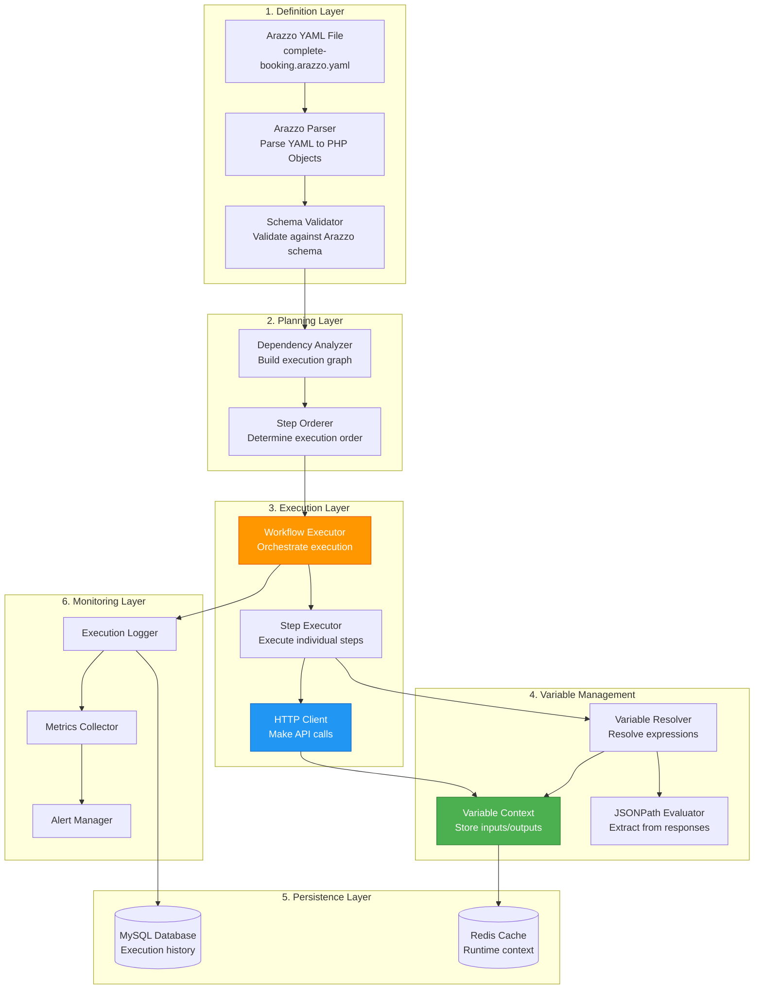
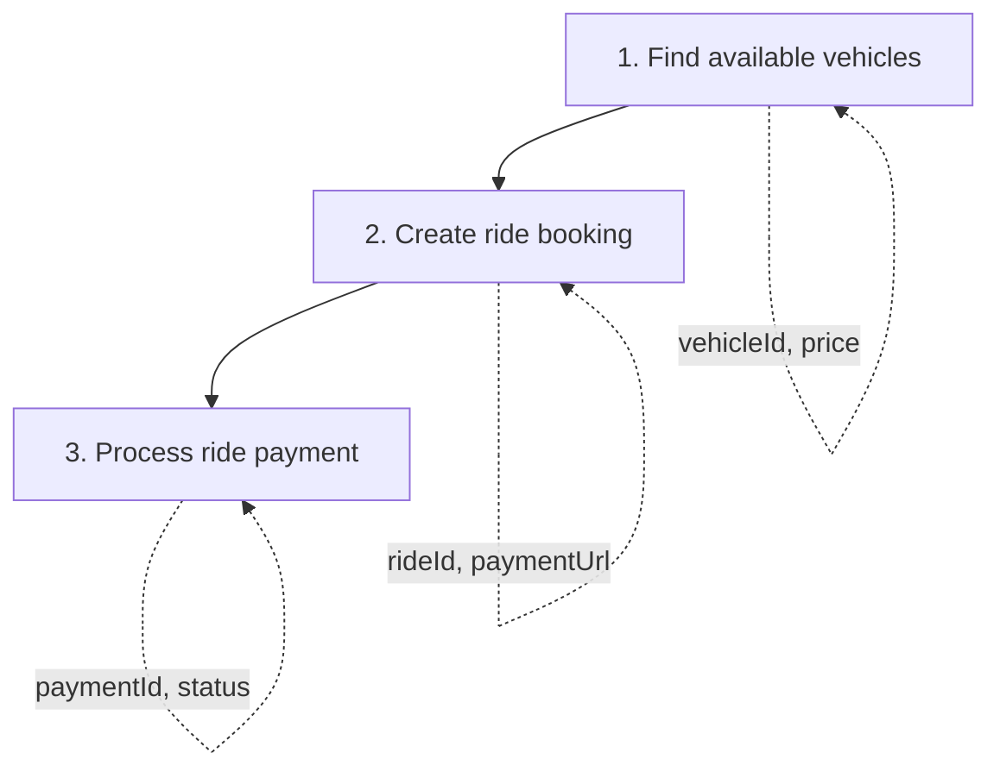

# Arazzo Execution & UI Architecture Deep Dive

**Status**: 📋 Technical Architecture Document
**Created**: 2025-10-14
**Related**: epistemic-analysis-and-implementation-plan.md

---

## 1. How Arazzo Specification Works

### 1.1 Arazzo is a Specification, Not an Executor

**Critical Understanding**:
```
OpenAPI Spec ──────────────────► Describes API structure
     │                            (What endpoints exist)
     │
     ▼
Arazzo Spec ───────────────────► Describes API workflows
                                  (How to chain endpoints together)
```

**Arazzo Definition** (YAML/JSON file):
```yaml
arazzo: 1.0.0
info:
  title: "Complete Ride Booking"
  version: "1.0.0"

sourceDescriptions:
  - name: sinaitaxi-api
    url: /docs/api.json          # References OpenAPI spec
    type: openapi

workflows:
  - workflowId: complete-ride-booking
    description: "End-to-end ride booking with payment"

    # Input schema (what the workflow needs to start)
    inputs:
      type: object
      properties:
        departure_polygon_id:
          type: integer
        destination_polygon_id:
          type: integer
        customer_id:
          type: integer
      required:
        - departure_polygon_id
        - destination_polygon_id
        - customer_id

    # Steps to execute
    steps:
      # STEP 1: Search for available vehicles
      - stepId: search-vehicles
        description: "Find available vehicles for route"
        operationId: searchVehicles    # References OpenAPI operationId

        # Parameters to pass to API
        parameters:
          - name: departure_polygon_id
            in: query
            value: $inputs.departure_polygon_id   # Variable reference
          - name: destination_polygon_id
            in: query
            value: $inputs.destination_polygon_id

        # Define success
        successCriteria:
          - condition: $statusCode == 200
          - condition: $response.body.data.length > 0

        # Extract data for next steps
        outputs:
          vehicleId: $response.body.data[0].id
          price: $response.body.data[0].price
          vehicleName: $response.body.data[0].name

      # STEP 2: Create the ride booking
      - stepId: create-booking
        description: "Create ride booking"
        operationId: createRide
        dependsOn: search-vehicles      # Execution dependency

        requestBody:
          contentType: application/json
          payload:
            departure_polygon_id: $inputs.departure_polygon_id
            destination_polygon_id: $inputs.destination_polygon_id
            vehicle_type_id: $steps.search-vehicles.outputs.vehicleId    # Use previous output
            customer_id: $inputs.customer_id
            pickup_date: "2024-12-01"
            pickup_time: "10:00"

        successCriteria:
          - condition: $statusCode == 201

        outputs:
          rideId: $response.body.data.id
          paymentUrl: $response.body.data.payment_url
          rideStatus: $response.body.data.status

      # STEP 3: Process payment
      - stepId: process-payment
        description: "Process ride payment"
        operationId: payForRide
        dependsOn: create-booking

        requestBody:
          contentType: application/json
          payload:
            ride_id: $steps.create-booking.outputs.rideId    # Chain from previous step
            payment_method: "stripe"

        successCriteria:
          - condition: $statusCode == 200
          - condition: $response.body.data.payment_status == "succeeded"

        # Failure handling
        onFailure:
          - type: retry
            retryAfter: 2
            retryLimit: 3
          - type: end
            workflowStatus: failed

        outputs:
          paymentId: $response.body.data.payment_id
          finalRideStatus: $response.body.data.ride_status

    # Final workflow outputs
    outputs:
      rideId: $steps.create-booking.outputs.rideId
      paymentId: $steps.process-payment.outputs.paymentId
      vehicleName: $steps.search-vehicles.outputs.vehicleName
      totalPrice: $steps.search-vehicles.outputs.price
      status: $steps.process-payment.outputs.finalRideStatus
```

### 1.2 Variable Resolution System

**Expression Types**:

```yaml
# 1. Workflow inputs
$inputs.departure_polygon_id

# 2. Step outputs
$steps.search-vehicles.outputs.vehicleId

# 3. Response data (JSONPath)
$response.body.data[0].id
$response.body.meta.total
$response.headers.X-Request-Id

# 4. Status code
$statusCode

# 5. Environment/Components
$components.parameters.api_key
$url
$method

# 6. Complex JSONPath
$response.body.data[?(@.status=='active')].id      # Filter
$response.body.data[0:3].name                      # Slice
$response.body..id                                  # Recursive descent
```

**Resolution Example**:

```javascript
// Context at Step 3 execution
{
  inputs: {
    departure_polygon_id: 123,
    destination_polygon_id: 456,
    customer_id: 789
  },
  steps: {
    "search-vehicles": {
      outputs: {
        vehicleId: 5,
        price: 500,
        vehicleName: "Sedan"
      }
    },
    "create-booking": {
      outputs: {
        rideId: 12345,
        paymentUrl: "https://payment.example.com/xyz",
        rideStatus: "pending"
      }
    }
  },
  response: {  // Current step's response (if evaluating successCriteria)
    statusCode: 200,
    headers: {...},
    body: {
      data: {
        payment_id: 67890,
        payment_status: "succeeded",
        ride_status: "inProgress"
      }
    }
  }
}

// Expression resolution:
"$steps.create-booking.outputs.rideId" → 12345
"$response.body.data.payment_id" → 67890
```

---

## 2. Execution Architecture

### 2.1 Who Executes Arazzo Workflows?

**You build the executor!** There are 3 approaches:

#### Approach A: Build Custom Executor (Recommended for us)

**Why**: Full control, Laravel integration, custom features

```php
// Our custom executor
Modules/ApiWorkflow/App/Services/WorkflowExecutor.php
```

**Pros**:
- Deep Laravel integration
- Custom authentication handling
- Custom error handling
- Performance optimization
- Add SinaiTaxi-specific features

**Cons**:
- More development work
- Must maintain Arazzo spec compliance

#### Approach B: Use Existing Executor Library

**Available Libraries** (as of 2024):
- **apimatic/apimatic-sdk-generator** - Code generation from Arazzo
- **Postman** - Planning Arazzo support
- **Swagger UI** - Future integration planned
- **Redocly** - Exploring Arazzo support

**Status**: **Very limited tooling available yet** (Arazzo is new - 2024)

**Pros**:
- Less development work
- Standard compliance guaranteed

**Cons**:
- Limited customization
- May not fit our needs
- Early stage, immature

#### Approach C: Hybrid (Use library + extend)

**Example**: Use a base Arazzo parser, build custom executor

```php
use ArazzoParser\Parser;  // Hypothetical library

class SinaiTaxiWorkflowExecutor extends BaseExecutor
{
    protected function executeStep($step) {
        // Add our custom logic
        // Authentication, logging, monitoring
        return parent::executeStep($step);
    }
}
```

### 2.2 Our Custom Executor Architecture



### 2.3 Execution Flow Detail

```php
// Modules/ApiWorkflow/App/Services/WorkflowExecutor.php

class WorkflowExecutor
{
    public function __construct(
        private ArazzoParser $parser,
        private SchemaValidator $validator,
        private DependencyAnalyzer $dependencyAnalyzer,
        private StepExecutor $stepExecutor,
        private VariableContext $variableContext,
        private ExecutionLogger $logger,
    ) {}

    public function execute(string $workflowFile, array $inputs, array $credentials): ExecutionResult
    {
        // PHASE 1: LOAD & VALIDATE
        // ============================================================

        // 1.1 Parse Arazzo YAML
        $workflow = $this->parser->parse($workflowFile);
        // Returns: WorkflowDefinition object

        // 1.2 Validate against Arazzo JSON Schema
        $this->validator->validate($workflow);
        // Throws: ValidationException if invalid

        // 1.3 Validate inputs match schema
        $this->validateInputs($workflow->inputs, $inputs);


        // PHASE 2: PLANNING
        // ============================================================

        // 2.1 Build dependency graph
        $graph = $this->dependencyAnalyzer->buildGraph($workflow->steps);
        // Example graph:
        // search-vehicles → []
        // create-booking → [search-vehicles]
        // process-payment → [create-booking]

        // 2.2 Determine execution order (topological sort)
        $executionOrder = $graph->topologicalSort();
        // Result: [search-vehicles, create-booking, process-payment]

        // 2.3 Detect cycles (invalid workflow)
        if ($graph->hasCycle()) {
            throw new InvalidWorkflowException("Circular dependency detected");
        }


        // PHASE 3: INITIALIZATION
        // ============================================================

        // 3.1 Initialize variable context
        $this->variableContext->initialize([
            'inputs' => $inputs,
            'steps' => [],
            'credentials' => $credentials,
        ]);

        // 3.2 Create execution record
        $execution = WorkflowExecution::create([
            'workflow_id' => $workflow->workflowId,
            'workflow_version' => $workflow->info->version,
            'status' => WorkflowStatusEnum::running,
            'inputs' => $inputs,
            'started_at' => now(),
        ]);

        $this->logger->startExecution($execution->id);


        // PHASE 4: EXECUTION
        // ============================================================

        $stepResults = [];

        foreach ($executionOrder as $stepId) {
            $step = $workflow->getStep($stepId);

            $this->logger->startStep($stepId);

            try {
                // 4.1 Execute step
                $stepResult = $this->stepExecutor->execute(
                    step: $step,
                    context: $this->variableContext,
                    credentials: $credentials
                );

                // 4.2 Evaluate success criteria
                $success = $this->evaluateSuccessCriteria(
                    criteria: $step->successCriteria,
                    response: $stepResult->response,
                    context: $this->variableContext
                );

                if (!$success) {
                    // 4.3 Handle failure
                    $this->handleStepFailure($step, $stepResult, $execution);
                    break;  // Halt workflow
                }

                // 4.4 Extract outputs using JSONPath
                $outputs = $this->extractOutputs($step->outputs, $stepResult->response);

                // 4.5 Update context with step outputs
                $this->variableContext->setStepOutputs($stepId, $outputs);

                // 4.6 Log step success
                $this->logger->completeStep($stepId, $stepResult, $outputs);

                $stepResults[$stepId] = $stepResult;

            } catch (Exception $e) {
                // 4.7 Handle step exception
                $this->logger->failStep($stepId, $e);
                $this->handleStepException($step, $e, $execution);
                break;
            }
        }


        // PHASE 5: FINALIZATION
        // ============================================================

        // 5.1 Extract final workflow outputs
        $finalOutputs = $this->extractWorkflowOutputs(
            $workflow->outputs,
            $this->variableContext
        );

        // 5.2 Update execution record
        $execution->update([
            'status' => WorkflowStatusEnum::completed,
            'outputs' => $finalOutputs,
            'completed_at' => now(),
            'duration_ms' => now()->diffInMilliseconds($execution->started_at),
        ]);

        $this->logger->completeExecution($execution->id);

        // 5.3 Return result
        return new ExecutionResult(
            executionId: $execution->id,
            status: 'completed',
            outputs: $finalOutputs,
            steps: $stepResults,
        );
    }


    // HELPER METHODS
    // ============================================================

    private function evaluateSuccessCriteria(array $criteria, Response $response, VariableContext $context): bool
    {
        foreach ($criteria as $criterion) {
            // Criterion example: "$statusCode == 200"

            // 1. Resolve variables in condition
            $condition = $this->variableContext->resolve($criterion->condition, [
                'statusCode' => $response->status(),
                'response' => $response->toArray(),
            ]);

            // 2. Evaluate condition (using expression evaluator)
            $result = $this->expressionEvaluator->evaluate($condition);

            if (!$result) {
                return false;  // Criterion failed
            }
        }

        return true;  // All criteria passed
    }

    private function extractOutputs(array $outputDefinitions, Response $response): array
    {
        $outputs = [];

        foreach ($outputDefinitions as $name => $expression) {
            // Expression example: "$response.body.data[0].id"

            // 1. Parse JSONPath expression
            $jsonPath = $this->jsonPathParser->parse($expression);

            // 2. Extract value from response
            $value = $jsonPath->evaluate($response->json());

            // 3. Store output
            $outputs[$name] = $value;
        }

        return $outputs;
    }

    private function handleStepFailure(WorkflowStep $step, StepResult $result, WorkflowExecution $execution): void
    {
        // Check for onFailure actions in step definition
        if ($step->onFailure) {
            foreach ($step->onFailure as $action) {
                match ($action->type) {
                    'retry' => $this->retryStep($step, $action),
                    'end' => $this->endWorkflow($execution, $action->workflowStatus),
                    'goto' => $this->gotoStep($action->stepId),
                };
            }
        } else {
            // Default: halt workflow
            $this->endWorkflow($execution, 'failed');
        }
    }
}
```

---

## 3. How UI Handles Arazzo Workflows

### 3.1 UI Architecture Options

#### Option A: Standalone Workflow UI (Recommended Phase 1)

**Separate application** at `/workflows` route

```
┌────────────────────────────────────────────────────────────┐
│  SinaiTaxi API Platform                                    │
├────────────────────────────────────────────────────────────┤
│                                                            │
│  [API Docs]  [Workflows]  [Dashboard]                     │
│      ▲           ▲                                         │
│      │           │                                         │
│      │           └─── /workflows (New UI)                 │
│      └─── /docs/api (Existing Scramble)                   │
│                                                            │
└────────────────────────────────────────────────────────────┘
```

**Tech Stack**:
- **Frontend**: Vue 3 or React
- **State**: Pinia (Vue) or Zustand (React)
- **Visualization**: Mermaid.js for diagrams
- **Editor**: Monaco Editor for YAML editing

**Why Separate**:
- Don't need to fork Scramble
- Full control over UI/UX
- Can use modern frontend framework
- Easier to iterate and add features

#### Option B: Embedded in Scramble (Future Phase 2)

**Extend Scramble's Stoplight Elements UI**

Stoplight Elements is built with React, so we could:
1. Create Scramble extension
2. Add "Workflows" tab to docs
3. Show related workflows per endpoint

**Challenges**:
- Scramble would need to support extensions
- Might need to fork Scramble
- More complex integration

#### Option C: Hybrid Approach (Best of both)

**Standalone UI + Deep linking from Scramble**

```
Scramble Docs
├── GET /api/rides
│   ├── Description
│   ├── Parameters
│   ├── Responses
│   └── 🔗 Used in Workflows:
│       ├── → Complete Ride Booking
│       └── → Cancel Ride with Refund
```

### 3.2 Workflow UI Components

```
┌─────────────────────────────────────────────────────────────┐
│ 🔄 API Workflow Automation                                  │
├─────────────────────────────────────────────────────────────┤
│                                                             │
│  ┌──────────────┐  ┌──────────────┐  ┌──────────────┐    │
│  │  📋 Library  │  │  ▶️ Execute  │  │  📊 History  │    │
│  └──────────────┘  └──────────────┘  └──────────────┘    │
│                                                             │
│  ┌───────────────────────────────────────────────────────┐ │
│  │ Workflow Library                                      │ │
│  ├───────────────────────────────────────────────────────┤ │
│  │                                                       │ │
│  │  📁 Ride Booking                                     │ │
│  │    ├─ Complete Ride Booking (3 steps)               │ │
│  │    ├─ Cancel with Refund (4 steps)                  │ │
│  │    └─ Reschedule Ride (5 steps)                     │ │
│  │                                                       │ │
│  │  📁 Intui Integration                                │ │
│  │    ├─ Driver Status Sync (5 steps)                  │ │
│  │    ├─ 4 Control Points Flow (8 steps)               │ │
│  │    └─ No-Show Handling (6 steps)                    │ │
│  │                                                       │ │
│  │  📁 Payment Processing                               │ │
│  │    ├─ Process Payment with Retry (3 steps)          │ │
│  │    └─ Partial Refund (4 steps)                      │ │
│  │                                                       │ │
│  └───────────────────────────────────────────────────────┘ │
└─────────────────────────────────────────────────────────────┘
```

**When you click a workflow:**

```
┌─────────────────────────────────────────────────────────────┐
│ ◀️ Back to Library    Complete Ride Booking                 │
├─────────────────────────────────────────────────────────────┤
│                                                             │
│  ┌──────────────┐  ┌──────────────┐  ┌──────────────┐    │
│  │  📖 Overview │  │  ▶️ Execute  │  │  📝 Edit     │    │
│  └──────────────┘  └──────────────┘  └──────────────┘    │
│                                                             │
│  ┌───────────────────────────────────────────────────────┐ │
│  │ Workflow Visualization                                │ │
│  ├───────────────────────────────────────────────────────┤ │
│  │                                                       │ │
│  │      ┌──────────────────┐                            │ │
│  │      │ 1. Search        │                            │ │
│  │      │    Vehicles      │                            │ │
│  │      └────────┬─────────┘                            │ │
│  │               │                                       │ │
│  │               │ vehicleId, price                      │ │
│  │               ▼                                       │ │
│  │      ┌──────────────────┐                            │ │
│  │      │ 2. Create        │                            │ │
│  │      │    Booking       │                            │ │
│  │      └────────┬─────────┘                            │ │
│  │               │                                       │ │
│  │               │ rideId, paymentUrl                    │ │
│  │               ▼                                       │ │
│  │      ┌──────────────────┐                            │ │
│  │      │ 3. Process       │                            │ │
│  │      │    Payment       │                            │ │
│  │      └──────────────────┘                            │ │
│  │                                                       │ │
│  └───────────────────────────────────────────────────────┘ │
│                                                             │
│  ┌───────────────────────────────────────────────────────┐ │
│  │ Workflow Details                                      │ │
│  ├───────────────────────────────────────────────────────┤ │
│  │                                                       │ │
│  │  Description:                                         │ │
│  │  End-to-end ride booking with payment processing     │ │
│  │                                                       │ │
│  │  Inputs Required:                                     │ │
│  │  • departure_polygon_id (integer)                    │ │
│  │  • destination_polygon_id (integer)                  │ │
│  │  • customer_id (integer)                             │ │
│  │                                                       │ │
│  │  Outputs:                                             │ │
│  │  • rideId                                            │ │
│  │  • paymentId                                         │ │
│  │  • status                                            │ │
│  │                                                       │ │
│  │  Average Duration: 2.5s                              │ │
│  │  Success Rate: 94.2%                                 │ │
│  │  Last Run: 2 hours ago                               │ │
│  │                                                       │ │
│  └───────────────────────────────────────────────────────┘ │
└─────────────────────────────────────────────────────────────┘
```

**Click "Execute" tab:**

```
┌─────────────────────────────────────────────────────────────┐
│ Execute Workflow: Complete Ride Booking                     │
├─────────────────────────────────────────────────────────────┤
│                                                             │
│  ┌───────────────────────────────────────────────────────┐ │
│  │ Workflow Inputs                                       │ │
│  ├───────────────────────────────────────────────────────┤ │
│  │                                                       │ │
│  │  Departure Polygon ID *                               │ │
│  │  ┌─────────────────────────────────────────────────┐ │ │
│  │  │ 123                                             │ │ │
│  │  └─────────────────────────────────────────────────┘ │ │
│  │                                                       │ │
│  │  Destination Polygon ID *                             │ │
│  │  ┌─────────────────────────────────────────────────┐ │ │
│  │  │ 456                                             │ │ │
│  │  └─────────────────────────────────────────────────┘ │ │
│  │                                                       │ │
│  │  Customer ID *                                        │ │
│  │  ┌─────────────────────────────────────────────────┐ │ │
│  │  │ 789                                             │ │ │
│  │  └─────────────────────────────────────────────────┘ │ │
│  │                                                       │ │
│  └───────────────────────────────────────────────────────┘ │
│                                                             │
│  ┌───────────────────────────────────────────────────────┐ │
│  │ Authentication                                        │ │
│  ├───────────────────────────────────────────────────────┤ │
│  │                                                       │ │
│  │  [ ] Use my session                                   │ │
│  │  [x] Bearer Token                                     │ │
│  │                                                       │ │
│  │  ┌─────────────────────────────────────────────────┐ │ │
│  │  │ •••••••••••••••••••••••••••••••••••••••••••••  │ │ │
│  │  └─────────────────────────────────────────────────┘ │ │
│  │                                                       │ │
│  └───────────────────────────────────────────────────────┘ │
│                                                             │
│  [ Execute Workflow ]  [ Dry Run ]  [ Clear ]             │
│                                                             │
└─────────────────────────────────────────────────────────────┘
```

**During execution:**

```
┌─────────────────────────────────────────────────────────────┐
│ Executing: Complete Ride Booking                            │
├─────────────────────────────────────────────────────────────┤
│                                                             │
│  Execution ID: exec_abc123                                  │
│  Started: 2 seconds ago                                     │
│                                                             │
│  ┌───────────────────────────────────────────────────────┐ │
│  │ Progress                                              │ │
│  ├───────────────────────────────────────────────────────┤ │
│  │                                                       │ │
│  │  ✅ Step 1/3: search-vehicles                         │ │
│  │     Status: completed (850ms)                         │ │
│  │     ┌─────────────────────────────────────────────┐  │ │
│  │     │ Outputs:                                    │  │ │
│  │     │ • vehicleId: 5                              │  │ │
│  │     │ • price: 500                                │  │ │
│  │     │ • vehicleName: "Sedan"                      │  │ │
│  │     └─────────────────────────────────────────────┘  │ │
│  │                                                       │ │
│  │  ✅ Step 2/3: create-booking                          │ │
│  │     Status: completed (920ms)                         │ │
│  │     ┌─────────────────────────────────────────────┐  │ │
│  │     │ Outputs:                                    │  │ │
│  │     │ • rideId: 12345                             │  │ │
│  │     │ • paymentUrl: https://...                   │  │ │
│  │     │ • rideStatus: "pending"                     │  │ │
│  │     └─────────────────────────────────────────────┘  │ │
│  │                                                       │ │
│  │  ⏳ Step 3/3: process-payment                         │ │
│  │     Status: running...                                │ │
│  │     ┌─────────────────────────────────────────────┐  │ │
│  │     │ Request:                                    │  │ │
│  │     │ POST /api/rides/12345/pay                   │  │ │
│  │     │ { "payment_method": "stripe" }              │  │ │
│  │     └─────────────────────────────────────────────┘  │ │
│  │                                                       │ │
│  └───────────────────────────────────────────────────────┘ │
└─────────────────────────────────────────────────────────────┘
```

**After completion:**

```
┌─────────────────────────────────────────────────────────────┐
│ ✅ Workflow Completed Successfully                           │
├─────────────────────────────────────────────────────────────┤
│                                                             │
│  Execution ID: exec_abc123                                  │
│  Duration: 2.45 seconds                                     │
│  Status: completed                                          │
│                                                             │
│  ┌───────────────────────────────────────────────────────┐ │
│  │ Final Outputs                                         │ │
│  ├───────────────────────────────────────────────────────┤ │
│  │                                                       │ │
│  │  {                                                    │ │
│  │    "rideId": 12345,                                   │ │
│  │    "paymentId": 67890,                                │ │
│  │    "vehicleName": "Sedan",                            │ │
│  │    "totalPrice": 500,                                 │ │
│  │    "status": "inProgress"                             │ │
│  │  }                                                    │ │
│  │                                                       │ │
│  │  [Copy JSON]  [Export]                                │ │
│  │                                                       │ │
│  └───────────────────────────────────────────────────────┘ │
│                                                             │
│  ┌───────────────────────────────────────────────────────┐ │
│  │ Execution Steps                                       │ │
│  ├───────────────────────────────────────────────────────┤ │
│  │                                                       │ │
│  │  ▼ 1. search-vehicles (850ms)                         │ │
│  │     Request:  GET /api/vehicles/search?...            │ │
│  │     Response: 200 OK                                  │ │
│  │     [View Details]                                    │ │
│  │                                                       │ │
│  │  ▼ 2. create-booking (920ms)                          │ │
│  │     Request:  POST /api/rides                         │ │
│  │     Response: 201 Created                             │ │
│  │     [View Details]                                    │ │
│  │                                                       │ │
│  │  ▼ 3. process-payment (680ms)                         │ │
│  │     Request:  POST /api/rides/12345/pay               │ │
│  │     Response: 200 OK                                  │ │
│  │     [View Details]                                    │ │
│  │                                                       │ │
│  └───────────────────────────────────────────────────────┘ │
│                                                             │
│  [ Run Again ]  [ View in History ]  [ Export Report ]    │
│                                                             │
└─────────────────────────────────────────────────────────────┘
```

### 3.3 Vue.js Implementation Example

```vue
<!-- WorkflowExecutor.vue -->
<template>
  <div class="workflow-executor">
    <h2>{{ workflow.info.title }}</h2>

    <!-- Input Form -->
    <div v-if="!isExecuting && !result" class="input-form">
      <h3>Workflow Inputs</h3>

      <div v-for="(schema, name) in workflow.inputs.properties" :key="name" class="input-field">
        <label>
          {{ formatLabel(name) }}
          <span v-if="workflow.inputs.required?.includes(name)" class="required">*</span>
        </label>

        <input
          v-model="inputs[name]"
          :type="getInputType(schema.type)"
          :required="workflow.inputs.required?.includes(name)"
        />

        <span class="help-text">{{ schema.description }}</span>
      </div>

      <!-- Authentication -->
      <div class="auth-section">
        <h3>Authentication</h3>
        <input v-model="bearerToken" type="password" placeholder="Bearer token" />
      </div>

      <div class="actions">
        <button @click="executeWorkflow" class="primary">Execute Workflow</button>
        <button @click="dryRun" class="secondary">Dry Run</button>
      </div>
    </div>

    <!-- Execution Progress -->
    <div v-if="isExecuting" class="execution-progress">
      <h3>Execution Progress</h3>

      <div class="execution-meta">
        <div>Execution ID: {{ executionId }}</div>
        <div>Started: {{ startedAt }}</div>
      </div>

      <div class="steps">
        <div
          v-for="(step, index) in steps"
          :key="step.stepId"
          :class="['step', `status-${step.status}`]"
        >
          <div class="step-header">
            <span class="step-icon">{{ getStepIcon(step.status) }}</span>
            <span class="step-title">
              Step {{ index + 1 }}/{{ steps.length }}: {{ step.stepId }}
            </span>
            <span v-if="step.duration_ms" class="step-duration">
              ({{ step.duration_ms }}ms)
            </span>
          </div>

          <!-- Step Outputs -->
          <div v-if="step.outputs && Object.keys(step.outputs).length" class="step-outputs">
            <div class="outputs-header">Outputs:</div>
            <ul>
              <li v-for="(value, key) in step.outputs" :key="key">
                <strong>{{ key }}:</strong> {{ formatValue(value) }}
              </li>
            </ul>
          </div>

          <!-- Step Request (expandable) -->
          <details v-if="step.request" class="step-details">
            <summary>View Request</summary>
            <pre><code>{{ step.request.method }} {{ step.request.url }}
{{ JSON.stringify(step.request.body, null, 2) }}</code></pre>
          </details>
        </div>
      </div>
    </div>

    <!-- Result -->
    <div v-if="result" class="execution-result">
      <div :class="['result-header', result.status]">
        <span class="result-icon">{{ result.status === 'completed' ? '✅' : '❌' }}</span>
        <h3>Workflow {{ result.status === 'completed' ? 'Completed' : 'Failed' }}</h3>
      </div>

      <div class="result-meta">
        <div>Execution ID: {{ result.executionId }}</div>
        <div>Duration: {{ result.duration_ms / 1000 }}s</div>
      </div>

      <!-- Final Outputs -->
      <div v-if="result.outputs" class="final-outputs">
        <h4>Final Outputs</h4>
        <pre><code>{{ JSON.stringify(result.outputs, null, 2) }}</code></pre>
        <button @click="copyOutputs">Copy JSON</button>
      </div>

      <!-- Step Summary -->
      <div class="steps-summary">
        <h4>Execution Steps</h4>
        <div v-for="(step, index) in result.steps" :key="step.stepId" class="step-summary">
          <details>
            <summary>
              {{ index + 1 }}. {{ step.stepId }} ({{ step.duration_ms }}ms)
            </summary>
            <div class="step-detail">
              <div><strong>Request:</strong> {{ step.request.method }} {{ step.request.url }}</div>
              <div><strong>Response:</strong> {{ step.response.statusCode }} {{ step.response.statusText }}</div>
              <pre><code>{{ JSON.stringify(step.response.body, null, 2) }}</code></pre>
            </div>
          </details>
        </div>
      </div>

      <div class="actions">
        <button @click="runAgain">Run Again</button>
        <button @click="viewHistory">View in History</button>
        <button @click="exportReport">Export Report</button>
      </div>
    </div>
  </div>
</template>

<script setup>
import { ref, computed, onMounted } from 'vue'
import { useWorkflowStore } from '@/stores/workflow'
import axios from 'axios'

const props = defineProps({
  workflowId: String
})

const workflowStore = useWorkflowStore()

const workflow = ref(null)
const inputs = ref({})
const bearerToken = ref('')
const isExecuting = ref(false)
const executionId = ref(null)
const startedAt = ref(null)
const steps = ref([])
const result = ref(null)

onMounted(async () => {
  // Load workflow definition
  workflow.value = await workflowStore.getWorkflow(props.workflowId)

  // Initialize inputs with defaults
  Object.keys(workflow.value.inputs.properties).forEach(key => {
    inputs.value[key] = workflow.value.inputs.properties[key].default || ''
  })
})

async function executeWorkflow() {
  isExecuting.value = true
  startedAt.value = new Date()
  steps.value = workflow.value.steps.map(step => ({
    stepId: step.stepId,
    status: 'pending'
  }))

  try {
    // Execute workflow via API
    const response = await axios.post(
      `/api/workflows/${props.workflowId}/execute`,
      {
        inputs: inputs.value,
        credentials: {
          bearer_token: bearerToken.value
        }
      }
    )

    // Poll for execution status (if async)
    executionId.value = response.data.execution_id
    await pollExecutionStatus()

  } catch (error) {
    console.error('Workflow execution failed:', error)
    result.value = {
      status: 'failed',
      error: error.response?.data || error.message
    }
  } finally {
    isExecuting.value = false
  }
}

async function pollExecutionStatus() {
  const pollInterval = setInterval(async () => {
    const response = await axios.get(`/api/workflows/executions/${executionId.value}`)

    // Update steps
    steps.value = response.data.steps

    // Check if completed
    if (response.data.status === 'completed' || response.data.status === 'failed') {
      clearInterval(pollInterval)
      result.value = response.data
    }
  }, 500)  // Poll every 500ms
}

function getStepIcon(status) {
  const icons = {
    pending: '⏳',
    running: '▶️',
    completed: '✅',
    failed: '❌',
    skipped: '⏭️'
  }
  return icons[status] || '❓'
}

function formatValue(value) {
  if (typeof value === 'object') {
    return JSON.stringify(value)
  }
  return value
}

function formatLabel(name) {
  return name
    .split('_')
    .map(word => word.charAt(0).toUpperCase() + word.slice(1))
    .join(' ')
}

function getInputType(schemaType) {
  const typeMap = {
    integer: 'number',
    number: 'number',
    string: 'text',
    boolean: 'checkbox'
  }
  return typeMap[schemaType] || 'text'
}

function copyOutputs() {
  navigator.clipboard.writeText(JSON.stringify(result.value.outputs, null, 2))
}

function runAgain() {
  result.value = null
  isExecuting.value = false
  steps.value = []
}

function viewHistory() {
  // Navigate to history view
}

function exportReport() {
  // Export execution report
}
</script>

<style scoped>
.workflow-executor {
  max-width: 1200px;
  margin: 0 auto;
  padding: 2rem;
}

.input-field {
  margin-bottom: 1rem;
}

.step {
  border-left: 3px solid #ccc;
  padding: 1rem;
  margin-bottom: 1rem;
}

.step.status-completed {
  border-left-color: #4caf50;
}

.step.status-running {
  border-left-color: #ff9800;
}

.step.status-failed {
  border-left-color: #f44336;
}

.required {
  color: red;
}

.actions {
  display: flex;
  gap: 1rem;
  margin-top: 2rem;
}
</style>
```

---

## 4. Workflow Visualization

### 4.1 Mermaid Diagram Generation

**Convert Arazzo to Mermaid:**

```javascript
// utils/arazzoToMermaid.js

export function generateMermaidDiagram(workflow) {
  let diagram = 'graph TB\n'

  // Add steps
  workflow.steps.forEach((step, index) => {
    const stepId = step.stepId.replace(/-/g, '_')
    diagram += `  ${stepId}["${index + 1}. ${step.description}"]\n`
  })

  // Add dependencies
  workflow.steps.forEach(step => {
    const stepId = step.stepId.replace(/-/g, '_')

    if (step.dependsOn) {
      step.dependsOn.forEach(dep => {
        const depId = dep.replace(/-/g, '_')
        diagram += `  ${depId} --> ${stepId}\n`
      })
    }
  })

  // Add outputs as labels
  workflow.steps.forEach(step => {
    if (step.outputs && Object.keys(step.outputs).length) {
      const stepId = step.stepId.replace(/-/g, '_')
      const outputs = Object.keys(step.outputs).join(', ')
      diagram += `  ${stepId} -.->|${outputs}| ${stepId}\n`
    }
  })

  return diagram
}
```

**Result:**



---

## 5. Third-Party Arazzo Tools (Current State)

### 5.1 Available Tools (2024)

**⚠️ Important**: Arazzo is very new (released 2024), so tooling is limited.

**Current Ecosystem**:

1. **Swagger/OpenAPI Tools**
   - Swagger Editor: Planning Arazzo support (not yet available)
   - Swagger UI: No workflow visualization yet
   - Swagger Codegen: No Arazzo support yet

2. **Postman**
   - Announced interest in Arazzo
   - No implementation yet

3. **Redocly**
   - Exploring Arazzo support
   - Timeline unclear

4. **APImatic**
   - SDK generation from OpenAPI
   - Evaluating Arazzo support

**Reality**: **We'll need to build our own tooling** (executor + UI)

### 5.2 Future Ecosystem Vision

**In 1-2 years, expect**:
- Swagger UI with workflow tabs
- Postman native Arazzo import
- IDE extensions (VS Code)
- Testing frameworks (Newman for Arazzo)
- CI/CD integrations

**Our Strategy**:
1. Build MVP now (custom executor + UI)
2. Monitor ecosystem development
3. Migrate to standard tools when mature
4. Contribute to open-source tools if possible

---

## 6. Execution Performance Considerations

### 6.1 Synchronous vs Asynchronous Execution

**Synchronous (Phase 1)**:
```php
$result = $workflowExecutor->execute($workflow, $inputs);
// Blocks until complete
```

**Pros**: Simple, immediate result
**Cons**: Can timeout for long workflows

**Asynchronous (Phase 2)**:
```php
$executionId = $workflowExecutor->executeAsync($workflow, $inputs);
// Returns immediately

// Later: poll for status
$status = $workflowExecutor->getExecutionStatus($executionId);
```

**Pros**: Handles long workflows, better UX
**Cons**: More complex, need polling/webhooks

### 6.2 Performance Optimization

**Strategies**:

1. **Parallel Step Execution**
   ```php
   // Analyze dependency graph
   $parallelGroups = $dependencyAnalyzer->getParallelGroups($workflow);

   // Execute independent steps concurrently
   foreach ($parallelGroups as $group) {
       $promises = [];
       foreach ($group as $step) {
           $promises[] = async(fn() => $this->executeStep($step));
       }
       await($promises);  // Wait for all
   }
   ```

2. **HTTP Connection Pooling**
   ```php
   // Reuse HTTP connections
   $httpClient = new Client([
       'timeout' => 30,
       'pool_size' => 10,  // Connection pool
   ]);
   ```

3. **Response Caching**
   ```php
   // Cache idempotent step results
   if ($step->isCacheable()) {
       $cacheKey = $this->buildCacheKey($step, $context);
       return Cache::remember($cacheKey, 3600, fn() => $this->executeStep($step));
   }
   ```

4. **Context Persistence**
   ```php
   // Use Redis for fast context storage
   Redis::set("workflow:{$executionId}:context", serialize($context));
   ```

---

## 7. Summary: What You Need to Build

### Frontend UI (Vue.js/React)

- **Workflow Library View**: Browse workflows
- **Workflow Detail View**: See visualization, description
- **Workflow Executor View**: Input form, execute, see progress
- **Execution History View**: Past executions
- **Workflow Editor** (optional): Edit Arazzo YAML

### Backend Executor (Laravel)

- **Arazzo Parser**: Parse YAML/JSON to PHP objects
- **Schema Validator**: Validate against Arazzo spec
- **Dependency Analyzer**: Build execution graph
- **Workflow Executor**: Orchestrate execution
- **Step Executor**: Execute individual steps
- **Variable Resolver**: Resolve expressions ($inputs, $steps)
- **JSONPath Evaluator**: Extract from responses
- **Execution Logger**: Track progress, store history

### API Endpoints

- `GET /api/workflows` - List workflows
- `GET /api/workflows/{id}` - Get workflow definition
- `POST /api/workflows/{id}/execute` - Execute workflow
- `GET /api/workflows/executions/{id}` - Get execution status
- `GET /api/workflows/executions` - List execution history

### Storage

- **Workflow definitions**: `/workflows/*.arazzo.yaml` files in repo
- **Execution history**: MySQL database tables
- **Runtime context**: Redis cache

---

## 8. Recommendation

**Phase 1**: Build custom executor + basic UI (no forking)
- Full control
- Laravel integration
- Can iterate quickly

**Phase 2**: Monitor Arazzo ecosystem
- If good tools emerge, integrate
- If not, we have working solution

**Phase 3**: Contribute back
- Open-source our executor
- Share UI components
- Help grow ecosystem

---

**END OF DOCUMENT**
