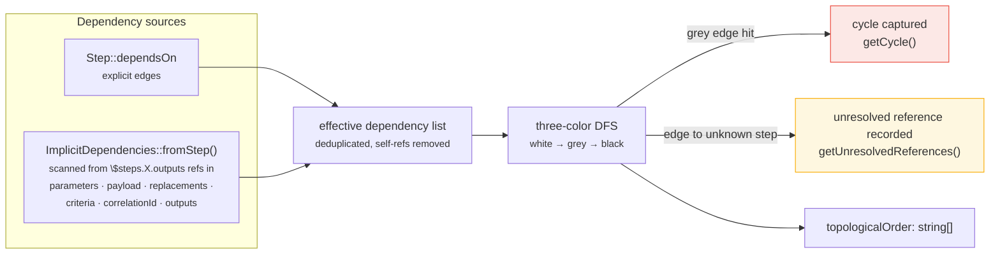
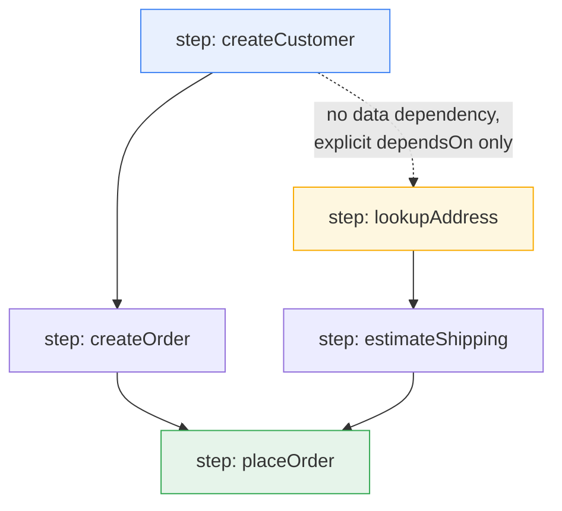
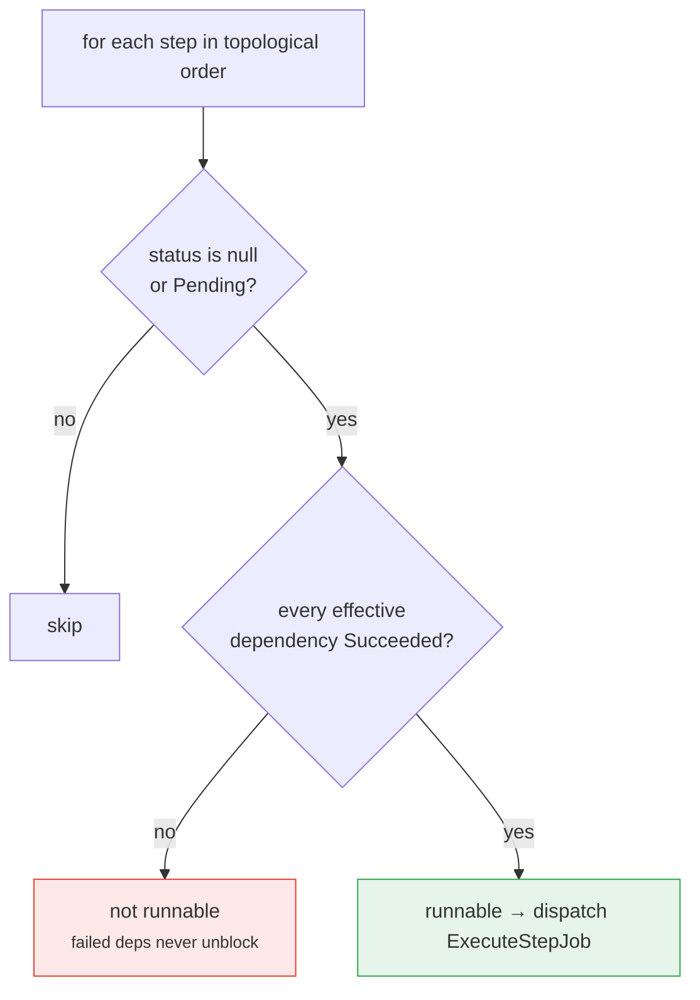

# 03 — Dependency Graph

## Purpose

Technical deep-dive into how `dependsOn` declarations become a Directed Acyclic Graph (DAG), how that DAG guarantees step execution order, and how upstream failures propagate. Relevant classes live in `Runner/Evaluation/`: `DependencyGraph`, `DependencyAnalyzer`, `ImplicitDependencies`.

## Two kinds of dependency

A step can depend on another step in two ways:

1. **Explicit** — listed in `Step::$dependsOn` (a `list<string>` of step IDs), directly from the Arazzo document's `dependsOn` field.
2. **Implicit** — inferred from the step's own content referencing another step's outputs via a runtime expression like `{$steps.createOrder.outputs.orderId}`.

Both are merged into a single **effective dependency list** before any ordering or reachability analysis happens.

## Building the graph: `DependencyGraph`



Constructed with a workflow's full `Step[]` list:

```php
$graph = new DependencyGraph($workflow->steps);
```

Internally it does two things in `analyze()`:

### 1. Compute effective dependencies

For each step, `ImplicitDependencies::fromStep($step)` scans every place a runtime expression can appear — `parameters[].value`, `requestBody->payload` and `requestBody->replacements[].value`, `successCriteria[].context`/`condition`, `correlationId`, and `outputs[]` — and extracts step IDs referenced via the pattern `\$steps\.([^.\s}\$]+)\.outputs\b`. Anything found is merged into `dependsOn` (deduplicated, self-references excluded):

```php
$deps = $step->dependsOn;
foreach (ImplicitDependencies::fromStep($step) as $implicit) {
    if (!in_array($implicit, $deps, true)) {
        $deps[] = $implicit;
    }
}
```

This means **you never have to declare `dependsOn` for a step whose parameters simply reference a prior step's output** — the engine infers the ordering edge automatically, per the Arazzo 1.1 "Tool Behavior" guidance referenced directly in `ImplicitDependencies`'s docblock. Explicit `dependsOn` remains necessary for ordering that has no data dependency (e.g. "run B after A even though B doesn't use A's output").

### 2. Topological sort with cycle and reference detection

A single iterative-recursive DFS (`$dfs`, a closure capturing `$color`, `$path`, `$reported` by reference) performs a classic three-color traversal:

- **White (0)** — unvisited
- **Grey (1)** — on the current DFS path (an ancestor)
- **Black (2)** — fully processed; appended to `$topologicalOrder` on completion

When a dependency edge points to a step ID not present in `$stepsById`, it's recorded in `$unresolvedReferences[$node][]` and skipped — the graph doesn't throw for this itself; that's left to the `Validator` package's `StepDependsOnNoCycleRule` / similar rules to catch as a document-level conformance error. `getUnresolvedReferences()` exposes this for callers who want to surface it.

When a dependency edge points to a **grey** node, that's a cycle: the path from the cycle's start to the current node is captured into `$cycle` and traversal short-circuits (`$reported = true`) — the DFS stops walking further once a cycle is found, rather than continuing to explore. `getCycle()` returns it (or `null` if none was found).

The result, `getTopologicalOrder(): string[]`, is a valid execution order for the DAG (assuming no cycle) — but note this is a *static* order computed once from the full step list; it's a convenience for the synchronous execution path (doc 02, Stage 3A), not the ordering mechanism used by production runs.

## Determining runnability at any point in time: `DependencyAnalyzer`

Example DAG and how it fans out — independent branches dispatch concurrently; there is no separate "parallel executor":



After the first tick, `A` and `B` are runnable simultaneously → two `ExecuteStepJob`s dispatched at once. `E` stays unrunnable until *both* `C` *and* `D` report `Succeeded`:



The topological order tells you *a* valid sequence, but production execution is driven by runnability, not by walking a fixed list — steps can be dispatched to a queue, retried, or reached via `goto`, so "what can run right now" has to be recomputed against live state. `DependencyAnalyzer::getRunnableSteps(WorkflowContext $context)` does exactly this:

```php
foreach ($this->graph->getTopologicalOrder() as $stepId) {
    $step = $this->graph->getStepsById()[$stepId];
    $status = $context->getStepStatus($step->stepId);

    // only unexecuted or explicitly-reset (Pending) steps are candidates
    if ($status !== null && $status !== StepStatus::Pending) {
        continue;
    }

    $dependencies = $this->graph->getEffectiveDependencies($step->stepId);
    if ($dependencies === []) {
        $runnable[] = $step;
        continue;
    }

    $dependenciesMet = true;
    foreach ($dependencies as $dependencyId) {
        if ($context->getStepStatus($dependencyId) !== StepStatus::Succeeded) {
            $dependenciesMet = false;
            break;
        }
    }
    if ($dependenciesMet) {
        $runnable[] = $step;
    }
}
```

A step is runnable when: it hasn't run yet (or was reset to `Pending`), **and** every entry in its effective dependency list has status `StepStatus::Succeeded` — not merely "attempted" or "failed". This is the function `Engine::evaluate()` calls to decide which `ExecuteStepJob`s to dispatch onto the queue (doc 02, Stage 3B):

```php
$graph = new DependencyGraph($workflow->steps);
$analyzer = new DependencyAnalyzer($graph);
$runnableSteps = $analyzer->getRunnableSteps($context);

foreach ($runnableSteps as $step) {
    $this->queueDriver->dispatch(new ExecuteStepJob($step, $context));
}
```

Because `getRunnableSteps()` can return **more than one step**, a workflow whose DAG has independent branches naturally fans out into multiple concurrently-dispatched jobs — this is the mechanism by which parallel step execution happens; there's no separate "parallel executor," just multiple simultaneously-runnable nodes in the same DAG.

## Guaranteeing execution order

Order is guaranteed at two layers working together:

1. **Structurally**, by the DAG itself: a step is never returned as runnable until all its effective dependencies report `Succeeded`.
2. **Operationally**, by the per-execution lock in `StepExecutionWorker::handle()` (doc 02/06): even though independent steps may be dispatched and processed concurrently by different queue workers, any read-modify-write of the shared `ExecutionState` for one execution is serialized through `LockManagerInterface::acquire("execution_lock_{$executionId}", ...)`. This prevents two workers from racing to persist conflicting state snapshots.

## Handling upstream failures

`DependencyAnalyzer` only ever considers a dependency "met" when its status is exactly `StepStatus::Succeeded`. A **failed** upstream step therefore never unblocks its dependents — they simply stay out of the runnable set forever (from the analyzer's perspective), and the workflow's progress halts at that branch.

What happens to the *overall run* is decided by `WorkflowEngine::transition()`, not by `DependencyAnalyzer`: when the failed step's own `onFailure` (or workflow-level `failureActions`) criteria are evaluated, the possible outcomes are the same ones described in doc 02 — `retry` (re-attempt the same step, subject to `retryLimit`), `goto` (jump elsewhere, potentially routing around the failure), or `end` with status `'failed'` (default when no action matches and criteria weren't met). There is no automatic "cancel sibling branches" behavior — other independent branches with no dependency on the failed step continue to be dispatched and can complete normally even while one branch has failed, until the run as a whole reaches a terminal transition.
