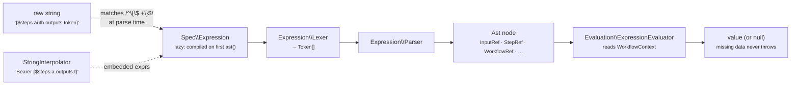
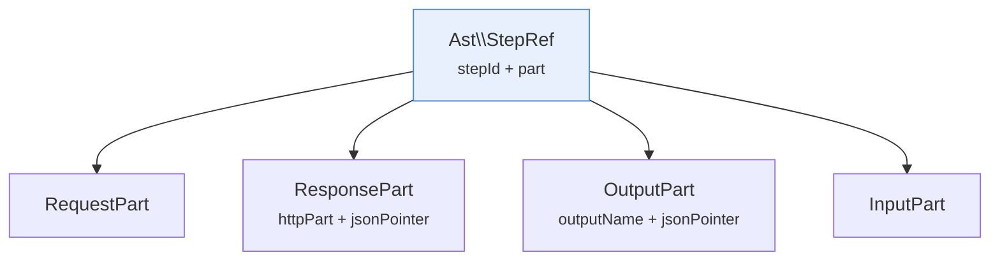
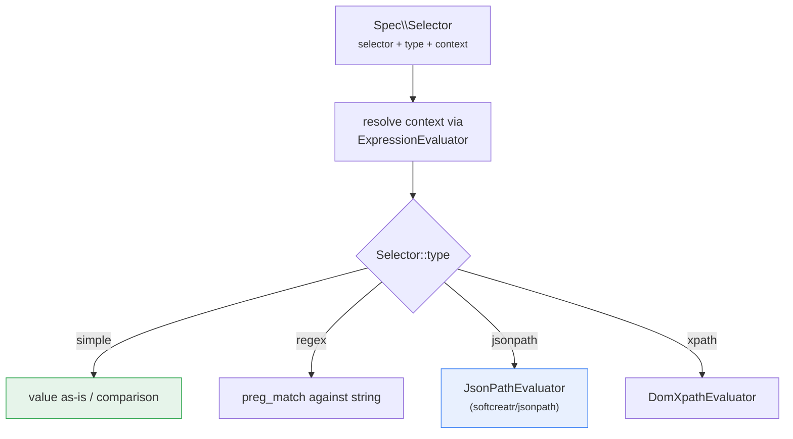
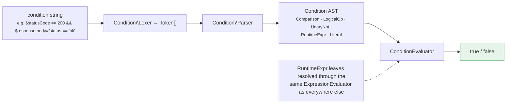
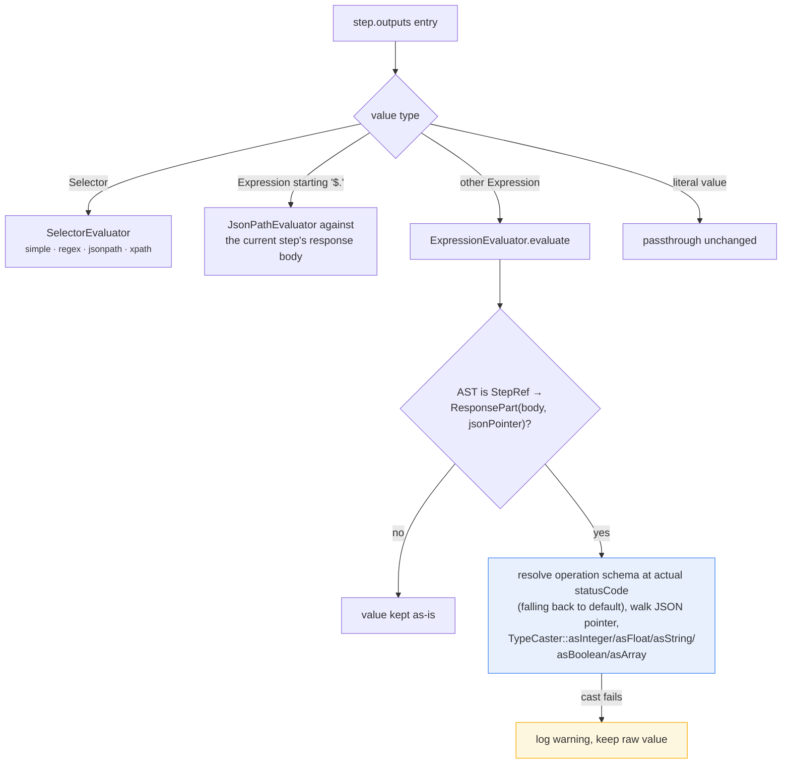

# 04 — Expression Evaluation

## Purpose

Technical deep-dive into how Arazzo runtime expressions (`{$inputs.foo}`, `{$steps.bar.outputs.id}`, `{$response.body#/id}`, ...) are parsed and resolved, how JSONPath/XPath/regex selectors fit in, and how state is preserved and read across steps — including concurrently-executed ones.

## Two resolution mechanisms: Expression vs Selector

The parser (doc 02) produces one of two types for any dynamic value:

- **`Spec\Expression`** — a runtime-expression *string* like `{$steps.step1.outputs.id}`, produced whenever a scalar value matches `/^\{\$.+\}$/` (or, for certain always-dynamic fields like `outputs` map values, unconditionally). Lazily compiled to an AST on first use via `Expression::ast()`.
- **`Spec\Selector`** — a structured `{selector, type, context}` object, used for `successCriteria` and `outputs` entries that need JSONPath (`$.foo.bar`), XPath, or regex extraction against a *context* (often a response body) rather than a fixed expression grammar. Evaluated by `Runner\Evaluation\SelectorEvaluator`, not `ExpressionEvaluator`.

Both ultimately read from the same source of truth: the current `WorkflowContext`.

## The expression grammar and AST

`Alama\Arazzo\Expression\` (note: **not** under `Runner/`) contains a small hand-written `Lexer`/`Parser`/`Token` pipeline that turns an expression's raw text into one of the AST node types under `Expression/Ast/`:

| AST node | Matches |
|---|---|
| `InputRef` | `$inputs.name` (optionally with a JSON Pointer suffix) |
| `StepRef` | `$steps.stepId.<part>` — see below |
| `WorkflowRef` | `$workflows.workflowId.<inputs\|outputs>.name` |
| `ComponentRef` | `$components.parameters.name` |
| `SourceRef` | `$sourceDescriptions.name.<url\|type>` |
| `SelfRef` | `$self` |
| `HttpMetaRef` | `$statusCode`, `$method`, `$url` (of the *current* step) |
| `MessageRef` | `$message.<header\|payload>` (AsyncAPI steps) |

`StepRef` further carries a `part`, one of `RequestPart`, `ResponsePart`, `OutputPart`, or `InputPart` — e.g. `{$steps.step1.response.body#/data/id}` parses to a `StepRef(stepId: 'step1', part: ResponsePart(httpPart: 'body', jsonPointer: '/data/id'))`.

## Evaluating an AST: `ExpressionEvaluator`

`Runner\Evaluation\ExpressionEvaluator::evaluate(Expression $expression, EvaluationContext $context)` pattern-matches on the AST node type and reads from `EvaluationContext->workflowContext` (a `Runner\Context\WorkflowContext`) plus, where relevant, `EvaluationContext->currentStepId` and `->document`. Some representative cases:

- **`InputRef`** → `$context->workflowContext->getInputs()[$ast->name]`, optionally narrowed by `JsonPointer::resolve()` if the expression had a `#/...` suffix.
- **`StepRef` + `ResponsePart`** → reads `$stepData['response']['body'|'headers'|'statusCode']` from `WorkflowContext::getSteps()[$targetStepId]`, where `$targetStepId` defaults to the *current* step if the expression omitted an explicit step ID (self-reference, e.g. within a step's own `outputs`).
- **`StepRef` + `OutputPart`** → reads `$stepData['outputs'][$part->name]`, itself possibly narrowed by a JSON Pointer — this is how one step's declared `outputs` become readable as `{$steps.X.outputs.Y}` in a later step.
- **`WorkflowRef`** → reads `WorkflowContext::getWorkflows()[$workflowId][$partKind][$name]`, populated via `WorkflowContext::withWorkflowData()` when a (sub-)workflow's `inputs`/`outputs` are recorded.
- **`SourceRef`** → looks up `ArazzoDocument::$sourceDescriptions` by name and returns `url` or `type`.

All missing-data cases resolve to `null` rather than throwing — an expression referencing a step that hasn't run yet, or an output key that was never set, simply evaluates to `null`. Callers (e.g. `evaluateSuccessCriteria`) are expected to handle `null` meaningfully rather than relying on the evaluator to fail loudly.

## JSONPath, XPath, and the Selector path

Two independent evaluators exist for structured extraction, used differently:

- **`JsonPathEvaluator::evaluate(string $expression, array|object $data)`** wraps `softcreatr/jsonpath`'s `Flow\JSONPath\JSONPath`. It's invoked directly by `ArazzoOutputExtractor` whenever an `outputs` expression's raw text starts with `$.` (a bare JSONPath against the current step's response body), and by `SelectorEvaluator` for `type: jsonpath` selectors. A single-match result is unwrapped from its one-element array for ergonomics; multi-match results stay as a list.
- **`Xpath\DomXpathEvaluator`** (implementing `XpathEvaluator`) supports `type: xpath` selectors against XML response bodies.

`SelectorEvaluator` (constructed with a `DomXpathEvaluator` and an `ExpressionEvaluator`) dispatches on `Selector::$type` (`simple` | `regex` | `jsonpath` | `xpath`), first resolving `Selector::$context` (itself often an `Expression`, e.g. `{$response.body}`) via the injected `ExpressionEvaluator`, then applying the selector's extraction logic against that resolved context value.

## Success criteria and the Criteria/Condition sub-language

`successCriteria` entries are evaluated by `ArazzoCriteriaEvaluator`, which for `condition`-bearing criteria delegates to a **separate** small grammar under `Runner/Evaluation/Condition/` (`Lexer`, `Parser`, `ConditionEvaluator`, and an AST of `Comparison`, `LogicalOp`, `UnaryNot`, `RuntimeExpr`, `Literal`). This lets a single criterion express boolean logic like `$statusCode == 200 && $response.body#/status == 'ok'`, where each `RuntimeExpr` leaf is itself resolved through the same `ExpressionEvaluator` described above. This is a distinct parser from the top-level `Expression\Parser` — don't confuse the two when navigating the codebase.

## String interpolation

Not every dynamic value is a bare expression — a `Parameter`'s value or a header can be a literal string with an expression *embedded*, e.g. `"Bearer {$steps.auth.outputs.token}"`. `StringInterpolator::interpolate()` handles this with a regex callback (`/\{\$([^\}]+)\}/`) that re-wraps each match as an `Expression`, evaluates it, and stringifies the result (`json_encode` for non-scalars). `StepExecutor::resolveValue()` decides which path to take: a bare `Expression` instance goes straight to `ExpressionResolverInterface::evaluate()`; a string merely *containing* `{$` is routed through the interpolator instead.

## Output extraction and schema-aware casting

`ArazzoOutputExtractor::extractOutputs()` is the point where a step's declared `outputs` map becomes concrete values written into context:

1. `Selector` values → `SelectorEvaluator`.
2. `Expression` values starting with `$.` → direct `JsonPathEvaluator` against the response body.
3. Other `Expression` values → `ExpressionEvaluator`, then — **if** the expression was a `StepRef` into `response.body` at a specific JSON Pointer — the extractor looks up the matching OpenAPI response schema (via `OpenApiOperationResolver`) at that pointer and casts the raw value to the schema's declared type (`TypeCaster::asInteger/asFloat/asString/asBoolean/asArray`). This is what turns a JSON-decoded string `"42"` in a response body into an actual PHP `int` when the OpenAPI schema says `type: integer`, without requiring the workflow author to cast manually. A cast failure is logged as a warning and the raw value is kept rather than thrown.
4. Literal (non-expression) values pass through unchanged.

## State preservation across sequential and parallel steps

All expression evaluation reads from a single `WorkflowContext` (or, in the persisted path, an `ExecutionState` reconstituted into one — see doc 02). Its internal `$steps` map is keyed by `stepId`, and each entry accumulates `request`, `response`, `outputs`, `inputs`, `status`, and `attempts` sub-keys as the step progresses — see `WorkflowContext::withStepRequest/withStepResponse/withStepOutput/withStepResult`. Because every mutator returns a *new* `WorkflowContext` rather than mutating in place, "state" in the sequential in-process path (doc 02, Stage 3A) is simply the latest returned instance threaded through the loop.

For the queue-driven path, where steps may execute on different worker processes (including concurrently, per doc 03's DAG fan-out), durability and consistency come from two things working together:

- **`ExecutionState`** is the serializable snapshot persisted to `StateStoreInterface` after every transition (doc 06). Its `$stepResults` array is exactly the `$steps` shape `ExpressionEvaluator` reads from — reconstructed as a `WorkflowContext` (`new WorkflowContext($state->definitionId, $state->inputs, $state->stepResults, ...)`) whenever an expression needs evaluating.
- **`StepExecutionWorker::reconcileWithPersistedState()`** merges a job's in-flight context with whatever's currently persisted (`array_merge($context->getSteps(), $persisted['steps'] ?? [])`) before doing any work, so a worker that picked up a job dispatched slightly before a sibling branch's completion was persisted still sees that sibling's output once available. Combined with the per-execution lock from doc 03, this means an expression like `{$steps.branchA.outputs.x}` evaluated while processing `branchB` reliably sees `branchA`'s committed output rather than a stale or partial value, as long as `branchA` had already transitioned to `Succeeded` (which is exactly the precondition `DependencyAnalyzer` enforces before `branchB` — if it depends on `branchA` — is ever dispatched in the first place).
