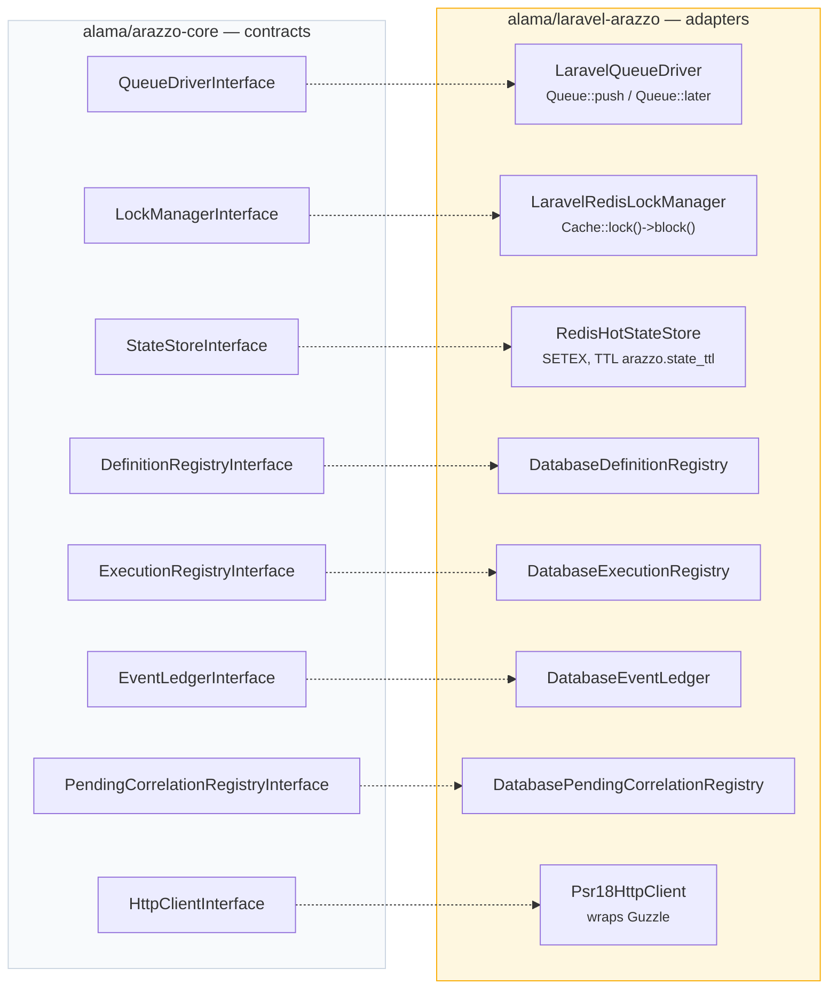
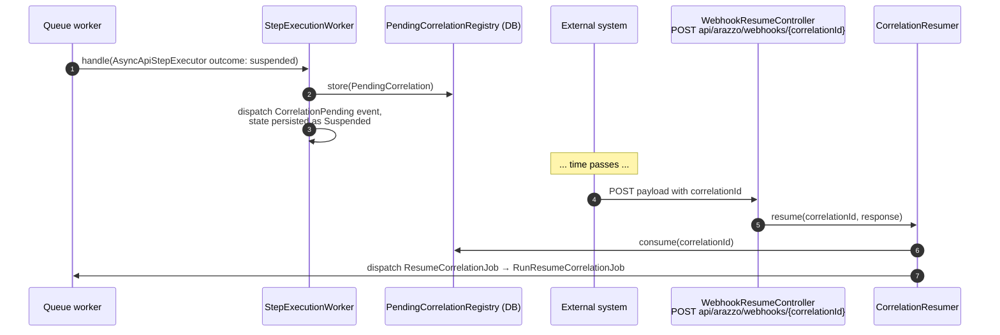

# 06 — Laravel Integration

## Purpose

Technical deep-dive into the Laravel bridge internals: how workflows are dispatched onto Laravel's async queues, how cache-based locking keeps concurrent step completions safe, and how the service container wires the core engine's interfaces to Laravel-specific implementations.

## The shape of the bridge

`packages/laravel/src/` mirrors the interfaces core defines, one implementation class per contract:

| Core contract | Laravel implementation | Location |
|---|---|---|
| `QueueDriverInterface` | `LaravelQueueDriver` | `Queue/LaravelQueueDriver.php` |
| `LockManagerInterface` | `LaravelRedisLockManager` | `Lock/LaravelRedisLockManager.php` |
| `StateStoreInterface` | `RedisHotStateStore` | `State/RedisHotStateStore.php` |
| `DefinitionRegistryInterface` | `DatabaseDefinitionRegistry` | `Persistence/DatabaseDefinitionRegistry.php` |
| `ExecutionRegistryInterface` | `DatabaseExecutionRegistry` | `Persistence/DatabaseExecutionRegistry.php` |
| `EventLedgerInterface` | `DatabaseEventLedger` | `Persistence/DatabaseEventLedger.php` |
| `PendingCorrelationRegistryInterface` | `DatabasePendingCorrelationRegistry` | `Persistence/DatabasePendingCorrelationRegistry.php` |
| `HttpClientInterface` | `Psr18HttpClient` (wraps Guzzle) | `Http/Psr18HttpClient.php` |

All wiring happens in exactly one place: `LaravelArazzoServiceProvider::packageRegistered()`.



The full live contract→implementation map is generated from source on every commit into [`docs/generated/contracts.md`](../generated/contracts.md).

## Dispatching workflows to Laravel's async queues

The queue boundary in `core` is a single job type, `Runner\Jobs\ExecuteStepJob` — a plain data carrier (a `Step` + a `WorkflowContext`), *not* itself a Laravel queueable job. `LaravelQueueDriver::dispatch()` is the adapter that bridges the two:

```php
class LaravelQueueDriver implements QueueDriverInterface
{
    public function dispatch(object $job, int $delaySeconds = 0): void
    {
        $wrapped = match (true) {
            $job instanceof ExecuteStepJob => new RunExecuteStepJob($job),
            $job instanceof ResumeCorrelationJob => new RunResumeCorrelationJob($job),
            default => $job,
        };

        if ($delaySeconds > 0) {
            Queue::later(now()->addSeconds($delaySeconds), $wrapped);
        } else {
            Queue::push($wrapped);
        }
    }
}
```

It pattern-matches the core job type and wraps it in a real `Illuminate\Contracts\Queue\ShouldQueue` job (`RunExecuteStepJob` / `RunResumeCorrelationJob`, under `Queue/Jobs/`), which uses the standard `Dispatchable`/`InteractsWithQueue`/`Queueable`/`SerializesModels` traits so it behaves like any other Laravel queued job (retries, backoff, failure handling all follow Laravel's normal queue configuration). `$delaySeconds > 0` — set by `WorkflowEngine`'s retry transitions honoring `retryAfter` — becomes `Queue::later()`; otherwise it's an immediate `Queue::push()`.

`RunExecuteStepJob::handle()` is intentionally thin — it just unwraps and forwards to the real logic:

```mermaid
sequenceDiagram
    autonumber
    participant APP as App code (Arazzo facade / Engine)
    participant QD as LaravelQueueDriver
    participant LQ as Laravel Queue
    participant WJ as RunExecuteStepJob (worker proc)
    participant SEW as StepExecutionWorker
    participant LM as LockManager (Redis)
    participant SS as StateStore (Redis)

    APP->>QD: dispatch(ExecuteStepJob)
    QD->>LQ: Queue::push(RunExecuteStepJob)<br/>or Queue::later(delay)
    Note over LQ: job may sit behind other work;<br/>siblings of the same DAG branch run concurrently
    LQ->>WJ: handle()
    WJ->>SEW: handle(inner ExecuteStepJob)
    SEW->>LM: acquire("execution_lock_{id}", 30s, block 5s)
    SEW->>SS: load(executionId) → reconcile state
    SEW->>SEW: skip if step already Succeeded (idempotency)
    SEW->>SEW: findExecutor() → SubWorkflow | Http | AsyncApi
    SEW->>SS: save(new ExecutionState)
    SEW-->>QD: next ExecuteStepJob(s) via QueueDriverInterface
```

```php
public function handle(StepExecutionWorker $worker): void
{
    $worker->handle($this->inner);
}
```

`$worker` is resolved from the container per-job, so `StepExecutionWorker` (and everything it depends on — lock manager, state store, registries, protocol executors) is constructed fresh for each queue worker process, following Laravel's normal job-resolution lifecycle. `RunExecuteStepJob` also promotes `definitionId`/`workflowId`/`executionId` to public properties purely so they're visible in queue monitoring/dashboards without deserializing the full inner job.

## Cache-based state locking

Two distinct concerns are both backed by Redis, but through different abstractions and for different reasons:

### Coordination lock: `LaravelRedisLockManager`

```php
class LaravelRedisLockManager implements LockManagerInterface
{
    public function acquire(string $key, int $ttlSeconds, callable $callback): mixed
    {
        return Cache::lock($key, $ttlSeconds)->block(5, $callback);
    }
}
```

This is Laravel's standard atomic cache lock (`Cache::lock()`, which uses Redis's `SET ... NX PX` under a Redis cache driver), not a bespoke implementation. `StepExecutionWorker::handle()` acquires `"execution_lock_{$executionId}"` with a 30-second TTL and blocks up to 5 seconds waiting for it before giving up — this is the mechanism described in doc 03 that keeps concurrent step completions for the *same* execution from racing on shared `ExecutionState`. The lock's *scope* is deliberately narrow: one execution's lock never blocks a different execution's steps, so independent workflow runs (and independent DAG branches, once dispatched — doc 03) still process in parallel across workers.

### Durable state: `RedisHotStateStore`

```php
class RedisHotStateStore implements StateStoreInterface
{
    public function save(string $executionId, array $state, ?int $ttlSeconds = null): void {
        $this->redis->connection()->setex($this->prefix . $executionId, $ttl, json_encode($state));
    }
    public function load(string $executionId): ?array {
        $data = $this->redis->connection()->get($this->prefix . $executionId);
        return $data ? json_decode($data, true) : null;
    }
}
```

This is a separate concern from locking: it's where `ExecutionState::toArray()`/`fromArray()` (doc 02) actually lives between step executions, keyed `"arazzo:state:{$executionId}"` with a TTL (default `86400`s, configurable via `arazzo.state_ttl`). It goes through the `Illuminate\Contracts\Redis\Factory`, not the generic `Cache` facade — a direct Redis connection, since the state payload benefits from Redis's `SETEX` semantics without going through the cache-tagging/serialization layer `Cache::put()` would add. Note this store is explicitly "hot" (fast, TTL-bounded) state — the durable historical record of what happened during a run lives in the database via `EventLedgerInterface`/`ExecutionRegistryInterface`, not here.

## Service container bindings and dependency injection strategy

`LaravelArazzoServiceProvider` extends Spatie's `PackageServiceProvider` (`spatie/laravel-package-tools`), which gives it config publishing, migrations, and package registration scaffolding via `configurePackage()`:

```php
public function configurePackage(Package $package): void
{
    $package->name('laravel-arazzo')
        ->hasConfigFile('arazzo')
        ->hasMigrations([
            'create_arazzo_definitions_table',
            'create_arazzo_executions_table',
            'create_arazzo_events_table',
            'update_arazzo_executions_table_add_status',
            'create_arazzo_pending_correlations_table',
        ])
        ->runsMigrations();
}
```

All actual dependency wiring happens in `packageRegistered()`, almost entirely via `$this->app->singleton(...)`. A few patterns worth calling out for contributors adding new bindings:

- **PSR interop first.** `ClientInterface`, `RequestFactoryInterface`, `StreamFactoryInterface` are bound (`bindIf`, so app-level overrides win) to Guzzle's `Client`/`HttpFactory` — everything downstream in `core` depends on the PSR interfaces, never on Guzzle directly.
- **Config-driven construction.** Nearly every binding pulls its tunables from `config('arazzo.*')` — e.g. `strict_schema_validation`, `retry_ceiling`, `state_ttl`, `idempotency.enabled`/`header`, table name overrides (`definitions_table`, `executions_table`, `events_table`, `pending_correlations_table`, `webhook_prefix`). This keeps `core` classes ignorant of Laravel config entirely — the provider reads config and passes plain constructor arguments.
- **Explicit constructor wiring, not autowiring.** Every binding is a closure that manually resolves and passes each dependency (`$app->make(X::class)`) rather than relying on Laravel's reflection-based autowiring. This is deliberate: many `core` classes take interface-typed constructor args with no default implementation Laravel could guess, and some (like `StepExecutionWorker`'s `array $protocolExecutors`) need an explicitly ordered list rather than a single resolved instance.
- **Layered construction mirrors the runtime call graph.** The bindings are declared in dependency order matching doc 02's execution lifecycle: PSR HTTP → event dispatcher → `SourceResolver` (doc 05) → `ExpressionResolverInterface` (doc 04, bundling `ArazzoOutputExtractor` + `ArazzoCriteriaEvaluator` + `ArazzoSchemaValidator`) → `StepExecutor`/`WorkflowExecutor` → persistence (`StateStoreInterface`, `EventLedgerInterface`, `DefinitionRegistryInterface`, `ExecutionRegistryInterface`) → queue/lock infra → `Engine`/`WorkflowEngine` → async-control-flow pieces (`PendingCorrelationRegistryInterface`, `SelectorEvaluator`, `SubWorkflowInvoker`) → the top-level `StepOutcomeHandler` and `StepExecutionWorker`, which pull nearly everything else together.
- **Protocol executors are assembled as an ordered array**, not auto-discovered:
  ```php
  [
      $app->make(SubWorkflowStepExecutor::class),
      $app->make(HttpStepExecutor::class),
      $app->make(AsyncApiStepExecutor::class),
  ]
  ```
  `StepExecutionWorker::findExecutor()` (doc 02) tries each in this order and picks the first whose `supports()` returns true — so if you add a new `StepProtocolExecutorInterface` implementation, it must be added to this array in the provider, and its position relative to the existing three matters if `supports()` checks could ever overlap.
- **Legacy alias shim.** `register()` conditionally uses Laravel's `AliasLoader` (or `class_alias()` as a fallback for non-facade/testing environments) to keep the old `Alama\LaravelArazzo\...` namespace resolvable after a package rename to `Alama\Arazzo\Laravel\...` — a pattern to be aware of if you're renaming any other public-facing class in the bridge.

## HTTP and route surface

The suspend/resume loop for AsyncAPI receive-steps is what ties the webhook route to the engine's correlation machinery:



`packageBooted()` registers a `GET /arazzo-builder` view route (`web` middleware) and, under `config('arazzo.webhook_prefix', 'api/arazzo')` with `api` middleware: `GET /endpoints` and `POST /generate` (`ArazzoApiController`, tooling for the builder UI and AI-assisted generation via `ArazzoGenerator`/`OpenAiClient`), and `POST /webhooks/{correlationId}` (`WebhookResumeController`) — the external entry point that lets an outside system resume a workflow suspended on an AsyncAPI "receive" step by supplying the awaited correlation ID (feeding into `CorrelationResumer`, doc 02).

## Extending the bridge

When adding new Laravel-specific infrastructure:

1. Define (or reuse) the contract in `core` under the relevant `Contracts/` namespace — never depend on Laravel classes from `core`.
2. Implement it under the matching `packages/laravel/src/<Area>/` directory.
3. Bind it in `LaravelArazzoServiceProvider::packageRegistered()`, in the same dependency-ordered position as its consumers expect, pulling any tunables from `config('arazzo.*')`.
4. If it needs a database table, add a migration and register it in `configurePackage()`'s `hasMigrations()` list.
