# Architecture Docs

Hand-authored deep-dives with embedded mermaid diagrams, plus machine-generated diagrams refreshed from the live source tree **before every commit** (see `.githooks/pre-commit`, or run `composer docs` manually).

```mermaid
flowchart TD
    README["README (you are here)"] --> D01["01 — System Overview<br/><small>packages, modules, glossary</small>"]
    README --> D02["02 — Execution Lifecycle<br/><small>file → run → transition loop</small>"]
    README --> D03["03 — Dependency Graph<br/><small>dependsOn → DAG → fan-out</small>"]
    README --> D04["04 — Expression Evaluation<br/><small>lexer/parser/AST, selectors</small>"]
    README --> D05["05 — Source Resolution<br/><small>fetchers, registry, OpenAPI path</small>"]
    README --> D06["06 — Laravel Integration<br/><small>queues, locks, webhooks</small>"]

    GEN["docs/generated/<br/><small>auto-refreshed per commit</small>"] -.-> G1["namespace-graph.md"]
    GEN -.-> G2["document-model.md"]
    GEN -.-> G3["contracts.md"]
    GEN -.-> G4["events.md"]
    GEN -.-> G5["validator-rules.md"]
    GEN -.-> G6["exceptions.md"]
    GEN -.-> G7["expression-ast.md"]
    GEN -.-> G8["database-schema.md"]

    style README fill:#e8f0fe,stroke:#4285f4;
    style GEN fill:#fef7e0,stroke:#f9ab00;
```

| Doc | Topic |
|---|---|
| [01 — System Overview](./01-system-overview.md) | What Arazzo is, monorepo layout, module map, vocabulary |
| [02 — Execution Lifecycle](./02-execution-lifecycle.md) | Loader → Parser → Context → step loop → Transition; state machines |
| [03 — Dependency Graph](./03-dependency-graph.md) | Explicit + implicit deps, topological sort, runnable-step analysis |
| [04 — Expression Evaluation](./04-expression-evaluation.md) | Runtime expressions, JSONPath/XPath selectors, condition sub-language |
| [05 — Source Resolution](./05-source-resolution.md) | sourceDescriptions fetching, caching, cycle guard, OpenAPI normalization |
| [06 — Laravel Integration](./06-laravel-integration.md) | Ports & adapters, queue jobs, Redis state, webhook resume |

## Generated docs

These are **never edited by hand** — they are regenerated by `php scripts/generate-docs.php` on every commit:

- [`docs/generated/namespace-graph.md`](../generated/namespace-graph.md) — cross-module dependency graph of both packages
- [`docs/generated/document-model.md`](../generated/document-model.md) — `Spec\` value-object composition tree + enums
- [`docs/generated/contracts.md`](../generated/contracts.md) — every interface and its implementations (ports & adapters)
- [`docs/generated/events.md`](../generated/events.md) — domain events and their dispatch sites
- [`docs/generated/validator-rules.md`](../generated/validator-rules.md) — all conformance rules, grouped by document area
- [`docs/generated/exceptions.md`](../generated/exceptions.md) — exception inheritance tree per module
- [`docs/generated/expression-ast.md`](../generated/expression-ast.md) — expression AST node hierarchy
- [`docs/generated/database-schema.md`](../generated/database-schema.md) — ER diagram of the Laravel persistence tables
