# Arazzo Database Schema

This documents the normalized relational schema for `alama/laravel-arazzo` persistence: the
shipped execution/event/definition tables, plus a proposed normalized index over the Arazzo
document structure itself.

## Architecture principle: `raw_document` stays the source of truth

`arazzo_definitions.raw_document` (the verbatim `ArazzoDocument::$rawRoot`, exactly what
`Parser::parse()` was fed) is **not replaced** by the tables below — that decision was made
deliberately in the shipped CQRS design specifically so `register()`/`get()` both terminate at
one validated parse path with no second hand-rolled serializer to drift out of sync as the DTO
tree gains fields. Everything else in this schema is a **derived index**: written in the same
DB transaction as `register()`, always rebuildable from `raw_document` alone if it ever drifts,
existing purely to give reporting/UI layers (Filament, etc.) real joinable, indexed, FK-backed
tables instead of querying into JSON.

## Versioning

- **Document/workflow versioning**: every distinct content change to a document (by
  `document_identity` + `content_hash`) is a new, immutable `arazzo_definitions` row.
  `version_number` is sequential per `document_identity` (1, 2, 3, ...); `is_current` marks
  exactly one row per `document_identity` as the latest, so "give me the current version of
  workflow X" is a direct indexed lookup instead of a `MAX(created_at)` subquery every time.
  Version history of a document is simply every row sharing its `document_identity`, ordered by
  `version_number`.
- **Execution versioning**: `arazzo_executions.definition_id` + `workflow_row_id` together pin a
  run to the *exact* definition version and normalized workflow it executed against —
  permanently, even after newer versions are later registered. This is what makes a past
  execution's audit trail reproducible: re-fetching `definition_id` always returns the same
  content, never "whatever is current now."
- **Execution concurrency**: `arazzo_executions.state_version` is an optimistic-lock counter
  incremented on every state write. The async engine dispatches step jobs across queue workers
  that can race on the same execution row; this catches lost-update races without a DB-level
  lock held across a job's HTTP call.

## Execution event log normalization

`arazzo_events` currently stores every event as `(execution_id, event_type, payload JSON, created_at)`
— same blob problem as `raw_document`, but with an important difference: unlike the Arazzo
document's genuinely open-ended expression trees, there are exactly **9 closed event types**
(`RunStarted`, `RunCompleted`, `RunFailed`, `StepStarted`, `StepExecuted`, `StepRetried`,
`StepFailed`, `CorrelationPending`, `CorrelationResumed` — see `packages/core/src/Events/*.php`),
each a `final readonly class` with a fixed, known set of properties. That closed shape makes this
far more tractable to normalize than the document was.

**Single widened table, not one child table per event type.** The obvious "proper" normalization
is a base `arazzo_events` row plus 9 per-event-type detail tables (class-table-inheritance style).
I'm deliberately not proposing that, because of a constraint the *existing* migration already
documents: on Postgres, `arazzo_events` is `PARTITION BY RANGE (created_at)`, which forces a
composite primary key `(id, created_at)` — and the migration's own comment notes "a partitioned
table can't carry a single-column FK." A child table keyed on `arazzo_events.id` alone hits that
same wall on Postgres. Rather than reintroduce it, every event's fields — across all 9 types —
are promoted directly onto the one base row as nullable typed columns (standard single-table
inheritance for a closed, small set of subtypes). This also keeps "every event for execution X,
in order" — the actual query the ledger UI needs constantly — a single-table scan with no joins.

**Three things the current shipped shape is missing, found by reading the event DTOs against what
`LedgerAppendingListener` actually persists:**
- Every event carries its own `$at: DateTimeImmutable` (when the domain event happened), but only
  `created_at` (when the DB row was inserted) is stored today. Under queue latency these can
  differ by more than a rounding error — added as a separate `occurred_at` column so
  step-duration reporting (`step.executed.occurred_at - step.started.occurred_at`) is accurate
  even if the ledger write itself was delayed.
- `workflow_id` isn't stored on `arazzo_events` at all today (only `execution_id`) — added as a
  denormalized column so "all `step.failed` events for workflow X" doesn't require a join back to
  `arazzo_executions` for what will be one of the most common Filament queries.
- Strict event sequencing: `sequence_number` (unique per `execution_id`) is added to guarantee strict linear append ordering and prevent race conditions when multiple async workers append events simultaneously. This mirrors `durable-workflow`'s event history design.

`inputs`/`outputs` stay as JSON columns (only populated on the event types that carry them) for
the same reason `arazzo_definitions`/`arazzo_request_bodies` values do — they're workflow-defined
dynamic maps, not fixed Arazzo structure.

## Spec-completeness gaps found against the official Arazzo spec

Checked the schema against the actual [Arazzo Specification v1.0.1](https://spec.openapis.org/arazzo/v1.0.1.html) fixed-fields tables (not just this codebase's DTOs) and found real gaps:

**`Info` object was under-modeled.** The spec's Info Object has `title`, `summary`, `description`,
`version` — all four required/optional per spec, but `arazzo_definitions` only captured `title`
(as `document_identity`). `summary` and `description` weren't stored anywhere structured. Added.

**`$self` and the `arazzo` version string weren't columns.** Both already exist on
`ArazzoDocument` (`$self` since 1.1.0, `arazzo` always) but were only reachable by parsing
`raw_document` JSON. "Give me every definition still on Arazzo 1.0.x" is a real migration-planning
query that shouldn't need a JSON parse. Added `spec_version` and `self_uri`.

**Root-level `x-` extensions had no column at all.** Section 4.8 of the spec confirms `x-`
extensions are allowed on *every* object (root, Info, SourceDescription, Workflow, Step,
Parameter, SuccessAction, FailureAction, Components, Criterion, RequestBody, PayloadReplacement)
— this is the "not a rigid standard" part: the spec is deliberately open at every level. This
codebase's `Parser::parse()` only actually captures the **root-level** ones today
(`ArazzoDocument::$specificationExtensions`, via a single `array_filter` over the document root —
see `Parser.php`'s `parse()` method), so that's the only level with real data to persist. Added
`specification_extensions json` to `arazzo_definitions` for exactly that root-level bag.

**Nested-level extensions (Workflow/Step/Parameter/etc.) were a real gap, but not a DB-schema
gap — a parser gap. Now partially closed by the custom step handlers below.**
`Parser::parseWorkflow()`, `parseStep()`, etc. never collect `x-` keys at those levels (Step only
special-cased the three named ones: `x-strict-validation`, `x-idempotency-key`,
`x-idempotency-header`). The custom-step-handlers feature (below) is itself a Step-level `x-`
extension (`x-handler`/`x-before-handlers`/`x-after-handlers`), so implementing it requires
extending `Parser::parseStep()` to capture those three specific nested keys — not full generic
nested-extension capture (any *other* `x-` field on a Workflow/Step remains dropped; that's still
open).

**Reusable parameters aren't modeled — and aren't parsed either.** The spec is explicit:
`Workflow.parameters` and `Step.parameters` are both typed `[Parameter Object | Reusable
Object]` — a parameter can be a full inline definition *or* a `{reference, value?}` pointer into
`components.parameters`. `arazzo_parameters` only modeled the inline case. Same finding as above,
two layers deep: `Parser::parseParameter()` requires `name` unconditionally and never checks for
a `reference` key the way `parseSuccessAction()`/`parseFailureAction()` do — so today, a Reusable
Parameter in an Arazzo document would actually throw a `ParserException::missingField` for
`name`, not silently drop. That's a real spec-compliance bug in the parser worth its own fix,
separate from this schema. The schema change here (`is_reusable_ref` + `reusable_reference`) is
forward-looking: it's ready for when the parser supports it, matching the same pattern already
used for actions.

**Missing uniqueness constraints the spec actually mandates (MUST / MUST NOT language):**
- `sourceDescriptions[].name` — "a unique name" → `UNIQUE (definition_id, name)`.
- `workflowId` — "MUST be unique amongst all workflows described in the Arazzo Description" →
  `UNIQUE (definition_id, workflow_id)`.
- `stepId` — "MUST be unique amongst all steps described in the workflow" →
  `UNIQUE (workflow_row_id, step_id)`.
- Workflow/Step `parameters`, `successActions`, `failureActions` — "list MUST NOT include
  duplicate [X]" (by name) → `UNIQUE (owner_type, owner_id, name)` on `arazzo_parameters` and
  `arazzo_actions`.

All four are noted directly on the relevant tables below.

**Confirmed, not a gap:** `Workflow.dependsOn` is a genuine spec field (§4.6.4.1 — "a list of
workflows that MUST be completed before this workflow can be processed"), not a codebase-only
addition as I'd assumed without checking — `arazzo_workflow_dependencies` was already correct.

## Custom step handlers (framework-extensible steps)

A step's target is normally `operationId` | `operationPath` | `workflowId` (all HTTP/sub-workflow,
all part of the official spec). This schema adds a 4th, non-standard target — a custom class
**resolved by the consuming framework, not by core** — riding on the spec's own `x-` extension
mechanism (`x-handler` on a Step is a legitimate, spec-permitted extension point; it just isn't
something any tooling defines behavior for out of the box). This is the "more like Drupal
workflows" direction: the workflow definition stays declarative, the actual behavior lives in
framework-registered code, discovered/resolved by ID rather than hardcoded into the definition —
same shape as Drupal's Plugin API (annotated/attributed classes, a Plugin Manager, referenced by
plugin ID from config), just framework-agnostic at the core-contract level.

Two distinct capabilities, deliberately kept separate:

- **Standalone handler** (`x-handler`) — replaces the HTTP call entirely. `StepExecutor` invokes
  the resolved class's `handle()` directly instead of compiling/sending a request; its return
  value becomes the step's outputs directly. **No `successCriteria`/`$statusCode` involved** —
  there's no HTTP response to evaluate against, so a handler step is considered successful unless
  `handle()` throws. Mutually exclusive with `operationId`/`operationPath`/`workflowId`.
- **Before/after hooks** (`x-before-handlers` / `x-after-handlers`) — wrap the *existing* HTTP
  dispatch on an `operationId`/`operationPath` step: a before-hook can mutate the compiled request
  (custom signing, etc.) before it's sent; an after-hook can transform the response before output
  extraction. Scoped to HTTP-target steps only for v1 — hooking a `workflowId` call or a
  standalone handler call is a real future extension, not designed here. Multiple hooks per phase
  run in order (`sort_order`).

**Resolution is framework-owned.** `handler_type` names a resolution strategy (`'class'` for a
raw FQCN resolved via a DI container — Laravel's binding — `'plugin'` for a Drupal-style
plugin-manager lookup by ID, `'service'` for a Symfony service alias); `handler_id` is the
identifier under that strategy's namespace. Core only defines the contract
(`StepHandlerResolverInterface`, with `NullStepHandlerResolver` as the default no-op binding,
matching the `NullLicenseVerifier`/`NullMetricsRecorder` pattern already established); it never
interprets `handler_id` itself — that's entirely the bridge's job.

**Handler arguments reuse the existing `Parameter` shape** (`arazzo_parameters` with
`owner_type = 'step_handler'`, `owner_id` = the `arazzo_step_handlers.id` row) rather than
inventing a separate config format — same expression-resolution machinery (inputs, prior step
outputs) a handler class gets access to, no new "value" representation needed.

**Prerequisite this activates, not defers:** as noted above, `Parser::parseStep()` needs to start
capturing these three specific `x-` keys — a small, scoped extension of the existing three-special-case
pattern already used for `x-strict-validation`/`x-idempotency-key`/`x-idempotency-header`, not a
generic nested-extension-capture rewrite.

## Open scoping decision

`Components` (the document-level reusable pool — `$components.successActions.*` etc.) is kept as
JSON on `arazzo_definitions` for v1 rather than normalized with the same polymorphic
`owner_type`/`owner_id` shape used below. It's referenced by pointer rather than inlined, and
normalizing it would roughly double the `owner_type` cases on `arazzo_actions`/`arazzo_parameters`
for something used far less often than inline definitions. Revisit if reusable-component browsing
becomes a real UI need.

## Diagram

```mermaid
erDiagram
    ARAZZO_DEFINITIONS ||--o{ ARAZZO_SOURCE_DESCRIPTIONS : "definition_id"
    ARAZZO_DEFINITIONS ||--o{ ARAZZO_WORKFLOWS : "definition_id"
    ARAZZO_DEFINITIONS ||--o{ ARAZZO_EXECUTIONS : "definition_id (exact version run)"

    ARAZZO_WORKFLOWS ||--o{ ARAZZO_WORKFLOW_DEPENDENCIES : "workflow_row_id"
    ARAZZO_WORKFLOWS ||--o{ ARAZZO_STEPS : "workflow_row_id"
    ARAZZO_WORKFLOWS ||--o{ ARAZZO_ACTIONS : "owner_id (workflow_success/failure)"
    ARAZZO_WORKFLOWS ||--o{ ARAZZO_VALUES : "owner_id (workflow_output)"
    ARAZZO_WORKFLOWS ||--o{ ARAZZO_EXECUTIONS : "workflow_row_id (exact workflow run)"

    ARAZZO_STEPS ||--o{ ARAZZO_STEP_DEPENDENCIES : "step_row_id"
    ARAZZO_STEPS ||--o{ ARAZZO_PARAMETERS : "owner_id (step)"
    ARAZZO_STEPS ||--o| ARAZZO_REQUEST_BODIES : "step_row_id"
    ARAZZO_STEPS ||--o{ ARAZZO_SUCCESS_CRITERIA : "owner_id (step)"
    ARAZZO_STEPS ||--o{ ARAZZO_VALUES : "owner_id (step_output)"
    ARAZZO_STEPS ||--o{ ARAZZO_ACTIONS : "owner_id (step_success/failure)"
    ARAZZO_STEPS ||--o{ ARAZZO_STEP_HANDLERS : "step_row_id"

    ARAZZO_STEP_HANDLERS ||--o{ ARAZZO_PARAMETERS : "owner_id (step_handler)"

    ARAZZO_REQUEST_BODIES ||--o{ ARAZZO_PAYLOAD_REPLACEMENTS : "request_body_id"

    ARAZZO_ACTIONS ||--o{ ARAZZO_SUCCESS_CRITERIA : "owner_id (action)"
    ARAZZO_ACTIONS ||--o{ ARAZZO_VALUES : "owner_id (action_parameter, invoke only)"

    ARAZZO_EXECUTIONS ||--o{ ARAZZO_EVENTS : "execution_id"
    ARAZZO_EXECUTIONS ||--o{ ARAZZO_PENDING_CORRELATIONS : "execution_id"

    ARAZZO_DEFINITIONS {
        string id PK "ULID"
        string document_identity "e.g. info.title"
        string content_hash "sha256 of sorted-key raw_document"
        int version_number "sequential per document_identity"
        boolean is_current "exactly one true per document_identity"
        string spec_version "arazzo field, e.g. 1.0.1, 1.1.0"
        string self_uri "nullable -- $self, 1.1.0+"
        string summary "nullable -- info.summary"
        text description "nullable -- info.description"
        json specification_extensions "nullable -- root-level x- fields"
        json raw_document "SOURCE OF TRUTH -- ArazzoDocument::rawRoot verbatim"
        timestamp created_at
    }

    ARAZZO_SOURCE_DESCRIPTIONS {
        bigint id PK
        string definition_id FK
        string name "UK with definition_id -- spec: name MUST be unique"
        string url
        string type "openapi | arazzo | asyncapi"
    }

    ARAZZO_WORKFLOWS {
        bigint id PK
        string definition_id FK
        string workflow_id "UK with definition_id -- spec: workflowId MUST be unique"
        string summary
        text description
        json inputs_schema "JSON Schema -- kept as JSON"
        smallint sort_order
    }

    ARAZZO_WORKFLOW_DEPENDENCIES {
        bigint id PK
        bigint workflow_row_id FK
        string depends_on_workflow_id
    }

    ARAZZO_STEPS {
        bigint id PK
        bigint workflow_row_id FK
        string step_id "UK with workflow_row_id -- spec: stepId MUST be unique"
        smallint sort_order
        text description
        string operation_id
        string operation_path
        string sub_workflow_id "invoke-a-workflow steps"
        string action "asyncapi: send | receive"
        string channel_path
        string correlation_id_expr
        boolean strict_validation
        boolean idempotency_key
        string idempotency_header
    }

    ARAZZO_STEP_DEPENDENCIES {
        bigint id PK
        bigint step_row_id FK
        string depends_on_step_id
    }

    ARAZZO_STEP_HANDLERS {
        bigint id PK
        bigint step_row_id FK
        string phase "standalone | before | after"
        smallint sort_order "ordering among multiple before/after hooks; always 0 for standalone"
        string handler_type "'class' | 'plugin' | 'service' -- resolution strategy, framework-defined"
        string handler_id "FQCN, plugin id, or service alias -- meaning is bridge-specific"
    }

    ARAZZO_PARAMETERS {
        bigint id PK
        string owner_type "step | workflow | component | step_handler (polymorphic, no DB FK)"
        bigint owner_id
        string name "UK with (owner_type, owner_id) -- spec: no duplicate names"
        string param_in "path|query|header|cookie|body|querystring, nullable -- null for step_handler owner"
        smallint sort_order
        boolean is_reusable_ref "true when this is a Reusable Object, not inline Parameter"
        string reusable_reference "'$components.parameters.x' -- set when is_reusable_ref=true"
        string value_kind "expression | selector | literal -- required unless is_reusable_ref (spec: Reusable.value is an optional override)"
        text value_expression "raw '{$...}' string when kind=expression"
        json value_selector "{context,selector,type,version} when kind=selector"
        json value_literal "scalar/array/object when kind=literal"
    }

    ARAZZO_REQUEST_BODIES {
        bigint id PK
        bigint step_row_id FK "unique -- one per step"
        string content_type
        string value_kind
        text value_expression
        json value_selector
        json value_literal "templated payload object -- kept as JSON"
    }

    ARAZZO_PAYLOAD_REPLACEMENTS {
        bigint id PK
        bigint request_body_id FK
        string target "JSON Pointer"
        string value_kind
        text value_expression
        json value_selector
        json value_literal
    }

    ARAZZO_SUCCESS_CRITERIA {
        bigint id PK
        string owner_type "step | action (polymorphic, no DB FK)"
        bigint owner_id
        smallint sort_order
        string context
        text condition
        string criterion_type "simple|regex|jsonpath|xpath, nullable"
        string version
    }

    ARAZZO_VALUES {
        bigint id PK
        string owner_type "step_output | workflow_output | action_parameter (polymorphic)"
        bigint owner_id
        string name
        string value_kind
        text value_expression
        json value_selector
        json value_literal
    }

    ARAZZO_ACTIONS {
        bigint id PK
        string owner_type "workflow_success | workflow_failure | step_success | step_failure"
        bigint owner_id
        smallint sort_order
        string name "UK with (owner_type, owner_id) -- spec: no duplicate action names"
        string action_type "goto|end|retry|invoke, null if reusable_reference set"
        string target_step_id
        string target_workflow_id
        int retry_after
        int retry_limit
        string invoke_version
        string reusable_reference "'$components.successActions.x' -- mutually exclusive w/ action_type"
        json reusable_value
    }

    ARAZZO_EXECUTIONS {
        string id PK "ULID = executionId"
        string definition_id FK "pins EXACT definition version -- immutable"
        bigint workflow_row_id FK "pins EXACT normalized workflow within that version"
        string workflow_id "spec workflowId, kept for quick display"
        string status "running | succeeded | failed"
        int state_version "optimistic lock, incremented on every state write"
        timestamp deadline_at "nullable -- SLA monitoring"
        timestamp completed_at
        timestamp archived_at "nullable -- cold storage offloading"
        timestamp created_at
        timestamp updated_at
    }

    ARAZZO_EVENTS {
        bigint id PK "composite (id, created_at) on pgsql -- see notes"
        string execution_id FK "no enforced FK on pgsql partitioned path, matches existing precedent"
        int sequence_number "UK with execution_id -- strict linear append order"
        string workflow_id "denormalized -- avoids join to executions for the common case"
        string step_id "nullable -- null for run.* events"
        string event_type "run.started|run.completed|run.failed|step.started|step.executed|step.retried|step.failed|correlation.pending|correlation.resumed"
        int attempt "nullable -- step.started, step.retried"
        int status_code "nullable -- step.executed"
        boolean criteria_met "nullable -- step.executed"
        string correlation_id "nullable -- correlation.pending, correlation.resumed"
        string channel_path "nullable -- correlation.pending"
        string error_class "nullable -- run.failed, step.failed, step.retried"
        text error_message "nullable -- same as above"
        json inputs "nullable -- run.started only"
        json outputs "nullable -- run.completed, step.executed"
        timestamp occurred_at "the event's own $at -- when it actually happened"
        timestamp created_at "DB insert time, partition key on pgsql"
    }

    ARAZZO_PENDING_CORRELATIONS {
        bigint id PK
        string correlation_id UK
        string execution_id FK
        string step_id
        string channel_path
        timestamp created_at
    }
```

## Notes on polymorphic tables

`ARAZZO_PARAMETERS`, `ARAZZO_SUCCESS_CRITERIA`, `ARAZZO_VALUES`, and `ARAZZO_ACTIONS` use an
`owner_type` + `owner_id` pair rather than a single dedicated foreign key, because each of these
shapes is legitimately reused across more than one parent in the Arazzo spec itself (e.g. a
`SuccessCriterion` list appears on both `Step` and every action type; a value can be a step
output, a workflow output, or an invoke-action parameter). The relationship lines in the diagram
above show the *logical* parent-child relationships for readability; they are **not** enforced by
a single database foreign key constraint the way `ARAZZO_STEPS.workflow_row_id` is. Application
code (the `register()` transaction) is responsible for `owner_id` referential correctness, and a
composite index on `(owner_type, owner_id)` should back every one of these tables.

## Already-shipped tables, unchanged in shape

`ARAZZO_PENDING_CORRELATIONS` is shown as-is from the current migration — it's operational state
(actively queried by `correlation_id` to resume a workflow), not an audit-log entry, so it stays
separate from the events normalization above. `ARAZZO_DEFINITIONS` and `ARAZZO_EXECUTIONS` are
shown with their current shipped columns plus the new versioning + spec-completeness columns
proposed above — everything else on those two tables is unchanged from what's live today.
`ARAZZO_EVENTS` **is** changed from its shipped shape — see "Execution event log normalization"
above for what and why.
