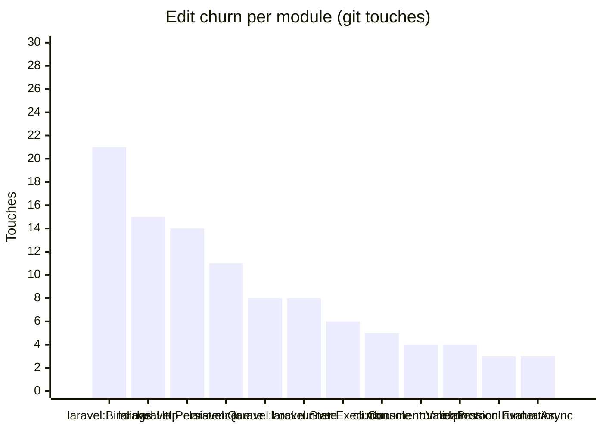

<!-- GENERATED by scripts/generate-docs.php — DO NOT EDIT.
     Refreshed automatically on every commit (see .githooks/pre-commit). -->

# Generated: Churn Hotspots

Where edit pressure lands. **Touches** = number of times a module's src files
appear in `git log` commits (full history, deterministic per HEAD). The
hotspot score normalizes churn by size: high touches-per-KLOC means a module
is edited far more often than its mass justifies — the classic "working in the
same corner every week" signal that static structure graphs cannot show.

Analyzed 144 total file-touches across 37 modules.

| Module | Touches | Share | LOC | Touches/KLOC |
|---|---:|---:|---:|---:|
| `laravel:Bindings` | 21 | 15% | 463 | 45.4 |
| `laravel:Http` | 15 | 10% | 161 | 93.2 |
| `laravel:Persistence` | 14 | 10% | 252 | 55.6 |
| `laravel:Queue` | 11 | 8% | 100 | 110 |
| `laravel:Lock` | 8 | 6% | 49 | 163.3 |
| `laravel:State` | 8 | 6% | 38 | 210.5 |
| `runner:Execution` | 6 | 4% | 3,769 | 1.6 |
| `cli:Console` | 5 | 3% | 754 | 6.6 |
| `document:Validator` | 4 | 3% | 3,092 | 1.3 |
| `runner:Protocol` | 4 | 3% | 545 | 7.3 |
| `expression:Evaluation` | 3 | 2% | 1,211 | 2.5 |
| `runner:Async` | 3 | 2% | 494 | 6.1 |
| `cli:Generator` | 2 | 1% | 105 | 19 |
| `cli:Renderer` | 2 | 1% | 253 | 7.9 |
| `contracts:Dependency` | 2 | 1% | 328 | 6.1 |
| `contracts:Spec` | 2 | 1% | 823 | 2.4 |
| `contracts:Support` | 2 | 1% | 171 | 11.7 |
| `document:Normalizer` | 2 | 1% | 588 | 3.4 |
| `document:Parser` | 2 | 1% | 1,096 | 1.8 |
| `document:Resolver` | 2 | 1% | 370 | 5.4 |
| `expression:Data` | 2 | 1% | 140 | 14.3 |
| `expression:Enum` | 2 | 1% | 42 | 47.6 |
| `laravel:Events` | 2 | 1% | 21 | 95.2 |
| `runner:Events` | 2 | 1% | 295 | 6.8 |
| `runner:Infrastructure` | 2 | 1% | 160 | 12.5 |
| `runner:Jobs` | 2 | 1% | 34 | 58.8 |
| `runner:Policy` | 2 | 1% | 96 | 20.8 |
| `runner:State` | 2 | 1% | 919 | 2.2 |
| `runner:Telemetry` | 2 | 1% | 278 | 7.2 |
| `contracts:Exceptions` | 1 | 1% | 28 | 35.7 |
| `contracts:Interfaces` | 1 | 1% | 116 | 8.6 |
| `contracts:State` | 1 | 1% | 667 | 1.5 |
| `expression:Ast` | 1 | 1% | 194 | 5.2 |
| `expression:Exceptions` | 1 | 1% | 55 | 18.2 |
| `expression:Interfaces` | 1 | 1% | 67 | 14.9 |
| `expression:Xpath` | 1 | 1% | 103 | 9.7 |
| `laravel:Support` | 1 | 1% | 60 | 16.7 |

**Hotspots** (highest touches-per-KLOC with meaningful size/churn): `laravel:Queue` (110), `laravel:Http` (93.2), `laravel:Persistence` (55.6)
