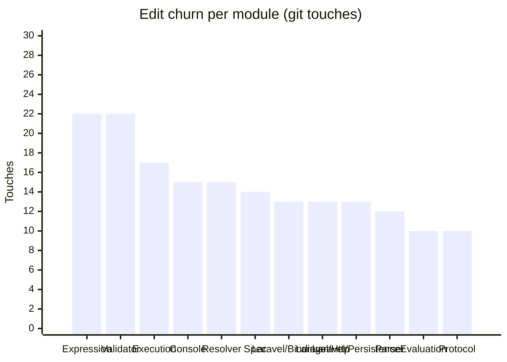

<!-- GENERATED by scripts/generate-docs.php — DO NOT EDIT.
     Refreshed automatically on every commit (see .githooks/pre-commit). -->

# Generated: Churn Hotspots

Where edit pressure lands. **Touches** = number of times a module's src files
appear in `git log` commits (full history, deterministic per HEAD). The
hotspot score normalizes churn by size: high touches-per-KLOC means a module
is edited far more often than its mass justifies — the classic "working in the
same corner every week" signal that static structure graphs cannot show.

Analyzed 264 total file-touches across 29 modules.

| Module | Touches | Share | LOC | Touches/KLOC |
|---|---:|---:|---:|---:|
| `Expression` | 22 | 8% | 1,510 | 14.6 |
| `Validator` | 22 | 8% | 3,154 | 7 |
| `Execution` | 17 | 6% | 4,151 | 4.1 |
| `Console` | 15 | 6% | 791 | 19 |
| `Resolver` | 15 | 6% | 370 | 40.5 |
| `Spec` | 14 | 5% | 823 | 17 |
| `Laravel/Bindings` | 13 | 5% | 451 | 28.8 |
| `Laravel/Http` | 13 | 5% | 161 | 80.7 |
| `Laravel/Persistence` | 13 | 5% | 252 | 51.6 |
| `Parser` | 12 | 5% | 1,096 | 10.9 |
| `Evaluation` | 10 | 4% | 1,159 | 8.6 |
| `Protocol` | 10 | 4% | 562 | 17.8 |
| `State` | 10 | 4% | 944 | 10.6 |
| `Laravel/Queue` | 9 | 3% | 100 | 90 |
| `Async` | 8 | 3% | 507 | 15.8 |
| `Events` | 7 | 3% | 295 | 23.7 |
| `Laravel/Lock` | 7 | 3% | 49 | 142.9 |
| `Laravel/State` | 7 | 3% | 38 | 184.2 |
| `Policy` | 7 | 3% | 96 | 72.9 |
| `Dependency` | 5 | 2% | 328 | 15.2 |
| `Generator` | 5 | 2% | 105 | 47.6 |
| `Jobs` | 5 | 2% | 34 | 147.1 |
| `Normalizer` | 5 | 2% | 588 | 8.5 |
| `Support` | 5 | 2% | 171 | 29.2 |
| `Infrastructure` | 2 | 1% | 160 | 12.5 |
| `Laravel/Events` | 2 | 1% | 21 | 95.2 |
| `Renderer` | 2 | 1% | 253 | 7.9 |
| `Laravel/Support` | 1 | 0% | 60 | 16.7 |
| `Telemetry` | 1 | 0% | 278 | 3.6 |

**Hotspots** (highest touches-per-KLOC with meaningful size/churn): `Laravel/Queue` (90), `Laravel/Http` (80.7), `Laravel/Persistence` (51.6)
