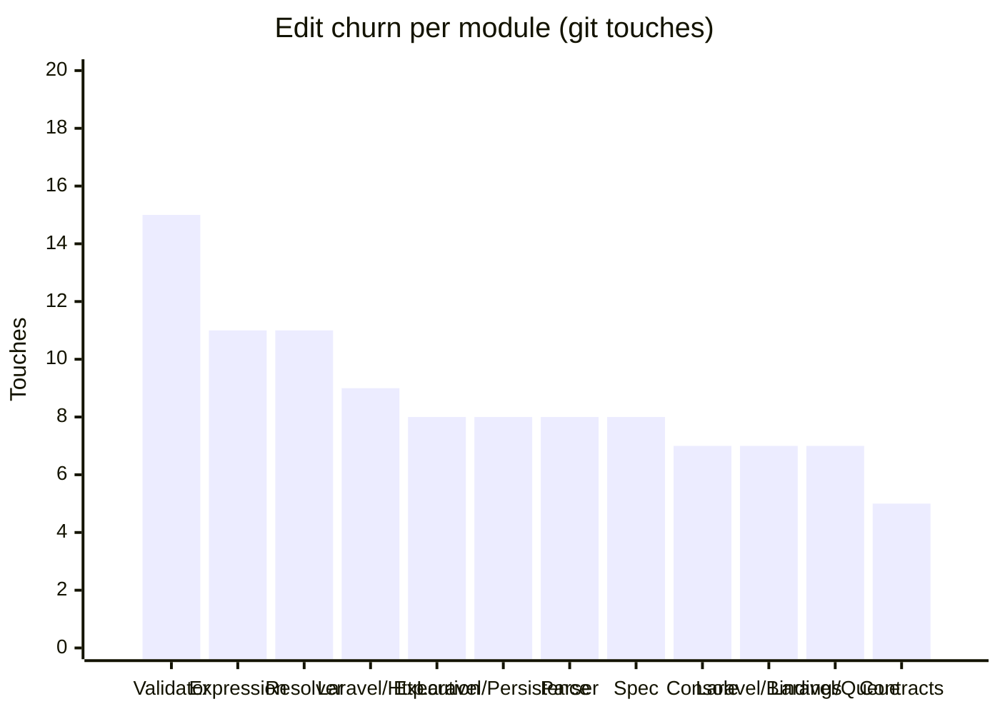

<!-- GENERATED by scripts/generate-docs.php — DO NOT EDIT.
     Refreshed automatically on every commit (see .githooks/pre-commit). -->

# Generated: Churn Hotspots

Where edit pressure lands. **Touches** = number of times a module's src files
appear in `git log` commits (full history, deterministic per HEAD). The
hotspot score normalizes churn by size: high touches-per-KLOC means a module
is edited far more often than its mass justifies — the classic "working in the
same corner every week" signal that static structure graphs cannot show.

Analyzed 147 total file-touches across 30 modules.

| Module | Touches | Share | LOC | Touches/KLOC |
|---|---:|---:|---:|---:|
| `Validator` | 15 | 10% | 3,094 | 4.8 |
| `Expression` | 11 | 7% | 1,346 | 8.2 |
| `Resolver` | 11 | 7% | 549 | 20 |
| `Laravel/Http` | 9 | 6% | 161 | 55.9 |
| `Execution` | 8 | 5% | 3,502 | 2.3 |
| `Laravel/Persistence` | 8 | 5% | 252 | 31.7 |
| `Parser` | 8 | 5% | 1,078 | 7.4 |
| `Spec` | 8 | 5% | 721 | 11.1 |
| `Console` | 7 | 5% | 791 | 8.8 |
| `Laravel/Bindings` | 7 | 5% | 451 | 15.5 |
| `Laravel/Queue` | 7 | 5% | 100 | 70 |
| `Contracts` | 5 | 3% | 512 | 9.8 |
| `Exceptions` | 5 | 3% | 162 | 30.9 |
| `Laravel/Lock` | 5 | 3% | 49 | 102 |
| `Laravel/State` | 5 | 3% | 38 | 131.6 |
| `Support` | 5 | 3% | 263 | 19 |
| `Events` | 4 | 3% | 187 | 21.4 |
| `Generator` | 3 | 2% | 105 | 28.6 |
| `Laravel/Events` | 2 | 1% | 21 | 95.2 |
| `Policy` | 2 | 1% | 96 | 20.8 |
| `Protocol` | 2 | 1% | 557 | 3.6 |
| `Renderer` | 2 | 1% | 253 | 7.9 |
| `State` | 2 | 1% | 1,507 | 1.3 |
| `Async` | 1 | 1% | 494 | 2 |
| `Evaluation` | 1 | 1% | 1,103 | 0.9 |
| `Jobs` | 1 | 1% | 34 | 29.4 |
| `Laravel/Support` | 1 | 1% | 60 | 16.7 |
| `Normalizer` | 1 | 1% | 313 | 3.2 |
| `Telemetry` | 1 | 1% | 278 | 3.6 |
| `Dependency` | 0 | 0% | 328 | 0 |

**Hotspots** (highest touches-per-KLOC with meaningful size/churn): `Laravel/Queue` (70), `Laravel/Http` (55.9), `Laravel/Persistence` (31.7)
