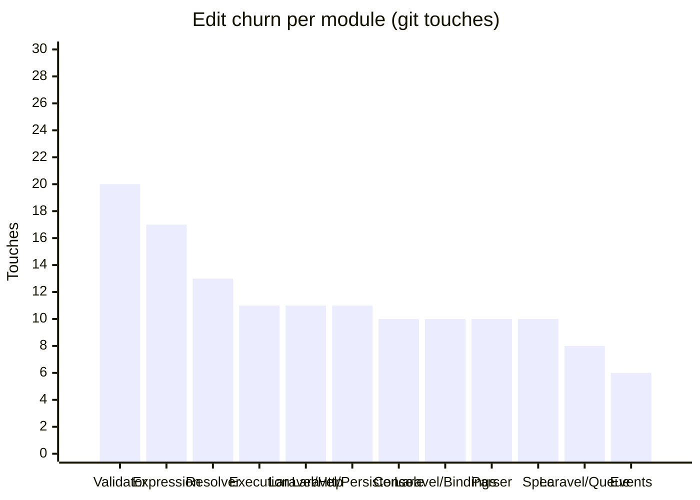

<!-- GENERATED by scripts/generate-docs.php — DO NOT EDIT.
     Refreshed automatically on every commit (see .githooks/pre-commit). -->

# Generated: Churn Hotspots

Where edit pressure lands. **Touches** = number of times a module's src files
appear in `git log` commits (full history, deterministic per HEAD). The
hotspot score normalizes churn by size: high touches-per-KLOC means a module
is edited far more often than its mass justifies — the classic "working in the
same corner every week" signal that static structure graphs cannot show.

Analyzed 205 total file-touches across 31 modules.

| Module | Touches | Share | LOC | Touches/KLOC |
|---|---:|---:|---:|---:|
| `Validator` | 20 | 10% | 3,085 | 6.5 |
| `Expression` | 17 | 8% | 1,402 | 12.1 |
| `Resolver` | 13 | 6% | 351 | 37 |
| `Execution` | 11 | 5% | 3,332 | 3.3 |
| `Laravel/Http` | 11 | 5% | 161 | 68.3 |
| `Laravel/Persistence` | 11 | 5% | 252 | 43.7 |
| `Console` | 10 | 5% | 791 | 12.6 |
| `Laravel/Bindings` | 10 | 5% | 451 | 22.2 |
| `Parser` | 10 | 5% | 1,080 | 9.3 |
| `Spec` | 10 | 5% | 1,172 | 8.5 |
| `Laravel/Queue` | 8 | 4% | 100 | 80 |
| `Events` | 6 | 3% | 279 | 21.5 |
| `Exceptions` | 6 | 3% | 152 | 39.5 |
| `Laravel/Lock` | 6 | 3% | 49 | 122.4 |
| `Laravel/State` | 6 | 3% | 38 | 157.9 |
| `Policy` | 5 | 2% | 96 | 52.1 |
| `Protocol` | 5 | 2% | 556 | 9 |
| `State` | 5 | 2% | 1,125 | 4.4 |
| `Support` | 5 | 2% | 171 | 29.2 |
| `Async` | 4 | 2% | 495 | 8.1 |
| `Evaluation` | 4 | 2% | 1,089 | 3.7 |
| `Generator` | 4 | 2% | 105 | 38.1 |
| `Jobs` | 4 | 2% | 34 | 117.6 |
| `Dependency` | 3 | 1% | 328 | 9.1 |
| `Normalizer` | 3 | 1% | 570 | 5.3 |
| `Laravel/Events` | 2 | 1% | 21 | 95.2 |
| `Renderer` | 2 | 1% | 253 | 7.9 |
| `Infrastructure` | 1 | 0% | 146 | 6.8 |
| `Interfaces` | 1 | 0% | 372 | 2.7 |
| `Laravel/Support` | 1 | 0% | 60 | 16.7 |
| `Telemetry` | 1 | 0% | 278 | 3.6 |

**Hotspots** (highest touches-per-KLOC with meaningful size/churn): `Laravel/Queue` (80), `Laravel/Http` (68.3), `Laravel/Persistence` (43.7)
