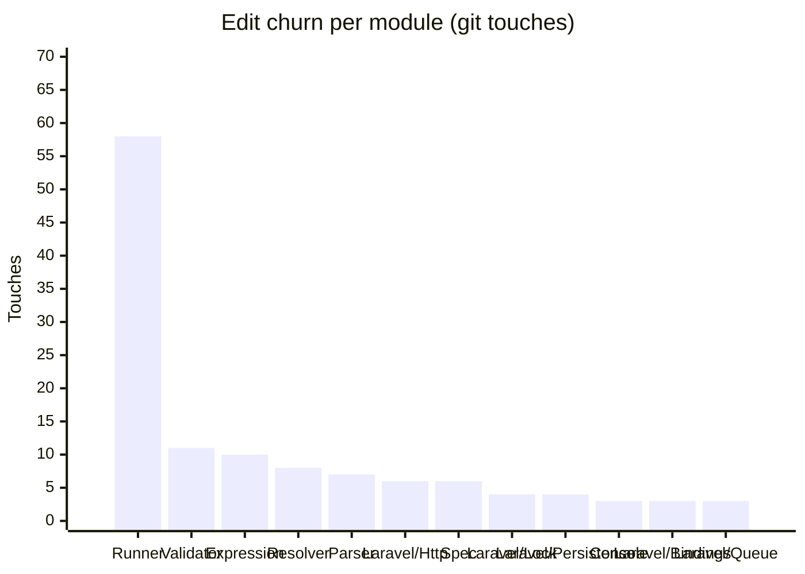

<!-- GENERATED by scripts/generate-docs.php — DO NOT EDIT.
     Refreshed automatically on every commit (see .githooks/pre-commit). -->

# Generated: Churn Hotspots

Where edit pressure lands. **Touches** = number of times a module's src files
appear in `git log` commits (full history, deterministic per HEAD). The
hotspot score normalizes churn by size: high touches-per-KLOC means a module
is edited far more often than its mass justifies — the classic "working in the
same corner every week" signal that static structure graphs cannot show.

Analyzed 132 total file-touches across 18 modules.

| Module | Touches | Share | LOC | Touches/KLOC |
|---|---:|---:|---:|---:|
| `Runner` | 58 | 44% | 10,204 | 5.7 |
| `Validator` | 11 | 8% | 3,112 | 3.5 |
| `Expression` | 10 | 8% | 910 | 11 |
| `Resolver` | 8 | 6% | 358 | 22.3 |
| `Parser` | 7 | 5% | 1,087 | 6.4 |
| `Laravel/Http` | 6 | 5% | 163 | 36.8 |
| `Spec` | 6 | 5% | 723 | 8.3 |
| `Laravel/Lock` | 4 | 3% | 49 | 81.6 |
| `Laravel/Persistence` | 4 | 3% | 257 | 15.6 |
| `Console` | 3 | 2% | 481 | 6.2 |
| `Laravel/Bindings` | 3 | 2% | 451 | 6.7 |
| `Laravel/Queue` | 3 | 2% | 102 | 29.4 |
| `Laravel/State` | 3 | 2% | 39 | 76.9 |
| `Support` | 2 | 2% | 269 | 7.4 |
| `Generator` | 1 | 1% | 122 | 8.2 |
| `Laravel/Events` | 1 | 1% | 23 | 43.5 |
| `Laravel/Support` | 1 | 1% | 60 | 16.7 |
| `Renderer` | 1 | 1% | 254 | 3.9 |

**Hotspots** (highest touches-per-KLOC with meaningful size/churn): `Laravel/Http` (36.8), `Resolver` (22.3), `Expression` (11)
