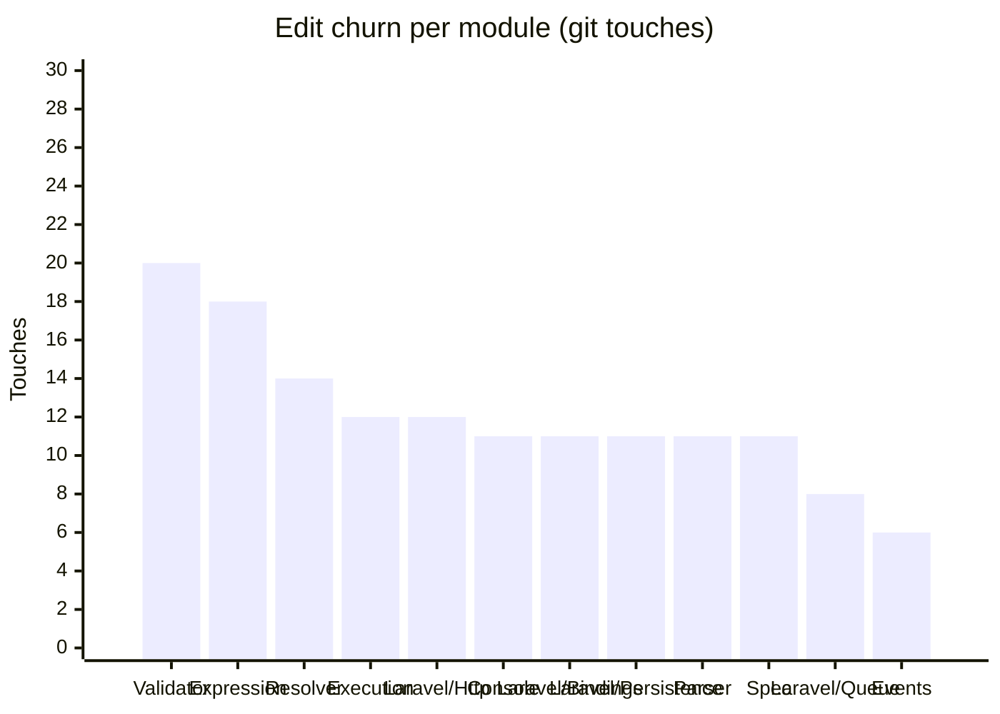

<!-- GENERATED by scripts/generate-docs.php — DO NOT EDIT.
     Refreshed automatically on every commit (see .githooks/pre-commit). -->

# Generated: Churn Hotspots

Where edit pressure lands. **Touches** = number of times a module's src files
appear in `git log` commits (full history, deterministic per HEAD). The
hotspot score normalizes churn by size: high touches-per-KLOC means a module
is edited far more often than its mass justifies — the classic "working in the
same corner every week" signal that static structure graphs cannot show.

Analyzed 210 total file-touches across 29 modules.

| Module | Touches | Share | LOC | Touches/KLOC |
|---|---:|---:|---:|---:|
| `Validator` | 20 | 10% | 3,135 | 6.4 |
| `Expression` | 18 | 9% | 1,455 | 12.4 |
| `Resolver` | 14 | 7% | 370 | 37.8 |
| `Execution` | 12 | 6% | 3,494 | 3.4 |
| `Laravel/Http` | 12 | 6% | 161 | 74.5 |
| `Console` | 11 | 5% | 791 | 13.9 |
| `Laravel/Bindings` | 11 | 5% | 451 | 24.4 |
| `Laravel/Persistence` | 11 | 5% | 252 | 43.7 |
| `Parser` | 11 | 5% | 1,096 | 10 |
| `Spec` | 11 | 5% | 1,172 | 9.4 |
| `Laravel/Queue` | 8 | 4% | 100 | 80 |
| `Events` | 6 | 3% | 295 | 20.3 |
| `Laravel/Lock` | 6 | 3% | 49 | 122.4 |
| `Laravel/State` | 6 | 3% | 38 | 157.9 |
| `Protocol` | 6 | 3% | 574 | 10.5 |
| `State` | 6 | 3% | 1,250 | 4.8 |
| `Evaluation` | 5 | 2% | 1,110 | 4.5 |
| `Policy` | 5 | 2% | 96 | 52.1 |
| `Support` | 5 | 2% | 171 | 29.2 |
| `Async` | 4 | 2% | 508 | 7.9 |
| `Generator` | 4 | 2% | 105 | 38.1 |
| `Jobs` | 4 | 2% | 34 | 117.6 |
| `Normalizer` | 4 | 2% | 588 | 6.8 |
| `Dependency` | 3 | 1% | 328 | 9.1 |
| `Laravel/Events` | 2 | 1% | 21 | 95.2 |
| `Renderer` | 2 | 1% | 253 | 7.9 |
| `Infrastructure` | 1 | 0% | 160 | 6.3 |
| `Laravel/Support` | 1 | 0% | 60 | 16.7 |
| `Telemetry` | 1 | 0% | 278 | 3.6 |

**Hotspots** (highest touches-per-KLOC with meaningful size/churn): `Laravel/Queue` (80), `Laravel/Http` (74.5), `Laravel/Persistence` (43.7)
