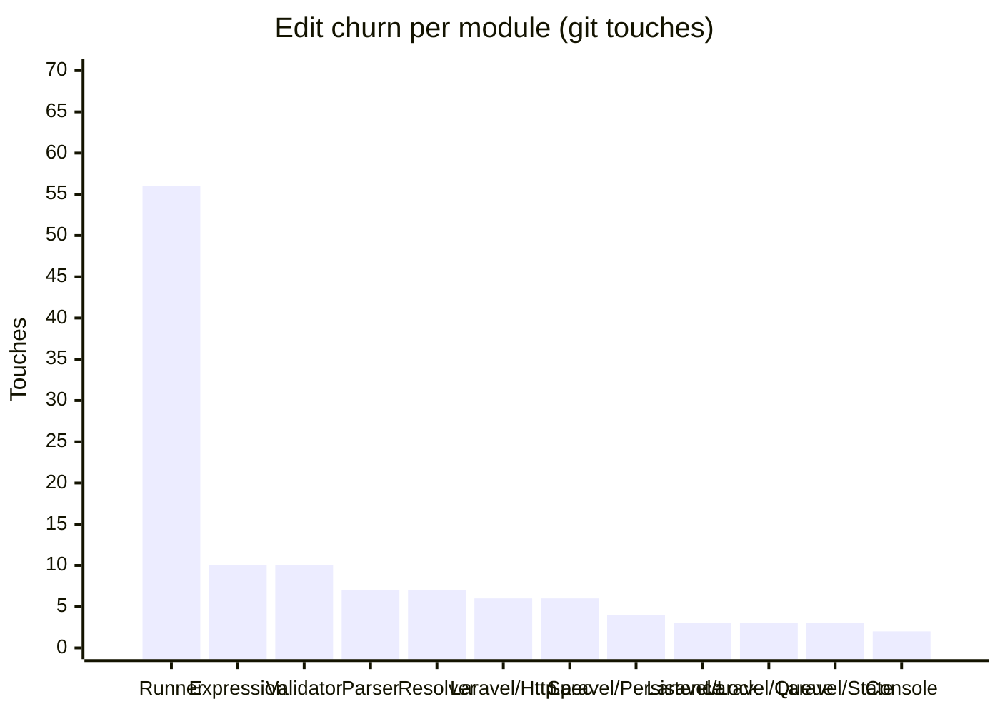

<!-- GENERATED by scripts/generate-docs.php — DO NOT EDIT.
     Refreshed automatically on every commit (see .githooks/pre-commit). -->

# Generated: Churn Hotspots

Where edit pressure lands. **Touches** = number of times a module's src files
appear in `git log` commits (full history, deterministic per HEAD). The
hotspot score normalizes churn by size: high touches-per-KLOC means a module
is edited far more often than its mass justifies — the classic "working in the
same corner every week" signal that static structure graphs cannot show.

Analyzed 124 total file-touches across 17 modules.

| Module | Touches | Share | LOC | Touches/KLOC |
|---|---:|---:|---:|---:|
| `Runner` | 56 | 45% | 7,757 | 7.2 |
| `Expression` | 10 | 8% | 910 | 11 |
| `Validator` | 10 | 8% | 3,011 | 3.3 |
| `Parser` | 7 | 6% | 1,087 | 6.4 |
| `Resolver` | 7 | 6% | 357 | 19.6 |
| `Laravel/Http` | 6 | 5% | 163 | 36.8 |
| `Spec` | 6 | 5% | 723 | 8.3 |
| `Laravel/Persistence` | 4 | 3% | 257 | 15.6 |
| `Laravel/Lock` | 3 | 2% | 17 | 176.5 |
| `Laravel/Queue` | 3 | 2% | 102 | 29.4 |
| `Laravel/State` | 3 | 2% | 39 | 76.9 |
| `Console` | 2 | 2% | 411 | 4.9 |
| `Laravel/Bindings` | 2 | 2% | 448 | 4.5 |
| `Support` | 2 | 2% | 269 | 7.4 |
| `Generator` | 1 | 1% | 122 | 8.2 |
| `Laravel/Events` | 1 | 1% | 23 | 43.5 |
| `Laravel/Support` | 1 | 1% | 60 | 16.7 |

**Hotspots** (highest touches-per-KLOC with meaningful size/churn): `Laravel/Http` (36.8), `Resolver` (19.6), `Expression` (11)
