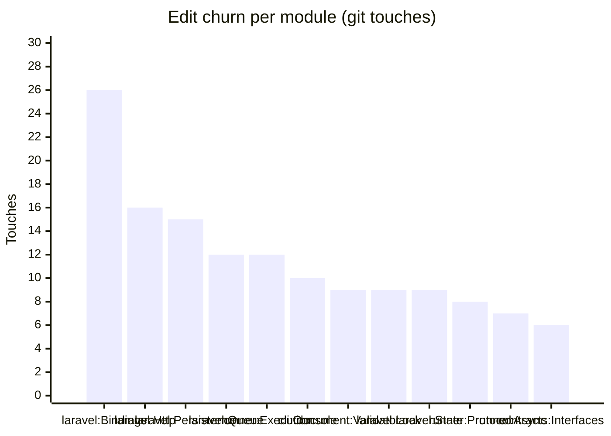

<!-- GENERATED by scripts/generate-docs.php — DO NOT EDIT.
     Refreshed automatically on every commit (see .githooks/pre-commit). -->

# Generated: Churn Hotspots

Where edit pressure lands. **Touches** = number of times a module's src files
appear in `git log` commits (full history, deterministic per HEAD). The
hotspot score normalizes churn by size: high touches-per-KLOC means a module
is edited far more often than its mass justifies — the classic "working in the
same corner every week" signal that static structure graphs cannot show.

Analyzed 227 total file-touches across 43 modules.

| Module | Touches | Share | LOC | Touches/KLOC |
|---|---:|---:|---:|---:|
| `laravel:Bindings` | 26 | 11% | 361 | 72 |
| `laravel:Http` | 16 | 7% | 170 | 94.1 |
| `laravel:Persistence` | 15 | 7% | 264 | 56.8 |
| `laravel:Queue` | 12 | 5% | 109 | 110.1 |
| `runner:Execution` | 12 | 5% | 3,863 | 3.1 |
| `cli:Console` | 10 | 4% | 765 | 13.1 |
| `document:Validator` | 9 | 4% | 3,261 | 2.8 |
| `laravel:Lock` | 9 | 4% | 52 | 173.1 |
| `laravel:State` | 9 | 4% | 41 | 219.5 |
| `runner:Protocol` | 8 | 4% | 557 | 14.4 |
| `runner:Async` | 7 | 3% | 500 | 14 |
| `contracts:Interfaces` | 6 | 3% | 305 | 19.7 |
| `contracts:Spec` | 6 | 3% | 1,148 | 5.2 |
| `laravel:Support` | 5 | 2% | 126 | 39.7 |
| `cli:Renderer` | 4 | 2% | 255 | 15.7 |
| `contracts:Dependency` | 4 | 2% | 336 | 11.9 |
| `document:Normalizer` | 4 | 2% | 608 | 6.6 |
| `document:Parser` | 4 | 2% | 1,154 | 3.5 |
| `expression:Ast` | 4 | 2% | 350 | 11.4 |
| `expression:Interfaces` | 4 | 2% | 32 | 125 |
| `cli:Generator` | 3 | 1% | 111 | 27 |
| `contracts:Support` | 3 | 1% | 185 | 16.2 |
| `document:Resolver` | 3 | 1% | 406 | 7.4 |
| `evaluation:Data` | 3 | 1% | 34 | 88.2 |
| `evaluation:Registries` | 3 | 1% | 120 | 25 |
| `expression:Data` | 3 | 1% | 109 | 27.5 |
| `expression:Enum` | 3 | 1% | 45 | 66.7 |
| `laravel:Events` | 3 | 1% | 24 | 125 |
| `runner:Events` | 3 | 1% | 328 | 9.1 |
| `runner:Infrastructure` | 3 | 1% | 172 | 17.4 |
| `runner:Jobs` | 3 | 1% | 40 | 75 |
| `runner:Policy` | 3 | 1% | 102 | 29.4 |
| `runner:State` | 3 | 1% | 952 | 3.2 |
| `runner:Telemetry` | 3 | 1% | 282 | 10.6 |
| `contracts:Exceptions` | 2 | 1% | 31 | 64.5 |
| `evaluation:Plugins` | 2 | 1% | 95 | 21.1 |
| `contracts:State` | 1 | 0% | 667 | 1.5 |
| `evaluation:Condition` | 1 | 0% | 654 | 1.5 |
| `evaluation:Enum` | 1 | 0% | 82 | 12.2 |
| `evaluation:Exceptions` | 1 | 0% | 32 | 31.3 |
| `evaluation:Interfaces` | 1 | 0% | 108 | 9.3 |
| `evaluation:Xpath` | 1 | 0% | 109 | 9.2 |
| `expression:Exceptions` | 1 | 0% | 23 | 43.5 |

**Hotspots** (highest touches-per-KLOC with meaningful size/churn): `laravel:Queue` (110.1), `laravel:Http` (94.1), `laravel:Bindings` (72)
