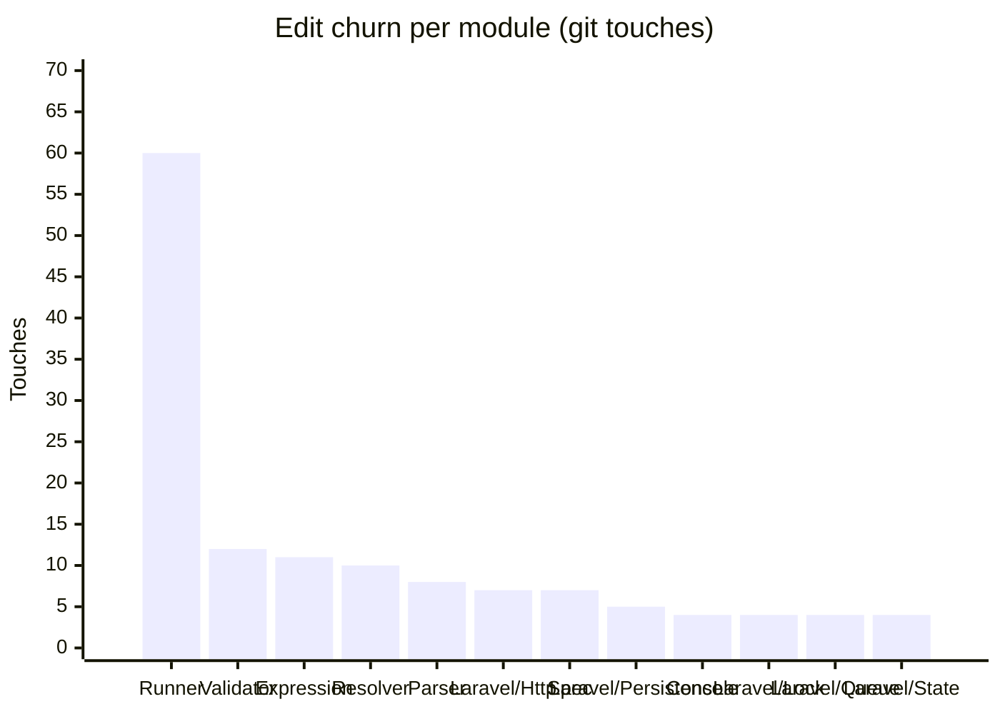

<!-- GENERATED by scripts/generate-docs.php — DO NOT EDIT.
     Refreshed automatically on every commit (see .githooks/pre-commit). -->

# Generated: Churn Hotspots

Where edit pressure lands. **Touches** = number of times a module's src files
appear in `git log` commits (full history, deterministic per HEAD). The
hotspot score normalizes churn by size: high touches-per-KLOC means a module
is edited far more often than its mass justifies — the classic "working in the
same corner every week" signal that static structure graphs cannot show.

Analyzed 149 total file-touches across 18 modules.

| Module | Touches | Share | LOC | Touches/KLOC |
|---|---:|---:|---:|---:|
| `Runner` | 60 | 40% | 10,109 | 5.9 |
| `Validator` | 12 | 8% | 3,094 | 3.9 |
| `Expression` | 11 | 7% | 880 | 12.5 |
| `Resolver` | 10 | 7% | 348 | 28.7 |
| `Parser` | 8 | 5% | 1,078 | 7.4 |
| `Laravel/Http` | 7 | 5% | 161 | 43.5 |
| `Spec` | 7 | 5% | 706 | 9.9 |
| `Laravel/Persistence` | 5 | 3% | 252 | 19.8 |
| `Console` | 4 | 3% | 481 | 8.3 |
| `Laravel/Lock` | 4 | 3% | 49 | 81.6 |
| `Laravel/Queue` | 4 | 3% | 100 | 40 |
| `Laravel/State` | 4 | 3% | 38 | 105.3 |
| `Laravel/Bindings` | 3 | 2% | 451 | 6.7 |
| `Support` | 3 | 2% | 263 | 11.4 |
| `Generator` | 2 | 1% | 119 | 16.8 |
| `Laravel/Events` | 2 | 1% | 21 | 95.2 |
| `Renderer` | 2 | 1% | 253 | 7.9 |
| `Laravel/Support` | 1 | 1% | 60 | 16.7 |

**Hotspots** (highest touches-per-KLOC with meaningful size/churn): `Laravel/Http` (43.5), `Resolver` (28.7), `Laravel/Persistence` (19.8)
