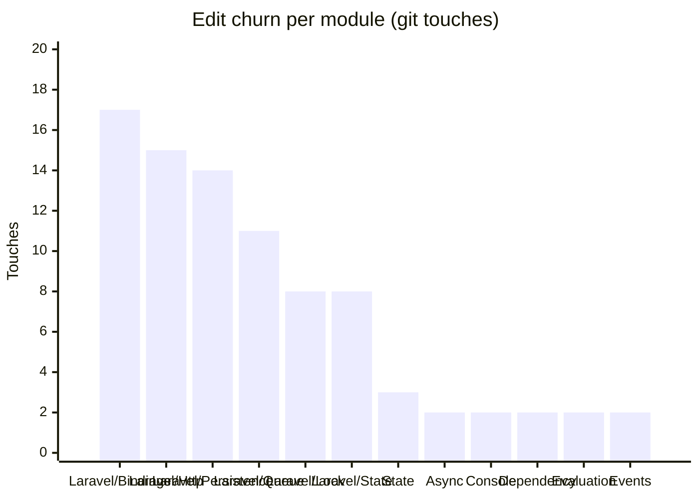

<!-- GENERATED by scripts/generate-docs.php — DO NOT EDIT.
     Refreshed automatically on every commit (see .githooks/pre-commit). -->

# Generated: Churn Hotspots

Where edit pressure lands. **Touches** = number of times a module's src files
appear in `git log` commits (full history, deterministic per HEAD). The
hotspot score normalizes churn by size: high touches-per-KLOC means a module
is edited far more often than its mass justifies — the classic "working in the
same corner every week" signal that static structure graphs cannot show.

Analyzed 125 total file-touches across 34 modules.

| Module | Touches | Share | LOC | Touches/KLOC |
|---|---:|---:|---:|---:|
| `Laravel/Bindings` | 17 | 14% | 476 | 35.7 |
| `Laravel/Http` | 15 | 12% | 161 | 93.2 |
| `Laravel/Persistence` | 14 | 11% | 252 | 55.6 |
| `Laravel/Queue` | 11 | 9% | 100 | 110 |
| `Laravel/Lock` | 8 | 6% | 49 | 163.3 |
| `Laravel/State` | 8 | 6% | 38 | 210.5 |
| `State` | 3 | 2% | 1,586 | 1.9 |
| `Async` | 2 | 2% | 494 | 4 |
| `Console` | 2 | 2% | 791 | 2.5 |
| `Dependency` | 2 | 2% | 328 | 6.1 |
| `Evaluation` | 2 | 2% | 1,159 | 1.7 |
| `Events` | 2 | 2% | 295 | 6.8 |
| `Exceptions` | 2 | 2% | 83 | 24.1 |
| `Execution` | 2 | 2% | 3,442 | 0.6 |
| `Generator` | 2 | 2% | 105 | 19 |
| `Infrastructure` | 2 | 2% | 160 | 12.5 |
| `Interfaces` | 2 | 2% | 183 | 10.9 |
| `Jobs` | 2 | 2% | 34 | 58.8 |
| `Laravel/Events` | 2 | 2% | 21 | 95.2 |
| `Normalizer` | 2 | 2% | 588 | 3.4 |
| `Parser` | 2 | 2% | 1,096 | 1.8 |
| `Policy` | 2 | 2% | 96 | 20.8 |
| `Protocol` | 2 | 2% | 544 | 3.7 |
| `Renderer` | 2 | 2% | 253 | 7.9 |
| `Resolver` | 2 | 2% | 370 | 5.4 |
| `Spec` | 2 | 2% | 823 | 2.4 |
| `Support` | 2 | 2% | 171 | 11.7 |
| `Telemetry` | 2 | 2% | 278 | 7.2 |
| `Validator` | 2 | 2% | 3,104 | 0.6 |
| `Ast` | 1 | 1% | 194 | 5.2 |
| `Data` | 1 | 1% | 94 | 10.6 |
| `Enum` | 1 | 1% | 17 | 58.8 |
| `Laravel/Support` | 1 | 1% | 60 | 16.7 |
| `Xpath` | 1 | 1% | 103 | 9.7 |

**Hotspots** (highest touches-per-KLOC with meaningful size/churn): `Laravel/Queue` (110), `Laravel/Http` (93.2), `Laravel/Persistence` (55.6)
