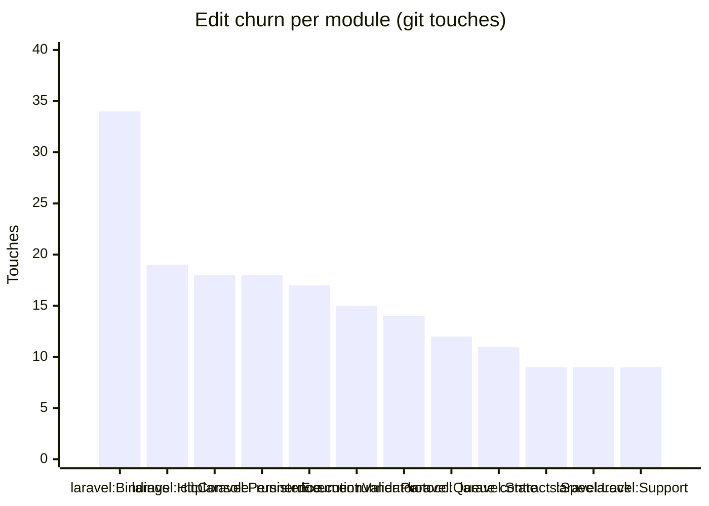

<!-- GENERATED by scripts/generate-docs.php — DO NOT EDIT.
     Refreshed automatically on every commit (see .githooks/pre-commit). -->

# Generated: Churn Hotspots

Where edit pressure lands. **Touches** = number of times a module's src files
appear in `git log` commits (full history, deterministic per HEAD). The
hotspot score normalizes churn by size: high touches-per-KLOC means a module
is edited far more often than its mass justifies — the classic "working in the
same corner every week" signal that static structure graphs cannot show.

```mermaid
xychart-beta
    title "Edit churn per module (git touches)"
    x-axis ["laravel:Bindings", "laravel:Http", "cli:Console", "laravel:Persistence", "runner:Execution", "document:Validator", "runner:Protocol", "laravel:Queue", "laravel:State", "contracts:Spec", "laravel:Lock", "laravel:Support"]
    y-axis "Touches" 0 --> 40
    bar [34, 19, 18, 18, 17, 15, 14, 12, 11, 9, 9, 9]
```

Analyzed 276 total file-touches across 47 modules.

| Module | Touches | Share | LOC | Touches/KLOC |
|---|---:|---:|---:|---:|
| `laravel:Bindings` | 34 | 12% | 364 | 93.4 |
| `laravel:Http` | 19 | 7% | 170 | 111.8 |
| `cli:Console` | 18 | 7% | 793 | 22.7 |
| `laravel:Persistence` | 18 | 7% | 264 | 68.2 |
| `runner:Execution` | 17 | 6% | 3,044 | 5.6 |
| `document:Validator` | 15 | 5% | 3,470 | 4.3 |
| `runner:Protocol` | 14 | 5% | 366 | 38.3 |
| `laravel:Queue` | 12 | 4% | 109 | 110.1 |
| `laravel:State` | 11 | 4% | 46 | 239.1 |
| `contracts:Spec` | 9 | 3% | 1,202 | 7.5 |
| `laravel:Lock` | 9 | 3% | 52 | 173.1 |
| `laravel:Support` | 9 | 3% | 126 | 71.4 |
| `document:Parser` | 8 | 3% | 1,316 | 6.1 |
| `contracts:Interfaces` | 7 | 3% | 322 | 21.7 |
| `sources:Normalizer` | 7 | 3% | 782 | 9 |
| `expression:Interfaces` | 5 | 2% | 25 | 200 |
| `cli:Renderer` | 4 | 1% | 255 | 15.7 |
| `contracts:Dependency` | 4 | 1% | 336 | 11.9 |
| `evaluation:Registries` | 4 | 1% | 121 | 33.1 |
| `expression:Ast` | 4 | 1% | 350 | 11.4 |
| `cli:Generator` | 3 | 1% | 111 | 27 |
| `contracts:Support` | 3 | 1% | 185 | 16.2 |
| `evaluation:Data` | 3 | 1% | 34 | 88.2 |
| `evaluation:Plugins` | 3 | 1% | 102 | 29.4 |
| `expression:Data` | 3 | 1% | 66 | 45.5 |
| `expression:Enum` | 3 | 1% | 45 | 66.7 |
| `laravel:Events` | 3 | 1% | 24 | 125 |
| `runner:Jobs` | 3 | 1% | 40 | 75 |
| `runtime:State` | 3 | 1% | 1,063 | 2.8 |
| `sources:Resolver` | 3 | 1% | 488 | 6.1 |
| `contracts:Exceptions` | 2 | 1% | 31 | 64.5 |
| `contracts:State` | 1 | 0% | 667 | 1.5 |
| `engine:Data` | 1 | 0% | 52 | 19.2 |
| `engine:Enum` | 1 | 0% | 15 | 66.7 |
| `evaluation:Condition` | 1 | 0% | 654 | 1.5 |
| `evaluation:Enum` | 1 | 0% | 82 | 12.2 |
| `evaluation:Exceptions` | 1 | 0% | 32 | 31.3 |
| `evaluation:Interfaces` | 1 | 0% | 108 | 9.3 |
| `evaluation:Xpath` | 1 | 0% | 109 | 9.2 |
| `events:Interfaces` | 1 | 0% | 19 | 52.6 |
| `events:Listener` | 1 | 0% | 95 | 10.5 |
| `expression:Exceptions` | 1 | 0% | 23 | 43.5 |
| `request-pipeline:Data` | 1 | 0% | 66 | 15.2 |
| `runtime:Infrastructure` | 1 | 0% | 155 | 6.5 |
| `runtime:Policy` | 1 | 0% | 102 | 9.8 |
| `runtime:Telemetry` | 1 | 0% | 282 | 3.5 |
| `sources:Validator` | 1 | 0% | 303 | 3.3 |

**Hotspots** (highest touches-per-KLOC with meaningful size/churn): `laravel:Http` (111.8), `laravel:Queue` (110.1), `laravel:Bindings` (93.4)
