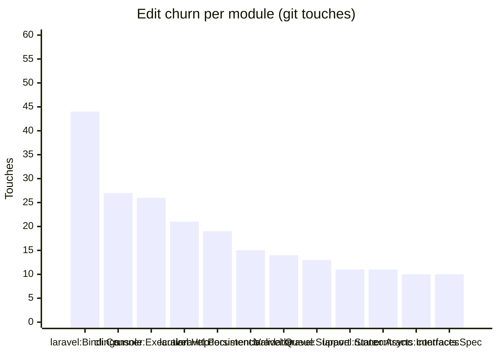

<!-- GENERATED by scripts/generate-docs.php — DO NOT EDIT.
     Refreshed automatically on every commit (see .githooks/pre-commit). -->

# Generated: Churn Hotspots

Where edit pressure lands. **Touches** = number of times a module's src files
appear in `git log` commits (full history, deterministic per HEAD). The
hotspot score normalizes churn by size: high touches-per-KLOC means a module
is edited far more often than its mass justifies — the classic "working in the
same corner every week" signal that static structure graphs cannot show.

```mermaid
xychart-beta
    title "Edit churn per module (git touches)"
    x-axis ["laravel:Bindings", "cli:Console", "runner:Execution", "laravel:Http", "laravel:Persistence", "document:Validator", "laravel:Queue", "laravel:Support", "laravel:State", "runner:Async", "contracts:Interfaces", "contracts:Spec"]
    y-axis "Touches" 0 --> 60
    bar [44, 27, 26, 21, 19, 15, 14, 13, 11, 11, 10, 10]
```

Analyzed 331 total file-touches across 47 modules.

| Module | Touches | Share | LOC | Touches/KLOC |
|---|---:|---:|---:|---:|
| `laravel:Bindings` | 44 | 13% | 385 | 114.3 |
| `cli:Console` | 27 | 8% | 933 | 28.9 |
| `runner:Execution` | 26 | 8% | 370 | 70.3 |
| `laravel:Http` | 21 | 6% | 170 | 123.5 |
| `laravel:Persistence` | 19 | 6% | 264 | 72 |
| `document:Validator` | 15 | 5% | 3,470 | 4.3 |
| `laravel:Queue` | 14 | 4% | 109 | 128.4 |
| `laravel:Support` | 13 | 4% | 150 | 86.7 |
| `laravel:State` | 11 | 3% | 46 | 239.1 |
| `runner:Async` | 11 | 3% | 1,317 | 8.4 |
| `contracts:Interfaces` | 10 | 3% | 359 | 27.9 |
| `contracts:Spec` | 10 | 3% | 1,203 | 8.3 |
| `sources:Normalizer` | 10 | 3% | 1,241 | 8.1 |
| `expression:Interfaces` | 9 | 3% | 110 | 81.8 |
| `laravel:Lock` | 9 | 3% | 52 | 173.1 |
| `document:Parser` | 8 | 2% | 1,316 | 6.1 |
| `evaluation:Registries` | 5 | 2% | 123 | 40.7 |
| `expression:Data` | 5 | 2% | 128 | 39.1 |
| `cli:Renderer` | 4 | 1% | 255 | 15.7 |
| `contracts:Dependency` | 4 | 1% | 336 | 11.9 |
| `evaluation:Plugins` | 4 | 1% | 110 | 36.4 |
| `expression:Ast` | 4 | 1% | 350 | 11.4 |
| `cli:Generator` | 3 | 1% | 111 | 27 |
| `contracts:Support` | 3 | 1% | 185 | 16.2 |
| `evaluation:Condition` | 3 | 1% | 654 | 4.6 |
| `expression:Enum` | 3 | 1% | 45 | 66.7 |
| `expression:Xpath` | 3 | 1% | 110 | 27.3 |
| `laravel:Events` | 3 | 1% | 24 | 125 |
| `runtime:State` | 3 | 1% | 1,039 | 2.9 |
| `sources:Resolver` | 3 | 1% | 488 | 6.1 |
| `contracts:Exceptions` | 2 | 1% | 31 | 64.5 |
| `engine:Data` | 2 | 1% | 74 | 27 |
| `engine:Enum` | 2 | 1% | 17 | 117.6 |
| `engine:Execution` | 2 | 1% | 984 | 2 |
| `evaluation:Interfaces` | 2 | 1% | 35 | 57.1 |
| `expression:Exceptions` | 2 | 1% | 55 | 36.4 |
| `sources:Validator` | 2 | 1% | 303 | 6.6 |
| `contracts:State` | 1 | 0% | 667 | 1.5 |
| `engine:Exceptions` | 1 | 0% | 42 | 23.8 |
| `evaluation:Enum` | 1 | 0% | 82 | 12.2 |
| `events:Interfaces` | 1 | 0% | 19 | 52.6 |
| `events:Listener` | 1 | 0% | 95 | 10.5 |
| `runner:Interfaces` | 1 | 0% | 25 | 40 |
| `runner:Sync` | 1 | 0% | 804 | 1.2 |
| `runtime:Infrastructure` | 1 | 0% | 155 | 6.5 |
| `runtime:Policy` | 1 | 0% | 102 | 9.8 |
| `runtime:Telemetry` | 1 | 0% | 282 | 3.5 |

**Hotspots** (highest touches-per-KLOC with meaningful size/churn): `laravel:Queue` (128.4), `laravel:Http` (123.5), `laravel:Bindings` (114.3)
