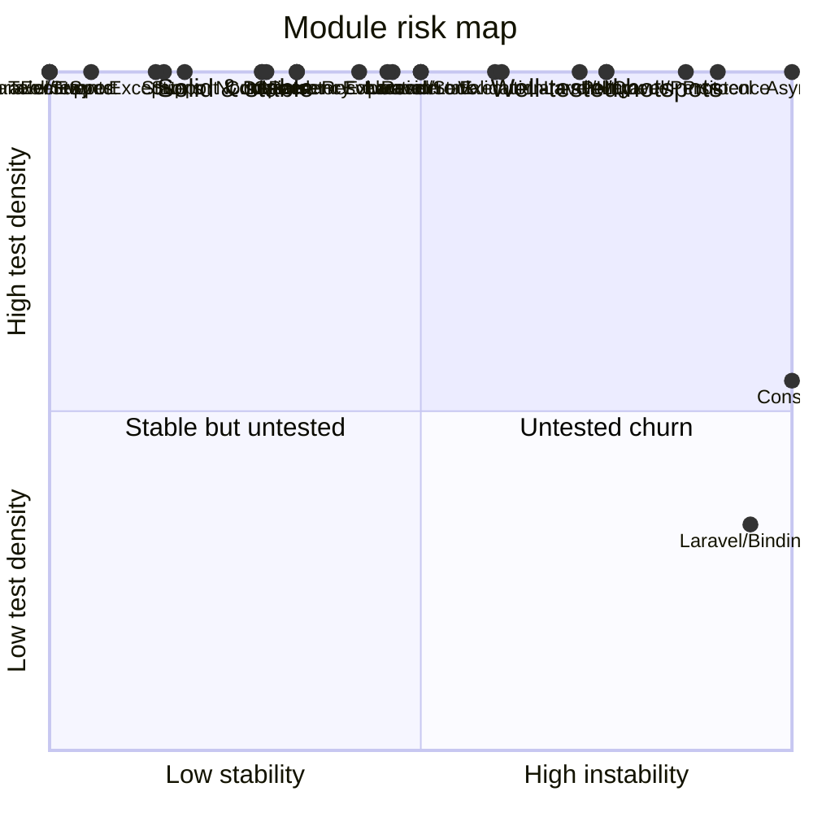

<!-- GENERATED by scripts/generate-docs.php — DO NOT EDIT.
     Refreshed automatically on every commit (see .githooks/pre-commit). -->

# Generated: Coverage / Risk Quadrant

Each module plotted by **instability** (x, from the coupling graph) vs **test
density** (y: test files referencing the module ÷ src files in it).

- *Untested churn* (bottom-right) — changing constantly with no safety net: refactor first.
- *Well-tested hotspots* (top-right) — churn is paid for; keep tests green.
- Test density is file-level and name-based (a test file counts once per
  module whose class names it mentions); it is a proxy, not line coverage.

| Module | Instability | Test files | Src files | Density |
|---|---:|---:|---:|---:|
| `Async` | 1.00 | 6 | 6 | 100% |
| `Console` | 1.00 | 6 | 11 | 55% |
| `Contracts` | 0.29 | 46 | 24 | 100% |
| `Dependency` | 0.33 | 5 | 3 | 100% |
| `Evaluation` | 0.46 | 39 | 18 | 100% |
| `Events` | 0.00 | 20 | 9 | 100% |
| `Exceptions` | 0.14 | 11 | 9 | 100% |
| `Execution` | 0.61 | 60 | 33 | 100% |
| `Expression` | 0.46 | 107 | 30 | 100% |
| `Generator` | 0.33 | 4 | 2 | 100% |
| `Jobs` | 0.29 | 7 | 2 | 100% |
| `Laravel/Bindings` | 0.94 | 2 | 6 | 33% |
| `Laravel/Events` | 0.00 | 1 | 1 | 100% |
| `Laravel/Http` | 0.71 | 4 | 3 | 100% |
| `Laravel/Lock` | 0.50 | 3 | 1 | 100% |
| `Laravel/Persistence` | 0.86 | 6 | 4 | 100% |
| `Laravel/Queue` | 0.75 | 6 | 3 | 100% |
| `Laravel/State` | 0.50 | 3 | 1 | 100% |
| `Laravel/Support` | 0.00 | 1 | 1 | 100% |
| `Normalizer` | 0.29 | 18 | 5 | 100% |
| `Parser` | 0.33 | 29 | 10 | 100% |
| `Policy` | 0.75 | 2 | 2 | 100% |
| `Protocol` | 0.90 | 10 | 5 | 100% |
| `Renderer` | 0.50 | 1 | 1 | 100% |
| `Resolver` | 0.42 | 28 | 13 | 100% |
| `Spec` | 0.06 | 149 | 33 | 100% |
| `State` | 0.15 | 55 | 9 | 100% |
| `Support` | 0.18 | 18 | 6 | 100% |
| `Telemetry` | 0.00 | 2 | 2 | 100% |
| `Validator` | 0.60 | 62 | 62 | 100% |
