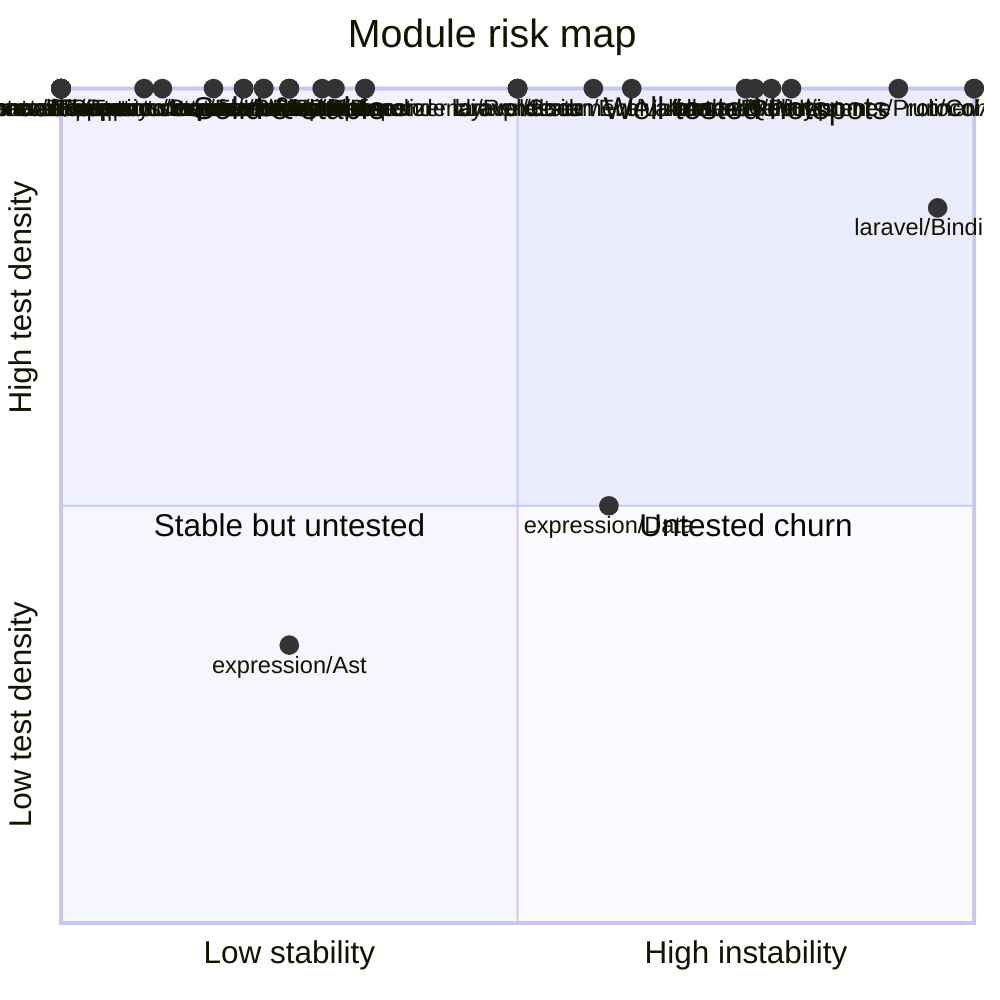

<!-- GENERATED by scripts/generate-docs.php — DO NOT EDIT.
     Refreshed automatically on every commit (see .githooks/pre-commit). -->

# Generated: Coverage / Risk Quadrant

Each module plotted by **instability** (x, from the coupling graph) vs **test
density** (y: test files referencing the module ÷ src files in it).

- *Untested churn* (bottom-right) — changing constantly with no safety net: refactor first.
- *Well-tested hotspots* (top-right) — churn is paid for; keep tests green.
- Test density is file-level and name-based (a test file counts once per
  module whose class names it mentions); it is a proxy, not line coverage.

| Module | Instability | Test files | Src files | Density |
|---|---:|---:|---:|---:|
| `cli/Console` | 1.00 | 11 | 11 | 100% |
| `cli/Generator` | 0.33 | 5 | 2 | 100% |
| `cli/Renderer` | 0.50 | 3 | 1 | 100% |
| `contracts/Dependency` | 0.33 | 5 | 3 | 100% |
| `contracts/Exceptions` | 0.00 | 3 | 1 | 100% |
| `contracts/Interfaces` | 0.20 | 17 | 8 | 100% |
| `contracts/Spec` | 0.00 | 166 | 38 | 100% |
| `contracts/State` | 0.09 | 52 | 2 | 100% |
| `contracts/Support` | 0.00 | 18 | 5 | 100% |
| `document/Normalizer` | 0.30 | 21 | 9 | 100% |
| `document/Parser` | 0.25 | 33 | 11 | 100% |
| `document/Resolver` | 0.22 | 22 | 12 | 100% |
| `document/Validator` | 0.62 | 65 | 62 | 100% |
| `expression/Ast` | 0.25 | 5 | 15 | 33% |
| `expression/Data` | 0.60 | 2 | 4 | 50% |
| `expression/Enum` | 0.00 | 1 | 1 | 100% |
| `expression/Evaluation` | 0.58 | 43 | 19 | 100% |
| `expression/Exceptions` | 0.25 | 5 | 2 | 100% |
| `expression/Interfaces` | 0.11 | 23 | 3 | 100% |
| `expression/Xpath` | 0.22 | 7 | 2 | 100% |
| `laravel/Bindings` | 0.96 | 6 | 7 | 86% |
| `laravel/Events` | 0.00 | 1 | 1 | 100% |
| `laravel/Http` | 0.78 | 4 | 3 | 100% |
| `laravel/Lock` | 0.50 | 3 | 1 | 100% |
| `laravel/Persistence` | 0.80 | 6 | 4 | 100% |
| `laravel/Queue` | 0.75 | 6 | 3 | 100% |
| `laravel/State` | 0.50 | 3 | 1 | 100% |
| `laravel/Support` | 0.00 | 1 | 1 | 100% |
| `runner/Async` | 1.00 | 6 | 6 | 100% |
| `runner/Events` | 0.17 | 29 | 11 | 100% |
| `runner/Execution` | 0.76 | 51 | 35 | 100% |
| `runner/Infrastructure` | 0.25 | 7 | 4 | 100% |
| `runner/Jobs` | 0.29 | 7 | 2 | 100% |
| `runner/Policy` | 0.75 | 2 | 2 | 100% |
| `runner/Protocol` | 0.92 | 10 | 5 | 100% |
| `runner/State` | 0.20 | 25 | 12 | 100% |
| `runner/Telemetry` | 0.00 | 2 | 2 | 100% |
