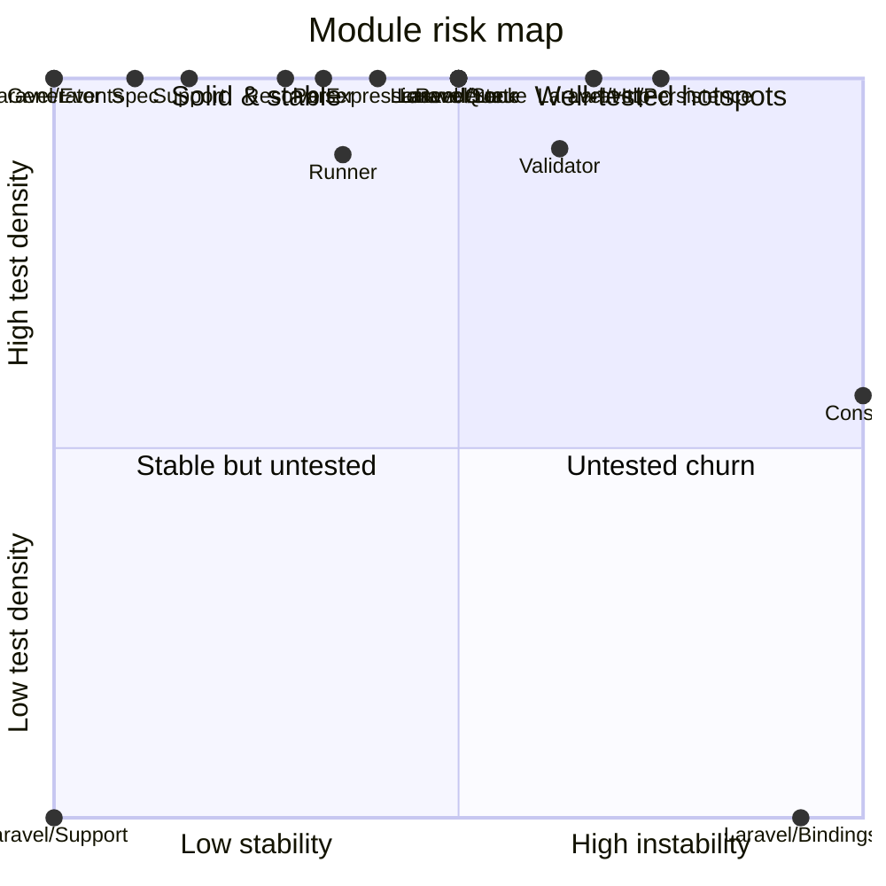

<!-- GENERATED by scripts/generate-docs.php — DO NOT EDIT.
     Refreshed automatically on every commit (see .githooks/pre-commit). -->

# Generated: Coverage / Risk Quadrant

Each module plotted by **instability** (x, from the coupling graph) vs **test
density** (y: test files referencing the module ÷ src files in it).

- *Untested churn* (bottom-right) — changing constantly with no safety net: refactor first.
- *Well-tested hotspots* (top-right) — churn is paid for; keep tests green.
- Test density is file-level and name-based (a test file counts once per
  module whose class names it mentions); it is a proxy, not line coverage.

| Module | Instability | Test files | Src files | Density |
|---|---:|---:|---:|---:|
| `Console` | 1.00 | 4 | 7 | 57% |
| `Expression` | 0.40 | 81 | 23 | 100% |
| `Generator` | 0.00 | 4 | 3 | 100% |
| `Laravel/Bindings` | 0.92 | 0 | 6 | 0% |
| `Laravel/Events` | 0.00 | 1 | 1 | 100% |
| `Laravel/Http` | 0.67 | 3 | 3 | 100% |
| `Laravel/Lock` | 0.50 | 2 | 1 | 100% |
| `Laravel/Persistence` | 0.75 | 5 | 4 | 100% |
| `Laravel/Queue` | 0.50 | 5 | 3 | 100% |
| `Laravel/State` | 0.50 | 2 | 1 | 100% |
| `Laravel/Support` | 0.00 | 0 | 1 | 0% |
| `Parser` | 0.33 | 28 | 10 | 100% |
| `Renderer` | 0.50 | 1 | 1 | 100% |
| `Resolver` | 0.29 | 20 | 11 | 100% |
| `Runner` | 0.36 | 122 | 136 | 90% |
| `Spec` | 0.10 | 133 | 32 | 100% |
| `Support` | 0.17 | 14 | 6 | 100% |
| `Validator` | 0.62 | 57 | 63 | 90% |

**Refactor-now list** (untested churn): `Laravel/Bindings`
