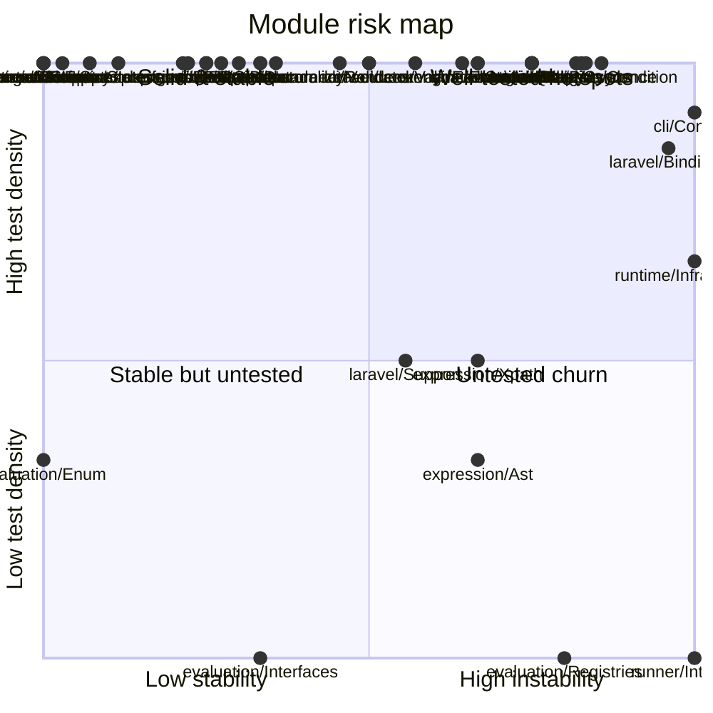

<!-- GENERATED by scripts/generate-docs.php — DO NOT EDIT.
     Refreshed automatically on every commit (see .githooks/pre-commit). -->

# Generated: Coverage / Risk Quadrant

Each module plotted by **instability** (x, from the coupling graph) vs **test
density** (y: test files referencing the module ÷ src files in it).

- *Untested churn* (bottom-right) — changing constantly with no safety net: refactor first.
- *Well-tested hotspots* (top-right) — churn is paid for; keep tests green.
- Test density is file-level and name-based (a test file counts once per
  module whose class names it mentions); it is a proxy, not line coverage.

```mermaid
quadrantChart
    title Module risk map
    x-axis Low stability --> High instability
    y-axis Low test density --> High test density
    quadrant-1 Well-tested hotspots
    quadrant-2 Solid & stable
    quadrant-3 Stable but untested
    quadrant-4 Untested churn
    cli/Console: [1, 0.917]
    cli/Generator: [0.333, 1]
    cli/Renderer: [0.5, 1]
    contracts/Dependency: [0.333, 1]
    contracts/Exceptions: [0, 1]
    contracts/Interfaces: [0.115, 1]
    contracts/Spec: [0.029, 1]
    contracts/State: [0.071, 1]
    contracts/Support: [0, 1]
    document/Parser: [0.222, 1]
    document/Validator: [0.455, 1]
    engine/Data: [0.75, 1]
    engine/Enum: [0, 1]
    engine/Exceptions: [0.25, 1]
    engine/Execution: [0.667, 1]
    evaluation/Condition: [0.857, 1]
    evaluation/Enum: [0, 0.333]
    evaluation/Interfaces: [0.333, 0]
    evaluation/Plugins: [0.75, 1]
    evaluation/Registries: [0.8, 0]
    events/Interfaces: [0, 1]
    events/Listener: [0.75, 1]
    expression/Ast: [0.667, 0.333]
    expression/Data: [0.3, 1]
    expression/Enum: [0, 1]
    expression/Exceptions: [0.25, 1]
    expression/Interfaces: [0.214, 1]
    expression/Xpath: [0.667, 0.5]
    laravel/Bindings: [0.96, 0.857]
    laravel/Events: [0, 1]
    laravel/Http: [0.75, 1]
    laravel/Lock: [0.5, 1]
    laravel/Persistence: [0.833, 1]
    laravel/Queue: [0.75, 1]
    laravel/State: [0.667, 1]
    laravel/Support: [0.556, 0.5]
    runner/Async: [0.826, 1]
    runner/Execution: [0.643, 1]
    runner/Interfaces: [1, 0]
    runner/Sync: [0.818, 1]
    runtime/Infrastructure: [1, 0.667]
    runtime/Policy: [0.75, 1]
    runtime/State: [0.25, 1]
    runtime/Telemetry: [0, 1]
    sources/Normalizer: [0.357, 1]
    sources/Resolver: [0.273, 1]
    sources/Validator: [0.571, 1]
```

| Module | Instability | Test files | Src files | Density |
|---|---:|---:|---:|---:|
| `cli/Console` | 1.00 | 11 | 12 | 92% |
| `cli/Generator` | 0.33 | 5 | 2 | 100% |
| `cli/Renderer` | 0.50 | 5 | 1 | 100% |
| `contracts/Dependency` | 0.33 | 5 | 3 | 100% |
| `contracts/Exceptions` | 0.00 | 3 | 1 | 100% |
| `contracts/Interfaces` | 0.12 | 40 | 19 | 100% |
| `contracts/Spec` | 0.03 | 204 | 49 | 100% |
| `contracts/State` | 0.07 | 59 | 2 | 100% |
| `contracts/Support` | 0.00 | 11 | 5 | 100% |
| `document/Parser` | 0.22 | 35 | 11 | 100% |
| `document/Validator` | 0.46 | 78 | 68 | 100% |
| `engine/Data` | 0.75 | 2 | 2 | 100% |
| `engine/Enum` | 0.00 | 1 | 1 | 100% |
| `engine/Exceptions` | 0.25 | 4 | 1 | 100% |
| `engine/Execution` | 0.67 | 12 | 8 | 100% |
| `evaluation/Condition` | 0.86 | 43 | 10 | 100% |
| `evaluation/Enum` | 0.00 | 1 | 3 | 33% |
| `evaluation/Interfaces` | 0.33 | 0 | 2 | 0% |
| `evaluation/Plugins` | 0.75 | 2 | 2 | 100% |
| `evaluation/Registries` | 0.80 | 0 | 2 | 0% |
| `events/Interfaces` | 0.00 | 21 | 1 | 100% |
| `events/Listener` | 0.75 | 3 | 1 | 100% |
| `expression/Ast` | 0.67 | 5 | 15 | 33% |
| `expression/Data` | 0.30 | 15 | 4 | 100% |
| `expression/Enum` | 0.00 | 4 | 2 | 100% |
| `expression/Exceptions` | 0.25 | 6 | 2 | 100% |
| `expression/Interfaces` | 0.21 | 15 | 2 | 100% |
| `expression/Xpath` | 0.67 | 1 | 2 | 50% |
| `laravel/Bindings` | 0.96 | 6 | 7 | 86% |
| `laravel/Events` | 0.00 | 1 | 1 | 100% |
| `laravel/Http` | 0.75 | 4 | 3 | 100% |
| `laravel/Lock` | 0.50 | 3 | 1 | 100% |
| `laravel/Persistence` | 0.83 | 6 | 4 | 100% |
| `laravel/Queue` | 0.75 | 6 | 3 | 100% |
| `laravel/State` | 0.67 | 3 | 1 | 100% |
| `laravel/Support` | 0.56 | 2 | 4 | 50% |
| `runner/Async` | 0.83 | 21 | 7 | 100% |
| `runner/Execution` | 0.64 | 30 | 15 | 100% |
| `runner/Interfaces` | 1.00 | 0 | 1 | 0% |
| `runner/Sync` | 0.82 | 32 | 5 | 100% |
| `runtime/Infrastructure` | 1.00 | 2 | 3 | 67% |
| `runtime/Policy` | 0.75 | 2 | 2 | 100% |
| `runtime/State` | 0.25 | 27 | 12 | 100% |
| `runtime/Telemetry` | 0.00 | 2 | 2 | 100% |
| `sources/Normalizer` | 0.36 | 19 | 11 | 100% |
| `sources/Resolver` | 0.27 | 24 | 13 | 100% |
| `sources/Validator` | 0.57 | 5 | 1 | 100% |

**Refactor-now list** (untested churn): `runner/Interfaces`, `evaluation/Registries`
