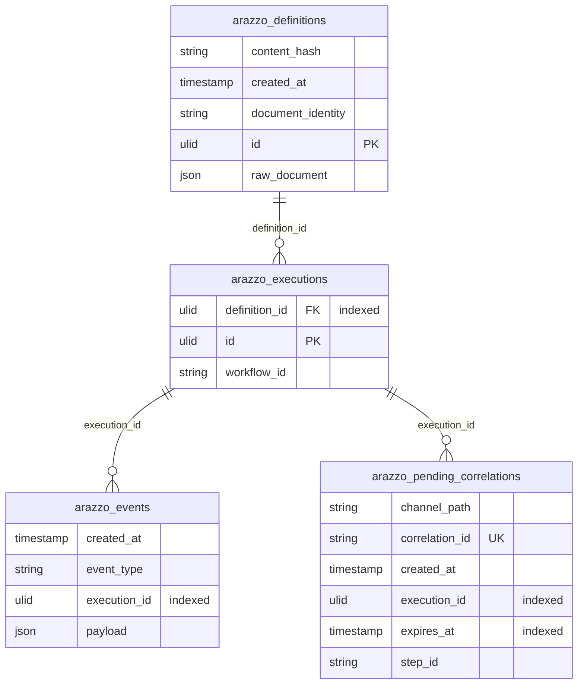

<!-- GENERATED by scripts/generate-docs.php — DO NOT EDIT.
     Refreshed automatically on every commit (see .githooks/pre-commit). -->

# Generated: Persistence Schema (ER Diagram)

Derived live from the Laravel migrations in
`packages/laravel/database/migrations`. Regenerated before every commit.

## Composite constraints

- `arazzo_definitions`: unique(document_identity, content_hash)
