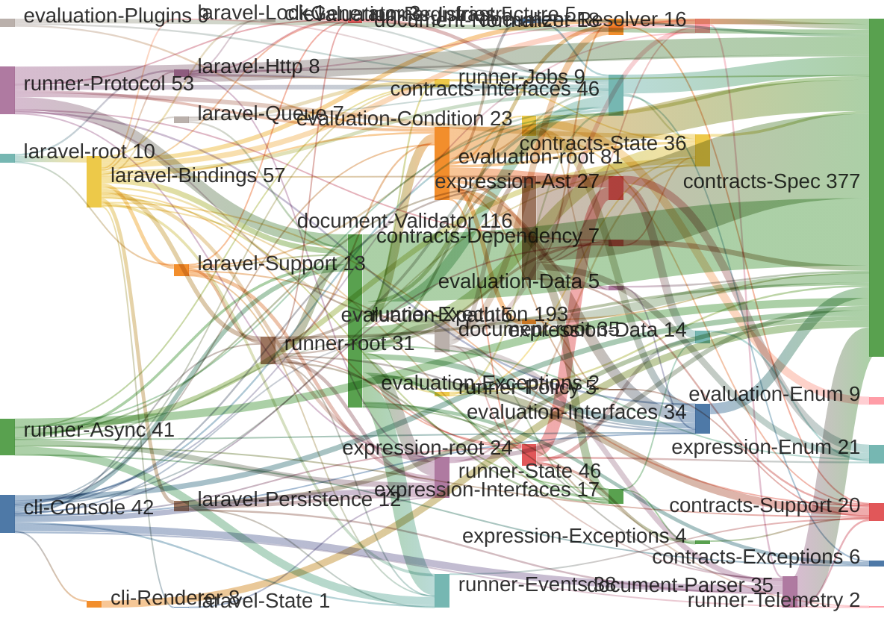

<!-- GENERATED by scripts/generate-docs.php — DO NOT EDIT.
     Refreshed automatically on every commit (see .githooks/pre-commit). -->

# Generated: Dependency Flow

The weighted coupling data from the metrics table, rendered as a flow:
band thickness = number of `use` references from one module to another. Read
it as "where the architectural mass moves" — thick bands into one module mean
changes there ripple widely.

Sankey diagrams must be acyclic; where dependencies are bidirectional only
the heavier direction is drawn and the folded side is listed below the chart.

## Folded flows

These references exist in the code but are not drawn: drawing them would close a dependency cycle and Sankey diagrams must stay acyclic. The heavier direction of each cycle is shown above.

| From | To | References |
|---|---|---:|
| `contracts-Spec` | `contracts-Interfaces` | 1 |
| `evaluation-Registries` | `evaluation-Plugins` | 2 |
| `runner-Execution` | `runner-Protocol` | 3 |
| `runner-Execution` | `runner-root` | 2 |
