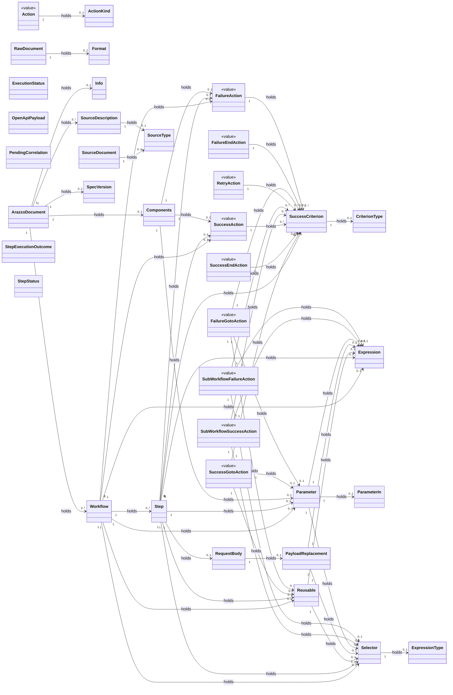

<!-- GENERATED by scripts/generate-docs.php — DO NOT EDIT.
     Refreshed automatically on every commit (see .githooks/pre-commit). -->

# Generated: Document Model (`Spec\`)

The immutable Arazzo document value-object tree, scanned live from
`packages/core/src/Spec`. Composition edges are derived from constructor
promoted properties whose types resolve to other `Spec\` classes.

## Enumerations

- **ActionKind** — `goto` &middot; `end` &middot; `retry` &middot; `invoke`
- **CriterionType** — `simple` &middot; `regex` &middot; `jsonpath` &middot; `xpath`
- **ExecutionStatus** — `running` &middot; `succeeded` &middot; `failed`
- **ExpressionType** — `jsonpath` &middot; `xpath` &middot; `jsonpointer`
- **Format** — `yaml` &middot; `json`
- **ParameterIn** — `path` &middot; `query` &middot; `header` &middot; `cookie` &middot; `body` &middot; `querystring`
- **SourceType** — `openapi` &middot; `arazzo` &middot; `asyncapi`
- **SpecVersion** — `1.0.0` &middot; `1.1.0`
- **StepStatus** — `pending` &middot; `succeeded` &middot; `failed` &middot; `retrying` &middot; `suspended`
