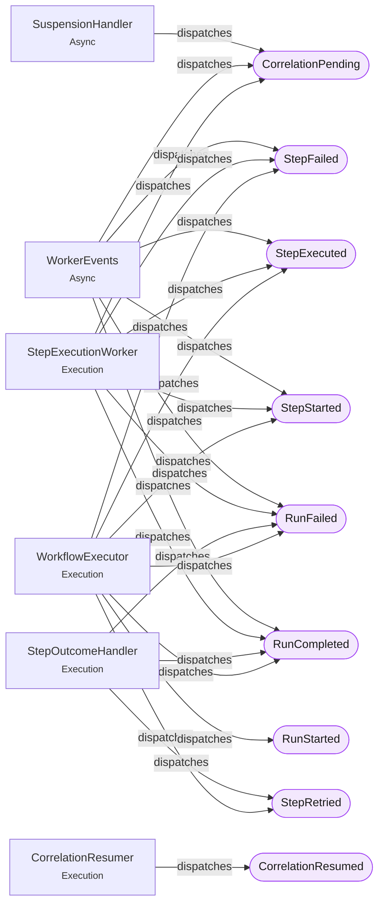

<!-- GENERATED by scripts/generate-docs.php — DO NOT EDIT.
     Refreshed automatically on every commit (see .githooks/pre-commit). -->

# Generated: Domain Events

PSR-14 event classes under `Runner/Events` (core) and `Events/` (Laravel), with
every dispatch site found in the live tree. Regenerated before every commit.

| Event | Dispatched from |
|---|---|
| **CorrelationPending** | `SuspensionHandler`, `WorkerEvents`, `StepExecutionWorker` |
| **CorrelationResumed** | `CorrelationResumer` |
| **RunCompleted** | `WorkerEvents`, `StepExecutionWorker`, `StepOutcomeHandler`, `WorkflowExecutor` |
| **RunFailed** | `WorkerEvents`, `StepExecutionWorker`, `StepOutcomeHandler`, `WorkflowExecutor` |
| **RunStarted** | `WorkflowExecutor` |
| **StepExecuted** | `WorkerEvents`, `StepExecutionWorker`, `WorkflowExecutor` |
| **StepFailed** | `WorkerEvents`, `StepExecutionWorker`, `WorkflowExecutor` |
| **StepRetried** | `StepOutcomeHandler`, `WorkflowExecutor` |
| **StepStarted** | `WorkerEvents`, `StepExecutionWorker`, `WorkflowExecutor` |
