<!-- GENERATED by scripts/generate-docs.php — DO NOT EDIT.
     Refreshed automatically on every commit (see .githooks/pre-commit). -->

# Generated: Exception Tree

Every exception class in both packages and what it extends, scanned live from
source. Use this to decide which exception to throw or catch.

```mermaid
classDiagram
    direction TB
    class E_RuntimeException["RuntimeException"]:::builtin
    class E_ArazzoException["ArazzoException<br/><small>Support</small>"]:::domain
    class E_ConditionSyntaxException["ConditionSyntaxException<br/><small>Evaluation</small>"]:::domain
    class E_DecodeException["DecodeException<br/><small>Parser</small>"]:::domain
    class E_DefinitionHydrationException["DefinitionHydrationException<br/><small>State</small>"]:::domain
    class E_ExecutionException["ExecutionException<br/><small>Execution</small>"]:::domain
    class E_ExpressionSyntaxException["ExpressionSyntaxException<br/><small>Exceptions</small>"]:::domain
    class E_GotoTargetNotFoundException["GotoTargetNotFoundException<br/><small>Execution</small>"]:::domain
    class E_LoaderException["LoaderException<br/><small>Parser</small>"]:::domain
    class E_NotImplementedException["NotImplementedException<br/><small>Support</small>"]:::domain
    class E_ParserException["ParserException<br/><small>Parser</small>"]:::domain
    class E_PreflightFailureException["PreflightFailureException<br/><small>Validator</small>"]:::domain
    class E_SchemaValidationException["SchemaValidationException<br/><small>Exceptions</small>"]:::domain
    class E_SelectorEvaluationException["SelectorEvaluationException<br/><small>Exceptions</small>"]:::domain
    class E_SourceFetchException["SourceFetchException<br/><small>Resolver</small>"]:::domain
    class E_SourceParseException["SourceParseException<br/><small>Resolver</small>"]:::domain
    class E_SourceResolutionException["SourceResolutionException<br/><small>Resolver</small>"]:::domain
    class E_StepBudgetExceededException["StepBudgetExceededException<br/><small>Execution</small>"]:::domain
    class E_UnresolvableReferenceException["UnresolvableReferenceException<br/><small>Resolver</small>"]:::domain
    class E_UnsupportedSerializationStyleException["UnsupportedSerializationStyleException<br/><small>Parser</small>"]:::domain
    class E_UnsupportedSourceVersionException["UnsupportedSourceVersionException<br/><small>Resolver</small>"]:::domain
    class E_WorkflowCycleException["WorkflowCycleException<br/><small>Execution</small>"]:::domain
    class E_WorkflowDepthExceededException["WorkflowDepthExceededException<br/><small>Execution</small>"]:::domain
    E_RuntimeException <|-- E_ArazzoException
    E_ArazzoException <|-- E_ConditionSyntaxException
    E_RuntimeException <|-- E_DecodeException
    E_RuntimeException <|-- E_DefinitionHydrationException
    E_ArazzoException <|-- E_ExecutionException
    E_ArazzoException <|-- E_ExpressionSyntaxException
    E_RuntimeException <|-- E_GotoTargetNotFoundException
    E_ArazzoException <|-- E_LoaderException
    E_ArazzoException <|-- E_NotImplementedException
    E_ArazzoException <|-- E_ParserException
    E_ArazzoException <|-- E_PreflightFailureException
    E_RuntimeException <|-- E_SchemaValidationException
    E_ArazzoException <|-- E_SelectorEvaluationException
    E_SourceResolutionException <|-- E_SourceFetchException
    E_SourceResolutionException <|-- E_SourceParseException
    E_RuntimeException <|-- E_SourceResolutionException
    E_ArazzoException <|-- E_StepBudgetExceededException
    E_SourceResolutionException <|-- E_UnresolvableReferenceException
    E_RuntimeException <|-- E_UnsupportedSerializationStyleException
    E_RuntimeException <|-- E_UnsupportedSourceVersionException
    E_ArazzoException <|-- E_WorkflowCycleException
    E_ArazzoException <|-- E_WorkflowDepthExceededException
    classDef builtin fill:#f1f5f9,stroke:#64748b,color:#1a1a1a;
    classDef domain fill:#fce8e6,stroke:#ea4335,color:#1a1a1a;
```

| Exception | Extends | Module |
|---|---|---|
| `ArazzoException` | `RuntimeException` | Support |
| `ConditionSyntaxException` | `ArazzoException` | Evaluation |
| `DecodeException` | `RuntimeException` | Parser |
| `DefinitionHydrationException` | `RuntimeException` | State |
| `ExecutionException` | `ArazzoException` | Execution |
| `ExpressionSyntaxException` | `ArazzoException` | Exceptions |
| `GotoTargetNotFoundException` | `RuntimeException` | Execution |
| `LoaderException` | `ArazzoException` | Parser |
| `NotImplementedException` | `ArazzoException` | Support |
| `ParserException` | `ArazzoException` | Parser |
| `PreflightFailureException` | `ArazzoException` | Validator |
| `SchemaValidationException` | `RuntimeException` | Exceptions |
| `SelectorEvaluationException` | `ArazzoException` | Exceptions |
| `SourceFetchException` | `SourceResolutionException` | Resolver |
| `SourceParseException` | `SourceResolutionException` | Resolver |
| `SourceResolutionException` | `RuntimeException` | Resolver |
| `StepBudgetExceededException` | `ArazzoException` | Execution |
| `UnresolvableReferenceException` | `SourceResolutionException` | Resolver |
| `UnsupportedSerializationStyleException` | `RuntimeException` | Parser |
| `UnsupportedSourceVersionException` | `RuntimeException` | Resolver |
| `WorkflowCycleException` | `ArazzoException` | Execution |
| `WorkflowDepthExceededException` | `ArazzoException` | Execution |
