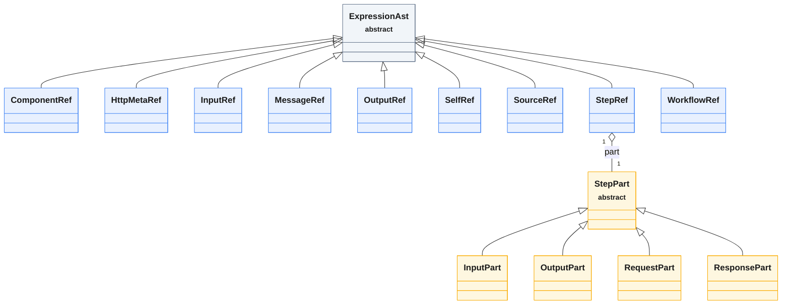

<!-- GENERATED by scripts/generate-docs.php — DO NOT EDIT.
     Refreshed automatically on every commit (see .githooks/pre-commit). -->

# Generated: Expression AST Hierarchy

Node classes under `packages/core/src/Expression/Ast`, scanned live from source.
`ExpressionEvaluator` pattern-matches on these node types.

