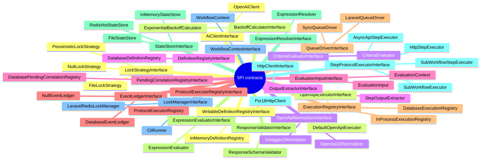

<!-- GENERATED by scripts/generate-docs.php — DO NOT EDIT.
     Refreshed automatically on every commit (see .githooks/pre-commit). -->

# Generated: Extension Points (SPI)

Every contract interface that other code implements, with its live
implementation set — the package's openness map. Contracts under a `Contracts`
directory are deliberate SPI; others appear when the codebase itself treats an
interface polymorphically. Interfaces nobody implements are listed separately:
either dead seams or seams waiting for their first adapter.

| Contract | SPI dir | Implementations |
|---|---|---|
| `AiClientInterface` | **yes** | `OpenAiClient` <small>core</small> |
| `BackoffCalculatorInterface` | **yes** | `ExponentialBackoffCalculator` <small>core</small> |
| `CriteriaEvaluatorInterface` | no | `CriteriaEvaluator` <small>core</small> |
| `DefinitionRegistryInterface` | no | `DatabaseDefinitionRegistry` <small>laravel</small> |
| `EvaluationInputInterface` | no | `EvaluationContext` <small>core</small>, `EvaluationInput` <small>core</small> |
| `EventLedgerInterface` | no | `NullEventLedger` <small>core</small>, `DatabaseEventLedger` <small>laravel</small> |
| `ExecutionRegistryInterface` | no | `InProcessExecutionRegistry` <small>core</small>, `DatabaseExecutionRegistry` <small>laravel</small> |
| `ExpressionEvaluatorInterface` | no | `ExpressionEvaluator` <small>core</small> |
| `ExpressionResolverInterface` | no | `ExpressionResolver` <small>core</small> |
| `HttpClientInterface` | no | `Psr18HttpClient` <small>laravel</small> |
| `LockManagerInterface` | **yes** | `CliRunner` <small>core</small>, `LaravelRedisLockManager` <small>laravel</small> |
| `LockStrategyInterface` | **yes** | `FileLockStrategy` <small>core</small>, `NullLockStrategy` <small>core</small>, `PessimisticLockStrategy` <small>core</small> |
| `OpenApiExecutorInterface` | no | `DefaultOpenApiExecutor` <small>core</small> |
| `OpenApiNormalizerInterface` | no | `Swagger2Normalizer` <small>core</small>, `OpenApi30Normalizer` <small>core</small> |
| `OutputExtractorInterface` | **yes** | `StepOutputExtractor` <small>core</small> |
| `PendingCorrelationRegistryInterface` | no | `DatabasePendingCorrelationRegistry` <small>laravel</small> |
| `ProtocolExecutorRegistryInterface` | no | `ProtocolExecutorRegistry` <small>core</small> |
| `QueueDriverInterface` | **yes** | `SyncQueueDriver` <small>core</small>, `LaravelQueueDriver` <small>laravel</small> |
| `ResponseValidatorInterface` | **yes** | `ResponseSchemaValidator` <small>core</small> |
| `StateStoreInterface` | no | `FileStateStore` <small>core</small>, `InMemoryStateStore` <small>core</small>, `RedisHotStateStore` <small>laravel</small> |
| `StepProtocolExecutorInterface` | **yes** | `HttpStepExecutor` <small>core</small>, `SubWorkflowExecutor` <small>core</small>, `AsyncApiStepExecutor` <small>core</small>, `SubWorkflowStepExecutor` <small>core</small> |
| `WorkflowContextInterface` | no | `WorkflowContext` <small>core</small> |
| `WritableDefinitionRegistryInterface` | no | `InMemoryDefinitionRegistry` <small>core</small> |
