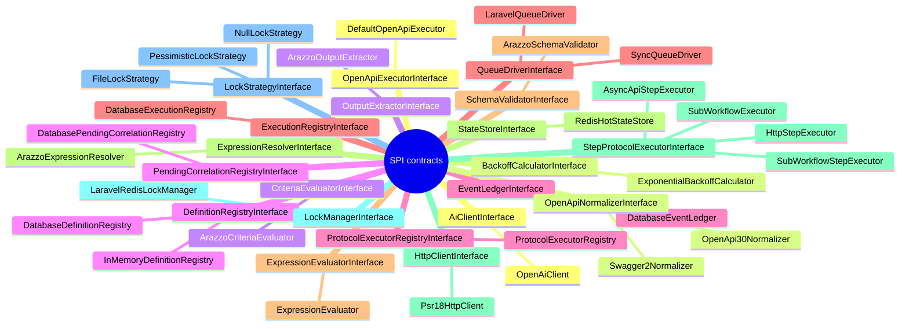

<!-- GENERATED by scripts/generate-docs.php — DO NOT EDIT.
     Refreshed automatically on every commit (see .githooks/pre-commit). -->

# Generated: Extension Points (SPI)

Every contract interface that other code implements, with its live
implementation set — the package's openness map. Contracts under a `Contracts`
directory are deliberate SPI; others appear when the codebase itself treats an
interface polymorphically. Interfaces nobody implements are listed separately:
either dead seams or seams waiting for their first adapter.

| Contract | SPI dir | Implementations |
|---|---|---|
| `AiClientInterface` | **yes** | `OpenAiClient` <small>core</small> |
| `BackoffCalculatorInterface` | no | `ExponentialBackoffCalculator` <small>core</small> |
| `CriteriaEvaluatorInterface` | **yes** | `ArazzoCriteriaEvaluator` <small>core</small> |
| `DefinitionRegistryInterface` | **yes** | `InMemoryDefinitionRegistry` <small>core</small>, `DatabaseDefinitionRegistry` <small>laravel</small> |
| `EventLedgerInterface` | **yes** | `DatabaseEventLedger` <small>laravel</small> |
| `ExecutionRegistryInterface` | **yes** | `DatabaseExecutionRegistry` <small>laravel</small> |
| `ExpressionEvaluatorInterface` | **yes** | `ExpressionEvaluator` <small>core</small> |
| `ExpressionResolverInterface` | **yes** | `ArazzoExpressionResolver` <small>core</small> |
| `HttpClientInterface` | **yes** | `Psr18HttpClient` <small>laravel</small> |
| `LockManagerInterface` | **yes** | `LaravelRedisLockManager` <small>laravel</small> |
| `LockStrategyInterface` | no | `FileLockStrategy` <small>core</small>, `NullLockStrategy` <small>core</small>, `PessimisticLockStrategy` <small>core</small> |
| `OpenApiExecutorInterface` | **yes** | `DefaultOpenApiExecutor` <small>core</small> |
| `OpenApiNormalizerInterface` | no | `Swagger2Normalizer` <small>core</small>, `OpenApi30Normalizer` <small>core</small> |
| `OutputExtractorInterface` | **yes** | `ArazzoOutputExtractor` <small>core</small> |
| `PendingCorrelationRegistryInterface` | **yes** | `DatabasePendingCorrelationRegistry` <small>laravel</small> |
| `ProtocolExecutorRegistryInterface` | no | `ProtocolExecutorRegistry` <small>core</small> |
| `QueueDriverInterface` | **yes** | `SyncQueueDriver` <small>core</small>, `LaravelQueueDriver` <small>laravel</small> |
| `SchemaValidatorInterface` | **yes** | `ArazzoSchemaValidator` <small>core</small> |
| `StateStoreInterface` | **yes** | `RedisHotStateStore` <small>laravel</small> |
| `StepProtocolExecutorInterface` | **yes** | `SubWorkflowExecutor` <small>core</small>, `HttpStepExecutor` <small>core</small>, `AsyncApiStepExecutor` <small>core</small>, `SubWorkflowStepExecutor` <small>core</small> |
