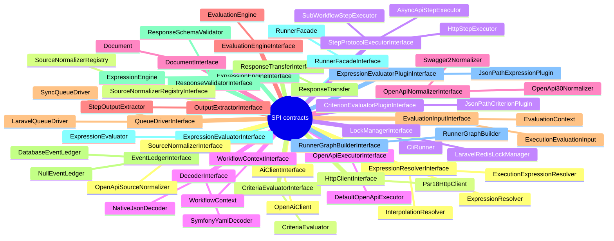

<!-- GENERATED by scripts/generate-docs.php — DO NOT EDIT.
     Refreshed automatically on every commit (see .githooks/pre-commit). -->

# Generated: Extension Points (SPI)

Every contract interface that other code implements, with its live
implementation set — the package's openness map. Contracts under a `Contracts`
directory are deliberate SPI; others appear when the codebase itself treats an
interface polymorphically. Interfaces nobody implements are listed separately:
either dead seams or seams waiting for their first adapter.

```mermaid
mindmap
  root((SPI contracts))
    AiClientInterface
      OpenAiClient
    CriteriaEvaluatorInterface
      CriteriaEvaluator
    CriterionEvaluatorPluginInterface
      JsonPathCriterionPlugin
    DecoderInterface
      NativeJsonDecoder
      SymfonyYamlDecoder
    DocumentInterface
      Document
    EvaluationEngineInterface
      EvaluationEngine
    EvaluationInputInterface
      EvaluationContext
      ExecutionEvaluationInput
    EventLedgerInterface
      NullEventLedger
      DatabaseEventLedger
    ExpressionEngineInterface
      ExpressionEngine
    ExpressionEvaluatorInterface
      ExpressionEvaluator
    ExpressionEvaluatorPluginInterface
      JsonPathExpressionPlugin
    ExpressionResolverInterface
      ExpressionResolver
      InterpolationResolver
      ExecutionExpressionResolver
    HttpClientInterface
      Psr18HttpClient
    LockManagerInterface
      CliRunner
      LaravelRedisLockManager
    OpenApiExecutorInterface
      DefaultOpenApiExecutor
    OpenApiNormalizerInterface
      OpenApi30Normalizer
      Swagger2Normalizer
    OutputExtractorInterface
      StepOutputExtractor
    QueueDriverInterface
      SyncQueueDriver
      LaravelQueueDriver
    ResponseTransferInterface
      ResponseTransfer
    ResponseValidatorInterface
      ResponseSchemaValidator
    RunnerFacadeInterface
      RunnerFacade
    RunnerGraphBuilderInterface
      RunnerGraphBuilder
    SourceNormalizerInterface
      OpenApiSourceNormalizer
    SourceNormalizerRegistryInterface
      SourceNormalizerRegistry
    StepProtocolExecutorInterface
      AsyncApiStepExecutor
      HttpStepExecutor
      SubWorkflowStepExecutor
    WorkflowContextInterface
      WorkflowContext
```

| Contract | SPI dir | Implementations |
|---|---|---|
| `AiClientInterface` | no | `OpenAiClient` <small>core</small> |
| `CriteriaEvaluatorInterface` | no | `CriteriaEvaluator` <small>core</small> |
| `CriterionEvaluatorPluginInterface` | no | `JsonPathCriterionPlugin` <small>core</small> |
| `DecoderInterface` | no | `NativeJsonDecoder` <small>core</small>, `SymfonyYamlDecoder` <small>core</small> |
| `DocumentInterface` | no | `Document` <small>core</small> |
| `EvaluationEngineInterface` | no | `EvaluationEngine` <small>core</small> |
| `EvaluationInputInterface` | no | `EvaluationContext` <small>core</small>, `ExecutionEvaluationInput` <small>core</small> |
| `EventLedgerInterface` | no | `NullEventLedger` <small>core</small>, `DatabaseEventLedger` <small>laravel</small> |
| `ExpressionEngineInterface` | no | `ExpressionEngine` <small>core</small> |
| `ExpressionEvaluatorInterface` | no | `ExpressionEvaluator` <small>core</small> |
| `ExpressionEvaluatorPluginInterface` | no | `JsonPathExpressionPlugin` <small>core</small> |
| `ExpressionResolverInterface` | no | `ExpressionResolver` <small>core</small>, `InterpolationResolver` <small>core</small>, `ExecutionExpressionResolver` <small>core</small> |
| `HttpClientInterface` | no | `Psr18HttpClient` <small>laravel</small> |
| `LockManagerInterface` | no | `CliRunner` <small>core</small>, `LaravelRedisLockManager` <small>laravel</small> |
| `OpenApiExecutorInterface` | no | `DefaultOpenApiExecutor` <small>core</small> |
| `OpenApiNormalizerInterface` | no | `OpenApi30Normalizer` <small>core</small>, `Swagger2Normalizer` <small>core</small> |
| `OutputExtractorInterface` | no | `StepOutputExtractor` <small>core</small> |
| `QueueDriverInterface` | no | `SyncQueueDriver` <small>core</small>, `LaravelQueueDriver` <small>laravel</small> |
| `ResponseTransferInterface` | no | `ResponseTransfer` <small>core</small> |
| `ResponseValidatorInterface` | no | `ResponseSchemaValidator` <small>core</small> |
| `RunnerFacadeInterface` | no | `RunnerFacade` <small>core</small> |
| `RunnerGraphBuilderInterface` | no | `RunnerGraphBuilder` <small>core</small> |
| `SourceNormalizerInterface` | no | `OpenApiSourceNormalizer` <small>core</small> |
| `SourceNormalizerRegistryInterface` | no | `SourceNormalizerRegistry` <small>core</small> |
| `StepProtocolExecutorInterface` | no | `AsyncApiStepExecutor` <small>core</small>, `HttpStepExecutor` <small>core</small>, `SubWorkflowStepExecutor` <small>core</small> |
| `WorkflowContextInterface` | no | `WorkflowContext` <small>core</small> |

## Unimplemented contracts

Declared but nothing in src implements them — candidates for removal or for a first adapter:

- `BackoffCalculatorInterface` <small>Interfaces</small>
- `LockStrategyInterface` <small>Interfaces</small>
- `OperationExecutorPluginInterface` <small>Interfaces</small>
- `PluginInterface` <small>Interfaces</small>
- `ProtocolExecutorRegistryInterface` <small>Execution/Interfaces</small>
- `ReplacementTargetResolverInterface` <small>Interfaces</small>
- `WorkflowStateRepositoryInterface` <small>Interfaces</small>
