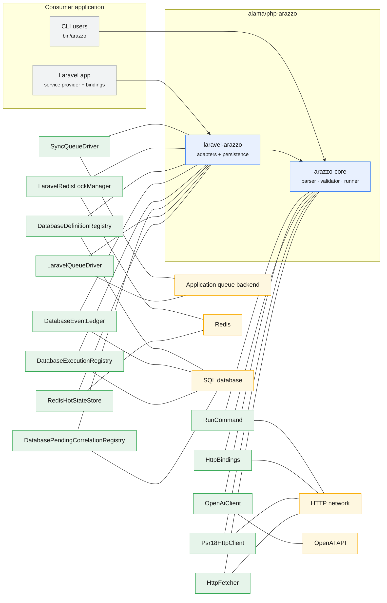

<!-- GENERATED by scripts/generate-docs.php — DO NOT EDIT.
     Refreshed automatically on every commit (see .githooks/pre-commit). -->

# Generated: Integration Context (C4-lite)

The system boundary view: what hosts the package, which infrastructure it
touches through its persistence/queue contracts, and what external networks it
reaches. Nodes and edges are derived from the live `implements` graph plus
known technology markers in implementation names (`Redis*`, `Database*`,
`Queue*`, Guzzle) — when a new adapter appears it joins the map automatically.

