<!-- GENERATED by scripts/generate-docs.php — DO NOT EDIT.
     Refreshed automatically on every commit (see .githooks/pre-commit). -->

# Generated: Layering Map

The real architecture is six composer packages, not one monolith with many
namespaces: `contracts <- expression <- document <- runner <- cli <- laravel`,
read directly from each package's `composer.json` `require`. A package may
only depend on packages strictly below it in that chain. Edges that point
**upward across a package boundary** violate the layering and are drawn red —
any red edge here is either a design regression to fix or a dependency
direction to consciously revise (which would mean editing the actual
`composer.json require`, since this order is derived from it, not declared
here).

Modules are grouped into their owning package's subgraph so the diagram shows
package boundaries directly, not just a flat list of namespaces.

```mermaid
flowchart TB
    subgraph PKG_M_contracts["contracts"]
        M_Dependency["Dependency"]:::node
        M_Spec["Spec"]:::node
        M_Support["Support"]:::node
    end
    subgraph PKG_M_expression["expression"]
        M_Ast["Ast"]:::node
        M_Data["Data"]:::node
        M_Enum["Enum"]:::node
        M_Evaluation["Evaluation"]:::node
        M_Exceptions["Exceptions"]:::node
        M_Interfaces["Interfaces"]:::node
        M_Xpath["Xpath"]:::node
    end
    subgraph PKG_M_document["document"]
        M_Normalizer["Normalizer"]:::node
        M_Parser["Parser"]:::node
        M_Resolver["Resolver"]:::node
        M_Validator["Validator"]:::node
    end
    subgraph PKG_M_runner["runner"]
        M_Async["Async"]:::node
        M_Events["Events"]:::node
        M_Execution["Execution"]:::node
        M_Infrastructure["Infrastructure"]:::node
        M_Jobs["Jobs"]:::node
        M_Policy["Policy"]:::node
        M_Protocol["Protocol"]:::node
        M_State["State"]:::node
        M_Telemetry["Telemetry"]:::node
        M__["(package root)"]:::node
    end
    subgraph PKG_M_cli["cli"]
        M_Console["Console"]:::node
        M_Generator["Generator"]:::node
        M_Renderer["Renderer"]:::node
    end
    subgraph PKG_M_laravel["laravel"]
        M_Laravel_Bindings["Laravel:Bindings"]:::laravelNode
        M_Laravel_Events["Laravel:Events"]:::laravelNode
        M_Laravel_Http["Laravel:Http"]:::laravelNode
        M_Laravel_Lock["Laravel:Lock"]:::laravelNode
        M_Laravel_Persistence["Laravel:Persistence"]:::laravelNode
        M_Laravel_Queue["Laravel:Queue"]:::laravelNode
        M_Laravel_State["Laravel:State"]:::laravelNode
        M_Laravel_Support["Laravel:Support"]:::laravelNode
        M_Laravel__["Laravel:_"]:::laravelNode
    end
    M_Ast --> M_Spec
    M_Async --> M_Events
    M_Async --> M_Exceptions
    M_Async --> M_Execution
    M_Async --> M_Interfaces
    M_Async --> M_Jobs
    M_Async --> M_Spec
    M_Async --> M_State
    M_Async --> M_Support
    M_Async --> M_Validator
    M_Console --> M_Dependency
    M_Console --> M_Evaluation
    M_Console --> M_Events
    M_Console --> M_Execution
    M_Console --> M_Interfaces
    M_Console --> M_Jobs
    M_Console --> M_Normalizer
    M_Console --> M_Parser
    M_Console --> M_Renderer
    M_Console --> M_Resolver
    M_Console --> M_Spec
    M_Console --> M_State
    M_Console --> M_Telemetry
    M_Console --> M_Validator
    M_Console --> M__
    M_Data --> M_Enum
    M_Data --> M_Interfaces
    M_Data --> M_Spec
    M_Dependency --> M_Spec
    M_Dependency -.->|violation| M_State
    M_Evaluation --> M_Interfaces
    M_Evaluation --> M_Spec
    M_Evaluation -.->|violation| M_State
    M_Evaluation --> M_Support
    M_Evaluation --> M_Xpath
    M_Evaluation -.->|violation| M__
    M_Events --> M_Support
    M_Exceptions --> M_Support
    M_Execution --> M_Ast
    M_Execution --> M_Dependency
    M_Execution --> M_Evaluation
    M_Execution --> M_Events
    M_Execution --> M_Exceptions
    M_Execution --> M_Interfaces
    M_Execution --> M_Jobs
    M_Execution --> M_Normalizer
    M_Execution --> M_Parser
    M_Execution --> M_Policy
    M_Execution --> M_Spec
    M_Execution --> M_State
    M_Execution --> M_Support
    M_Execution --> M_Telemetry
    M_Execution --> M_Validator
    M_Execution --> M_Xpath
    M_Execution --> M__
    M_Generator --> M_Interfaces
    M_Infrastructure --> M_Interfaces
    M_Interfaces --> M_Exceptions
    M_Interfaces --> M_Spec
    M_Interfaces -.->|violation| M_State
    M_Jobs --> M_Spec
    M_Jobs --> M_State
    M_Laravel_Bindings --> M_Evaluation
    M_Laravel_Bindings --> M_Events
    M_Laravel_Bindings --> M_Execution
    M_Laravel_Bindings --> M_Generator
    M_Laravel_Bindings --> M_Infrastructure
    M_Laravel_Bindings --> M_Interfaces
    M_Laravel_Bindings --> M_Laravel_Http
    M_Laravel_Bindings --> M_Laravel_Lock
    M_Laravel_Bindings --> M_Laravel_Persistence
    M_Laravel_Bindings --> M_Laravel_Queue
    M_Laravel_Bindings --> M_Laravel_State
    M_Laravel_Bindings --> M_Laravel_Support
    M_Laravel_Bindings --> M_Normalizer
    M_Laravel_Bindings --> M_Parser
    M_Laravel_Bindings --> M_Protocol
    M_Laravel_Bindings --> M_Resolver
    M_Laravel_Bindings --> M_State
    M_Laravel_Bindings --> M_Support
    M_Laravel_Bindings --> M_Validator
    M_Laravel_Bindings --> M_Xpath
    M_Laravel_Bindings --> M__
    M_Laravel_Http --> M_Generator
    M_Laravel_Http --> M_Infrastructure
    M_Laravel_Http --> M_Interfaces
    M_Laravel_Http --> M_Jobs
    M_Laravel_Http --> M_Resolver
    M_Laravel_Http --> M_Spec
    M_Laravel_Http --> M_State
    M_Laravel_Lock --> M_Interfaces
    M_Laravel_Persistence --> M_Events
    M_Laravel_Persistence --> M_Parser
    M_Laravel_Persistence --> M_Spec
    M_Laravel_Persistence --> M_State
    M_Laravel_Queue --> M_Execution
    M_Laravel_Queue --> M_Interfaces
    M_Laravel_Queue --> M_Jobs
    M_Laravel_State --> M_State
    M_Laravel__ --> M_Laravel_Bindings
    M_Laravel__ --> M_Laravel_Http
    M_Normalizer --> M_Resolver
    M_Normalizer --> M_Spec
    M_Normalizer --> M_Support
    M_Parser --> M_Spec
    M_Parser --> M_Support
    M_Policy --> M_Interfaces
    M_Policy --> M_Spec
    M_Policy --> M_State
    M_Protocol --> M_Dependency
    M_Protocol --> M_Evaluation
    M_Protocol --> M_Execution
    M_Protocol --> M_Infrastructure
    M_Protocol --> M_Interfaces
    M_Protocol --> M_Normalizer
    M_Protocol --> M_Spec
    M_Protocol --> M_State
    M_Protocol --> M__
    M_Renderer --> M_Spec
    M_Resolver --> M_Parser
    M_Resolver --> M_Spec
    M_State --> M_Spec
    M_Validator --> M_Ast
    M_Validator --> M_Data
    M_Validator --> M_Dependency
    M_Validator --> M_Exceptions
    M_Validator --> M_Normalizer
    M_Validator --> M_Resolver
    M_Validator --> M_Spec
    M_Validator --> M_Support
    M_Validator --> M_Xpath
    M_Validator -.->|violation| M__
    M_Xpath --> M_Exceptions
    M_Xpath --> M_Spec
    M__ --> M_Ast
    M__ --> M_Data
    M__ --> M_Enum
    M__ --> M_Evaluation
    M__ --> M_Exceptions
    M__ --> M_Execution
    M__ --> M_Interfaces
    M__ --> M_Normalizer
    M__ --> M_Parser
    M__ --> M_Resolver
    M__ --> M_Spec
    M__ --> M_Validator
    M__ --> M_Xpath
    classDef node fill:#e8f0fe,stroke:#4285f4,color:#1a1a1a;
    classDef laravelNode fill:#fef7e0,stroke:#f9ab00,color:#1a1a1a;
    classDef rootNode fill:#f1f3f4,stroke:#9aa0a6,color:#1a1a1a;
```

## Package boundaries

**3 package boundary violation(s):**

| Package | ↑ depends on package | Refs | Modules involved |
|---|---|---:|---|
| `document` | `runner` | 61 | `Validator -> (package root)` |
| `expression` | `runner` | 4 | `Interfaces -> State`, `Evaluation -> State`, `Evaluation -> (package root)` |
| `contracts` | `runner` | 1 | `Dependency -> State` |

### All package edges (reference counts)

| From package | To package | Refs |
|---|---|---:|
| `cli` | `contracts` | 15 |
| `cli` | `document` | 19 |
| `cli` | `expression` | 7 |
| `cli` | `runner` | 23 |
| `contracts` | `runner` | 1 |
| `document` | `contracts` | 136 |
| `document` | `expression` | 26 |
| `document` | `runner` | 61 |
| `expression` | `contracts` | 45 |
| `expression` | `runner` | 4 |
| `laravel` | `cli` | 3 |
| `laravel` | `contracts` | 8 |
| `laravel` | `document` | 18 |
| `laravel` | `expression` | 14 |
| `laravel` | `runner` | 56 |
| `runner` | `contracts` | 144 |
| `runner` | `document` | 46 |
| `runner` | `expression` | 93 |

## Module-level detail

**5 module-level violation(s) found:**

| From | ↑ depends on | Weight |
|---|---|---:|
| `Validator` | `(package root)` | 61 |
| `Evaluation` | `(package root)` | 2 |
| `Dependency` | `State` | 1 |
| `Evaluation` | `State` | 1 |
| `Interfaces` | `State` | 1 |
