<!-- GENERATED by scripts/generate-docs.php — DO NOT EDIT.
     Refreshed automatically on every commit (see .githooks/pre-commit). -->

# Generated: Layering Map

The intended architecture as a strict layer order (bottom = depended upon,
top = depends). Edges that point **upward** violate the layering and are drawn
red — any red edge in this diagram is a design regression to fix or an order
to consciously revise in `LAYER_ORDER` below.

Edit `scripts/generate-docs/LayeringDoc.php → LAYER_ORDER` when the intended
architecture changes; the map stays honest because edges are always scanned
live.

```mermaid
flowchart TB
    subgraph L0["layer 0"]
        M_Expression["Expression"]:::node
    end
    subgraph L1["layer 1"]
        M_Spec["Spec"]:::node
    end
    subgraph L2["layer 2"]
        M_Laravel_Support["Support"]:::laravelNode
        M_Support["Support"]:::node
    end
    subgraph L4["layer 4"]
        M_Generator["Generator"]:::node
    end
    subgraph L5["layer 5"]
        M_Parser["Parser"]:::node
    end
    subgraph L6["layer 6"]
        M_Resolver["Resolver"]:::node
    end
    subgraph L7["layer 7"]
        M_Validator["Validator"]:::node
    end
    subgraph L10["layer 10"]
        M_Laravel_Bindings["Bindings"]:::laravelNode
        M_Laravel_Events["Events"]:::laravelNode
        M_Laravel_Http["Http"]:::laravelNode
        M_Laravel_Lock["Lock"]:::laravelNode
        M_Laravel_Persistence["Persistence"]:::laravelNode
        M_Laravel_Queue["Queue"]:::laravelNode
        M_Laravel_State["State"]:::laravelNode
        M_Laravel__["_"]:::laravelNode
    end
    subgraph L11["layer 11"]
        M_Async["Async"]:::node
        M_Console["Console"]:::node
        M_Context["Context"]:::node
        M_Contracts["Contracts"]:::node
        M_Evaluation["Evaluation"]:::node
        M_Events["Events"]:::node
        M_Exceptions["Exceptions"]:::node
        M_Execution["Execution"]:::node
        M_Jobs["Jobs"]:::node
        M_Normalizer["Normalizer"]:::node
        M_Policy["Policy"]:::node
        M_Protocol["Protocol"]:::node
        M_Renderer["Renderer"]:::node
        M_State["State"]:::node
        M_Telemetry["Telemetry"]:::node
    end
    M_Async --> M_Context
    M_Async --> M_Contracts
    M_Async --> M_Events
    M_Async --> M_Exceptions
    M_Async --> M_Execution
    M_Async --> M_Jobs
    M_Async --> M_Spec
    M_Async --> M_Support
    M_Async --> M_Validator
    M_Console --> M_Context
    M_Console --> M_Contracts
    M_Console --> M_Evaluation
    M_Console --> M_Execution
    M_Console --> M_Jobs
    M_Console --> M_Normalizer
    M_Console --> M_Parser
    M_Console --> M_Renderer
    M_Console --> M_Resolver
    M_Console --> M_Spec
    M_Console --> M_Telemetry
    M_Console --> M_Validator
    M_Context --> M_Spec
    M_Contracts --> M_Context
    M_Contracts --> M_Evaluation
    M_Contracts --> M_Exceptions
    M_Contracts --> M_Execution
    M_Contracts --> M_Normalizer
    M_Contracts --> M_Resolver
    M_Contracts --> M_Spec
    M_Evaluation --> M_Context
    M_Evaluation --> M_Contracts
    M_Evaluation --> M_Expression
    M_Evaluation --> M_Spec
    M_Evaluation --> M_Support
    M_Exceptions --> M_Support
    M_Execution --> M_Context
    M_Execution --> M_Contracts
    M_Execution --> M_Evaluation
    M_Execution --> M_Events
    M_Execution --> M_Exceptions
    M_Execution --> M_Expression
    M_Execution --> M_Jobs
    M_Execution --> M_Policy
    M_Execution --> M_Resolver
    M_Execution --> M_Spec
    M_Execution --> M_State
    M_Execution --> M_Support
    M_Execution --> M_Telemetry
    M_Execution --> M_Validator
    M_Expression -.->|violation| M_Spec
    M_Expression -.->|violation| M_Support
    M_Generator -.->|violation| M_Contracts
    M_Jobs --> M_Context
    M_Jobs --> M_Spec
    M_Laravel_Bindings -.->|violation| M_Contracts
    M_Laravel_Bindings -.->|violation| M_Evaluation
    M_Laravel_Bindings -.->|violation| M_Execution
    M_Laravel_Bindings --> M_Generator
    M_Laravel_Bindings --> M_Laravel_Http
    M_Laravel_Bindings --> M_Laravel_Lock
    M_Laravel_Bindings --> M_Laravel_Persistence
    M_Laravel_Bindings --> M_Laravel_Queue
    M_Laravel_Bindings --> M_Laravel_State
    M_Laravel_Bindings --> M_Laravel_Support
    M_Laravel_Bindings -.->|violation| M_Normalizer
    M_Laravel_Bindings --> M_Parser
    M_Laravel_Bindings --> M_Resolver
    M_Laravel_Bindings --> M_Support
    M_Laravel_Bindings --> M_Validator
    M_Laravel_Http -.->|violation| M_Contracts
    M_Laravel_Http --> M_Generator
    M_Laravel_Http -.->|violation| M_Jobs
    M_Laravel_Http --> M_Resolver
    M_Laravel_Http --> M_Spec
    M_Laravel_Lock -.->|violation| M_Contracts
    M_Laravel_Persistence -.->|violation| M_Context
    M_Laravel_Persistence -.->|violation| M_Contracts
    M_Laravel_Persistence -.->|violation| M_Exceptions
    M_Laravel_Persistence -.->|violation| M_Execution
    M_Laravel_Persistence --> M_Parser
    M_Laravel_Persistence --> M_Spec
    M_Laravel_Queue -.->|violation| M_Contracts
    M_Laravel_Queue -.->|violation| M_Execution
    M_Laravel_Queue -.->|violation| M_Jobs
    M_Laravel_State -.->|violation| M_Contracts
    M_Laravel__ --> M_Laravel_Bindings
    M_Laravel__ --> M_Laravel_Http
    M_Normalizer --> M_Contracts
    M_Normalizer --> M_Support
    M_Parser --> M_Spec
    M_Parser --> M_Support
    M_Policy --> M_Context
    M_Policy --> M_Contracts
    M_Policy --> M_Spec
    M_Protocol --> M_Context
    M_Protocol --> M_Contracts
    M_Protocol --> M_Evaluation
    M_Protocol --> M_Execution
    M_Protocol --> M_Spec
    M_Renderer --> M_Spec
    M_Resolver -.->|violation| M_Exceptions
    M_Resolver -.->|violation| M_Execution
    M_Resolver -.->|violation| M_Normalizer
    M_Resolver --> M_Parser
    M_Resolver --> M_Spec
    M_Spec --> M_Expression
    M_State --> M_Context
    M_State --> M_Contracts
    M_State --> M_Spec
    M_Support -.->|violation| M_Contracts
    M_Support -.->|violation| M_Events
    M_Validator -.->|violation| M_Evaluation
    M_Validator --> M_Expression
    M_Validator -.->|violation| M_Normalizer
    M_Validator --> M_Resolver
    M_Validator --> M_Spec
    M_Validator --> M_Support
    classDef node fill:#e8f0fe,stroke:#4285f4,color:#1a1a1a;
    classDef laravelNode fill:#fef7e0,stroke:#f9ab00,color:#1a1a1a;
    classDef rootNode fill:#f1f3f4,stroke:#9aa0a6,color:#1a1a1a;
```

**25 violation(s) found:**

| From | ↑ depends on | Weight |
|---|---|---:|
| `Laravel:Bindings` | `Contracts` | 21 |
| `Laravel:Bindings` | `Execution` | 17 |
| `Support` | `Events` | 9 |
| `Laravel:Bindings` | `Evaluation` | 8 |
| `Expression` | `Spec` | 6 |
| `Laravel:Persistence` | `Contracts` | 4 |
| `Laravel:Queue` | `Jobs` | 4 |
| `Resolver` | `Normalizer` | 4 |
| `Laravel:Bindings` | `Normalizer` | 3 |
| `Laravel:Http` | `Contracts` | 3 |
| `Generator` | `Contracts` | 2 |
| `Laravel:Queue` | `Execution` | 2 |
| `Validator` | `Evaluation` | 2 |
| `Expression` | `Support` | 1 |
| `Laravel:Http` | `Jobs` | 1 |
| `Laravel:Lock` | `Contracts` | 1 |
| `Laravel:Persistence` | `Context` | 1 |
| `Laravel:Persistence` | `Exceptions` | 1 |
| `Laravel:Persistence` | `Execution` | 1 |
| `Laravel:Queue` | `Contracts` | 1 |
| `Laravel:State` | `Contracts` | 1 |
| `Resolver` | `Exceptions` | 1 |
| `Resolver` | `Execution` | 1 |
| `Support` | `Contracts` | 1 |
| `Validator` | `Normalizer` | 1 |
