<!-- GENERATED by scripts/generate-docs.php — DO NOT EDIT.
     Refreshed automatically on every commit (see .githooks/pre-commit). -->

# Generated: Layering Map

The real architecture is six composer packages, not one monolith with many
namespaces: `contracts <- expression <- document <- runner <- cli <- laravel`,
read directly from each package's `composer.json` `require`. A package may
only depend on packages strictly below it in that chain. Edges that point
**upward across a package boundary** violate the layering and are drawn red —
any red edge here is either a design regression to fix or a dependency
direction to consciously revise (which would mean editing the actual
`composer.json require`, since this order is derived from it, not declared
here).

Modules are grouped into their owning package's subgraph so the diagram shows
package boundaries directly, not just a flat list of namespaces.

```mermaid
flowchart TB
    subgraph PKG_M_contracts["contracts"]
        M_contracts_Dependency["contracts:Dependency"]:::node
        M_contracts_Exceptions["contracts:Exceptions"]:::node
        M_contracts_Interfaces["contracts:Interfaces"]:::node
        M_contracts_Spec["contracts:Spec"]:::node
        M_contracts_State["contracts:State"]:::node
        M_contracts_Support["contracts:Support"]:::node
    end
    subgraph PKG_M_expression["expression"]
        M_expression_Ast["expression:Ast"]:::node
        M_expression_Data["expression:Data"]:::node
        M_expression_Enum["expression:Enum"]:::node
        M_expression_Evaluation["expression:Evaluation"]:::node
        M_expression_Exceptions["expression:Exceptions"]:::node
        M_expression_Interfaces["expression:Interfaces"]:::node
        M_expression_Xpath["expression:Xpath"]:::node
        M_expression__["(expression package root)"]:::node
    end
    subgraph PKG_M_document["document"]
        M_document_Normalizer["document:Normalizer"]:::node
        M_document_Parser["document:Parser"]:::node
        M_document_Resolver["document:Resolver"]:::node
        M_document_Validator["document:Validator"]:::node
        M_document__["(document package root)"]:::node
    end
    subgraph PKG_M_runner["runner"]
        M_runner_Async["runner:Async"]:::node
        M_runner_Events["runner:Events"]:::node
        M_runner_Execution["runner:Execution"]:::node
        M_runner_Infrastructure["runner:Infrastructure"]:::node
        M_runner_Jobs["runner:Jobs"]:::node
        M_runner_Policy["runner:Policy"]:::node
        M_runner_Protocol["runner:Protocol"]:::node
        M_runner_State["runner:State"]:::node
        M_runner_Telemetry["runner:Telemetry"]:::node
        M_runner__["(runner package root)"]:::node
    end
    subgraph PKG_M_cli["cli"]
        M_cli_Console["cli:Console"]:::node
        M_cli_Generator["cli:Generator"]:::node
        M_cli_Renderer["cli:Renderer"]:::node
    end
    subgraph PKG_M_laravel["laravel"]
        M_laravel_Bindings["laravel:Bindings"]:::laravelNode
        M_laravel_Events["laravel:Events"]:::laravelNode
        M_laravel_Http["laravel:Http"]:::laravelNode
        M_laravel_Lock["laravel:Lock"]:::laravelNode
        M_laravel_Persistence["laravel:Persistence"]:::laravelNode
        M_laravel_Queue["laravel:Queue"]:::laravelNode
        M_laravel_State["laravel:State"]:::laravelNode
        M_laravel_Support["laravel:Support"]:::laravelNode
        M_laravel__["(laravel package root)"]:::laravelNode
    end
    M_cli_Console --> M_cli_Renderer
    M_cli_Console --> M_contracts_Dependency
    M_cli_Console --> M_contracts_Interfaces
    M_cli_Console --> M_contracts_Spec
    M_cli_Console --> M_contracts_State
    M_cli_Console --> M_document_Normalizer
    M_cli_Console --> M_document_Parser
    M_cli_Console --> M_document_Resolver
    M_cli_Console --> M_document_Validator
    M_cli_Console --> M_expression_Evaluation
    M_cli_Console --> M_expression_Interfaces
    M_cli_Console --> M_expression__
    M_cli_Console --> M_runner_Events
    M_cli_Console --> M_runner_Execution
    M_cli_Console --> M_runner_Jobs
    M_cli_Console --> M_runner_State
    M_cli_Console --> M_runner_Telemetry
    M_cli_Generator --> M_contracts_Interfaces
    M_cli_Renderer --> M_contracts_Spec
    M_contracts_Dependency --> M_contracts_Spec
    M_contracts_Dependency --> M_contracts_State
    M_contracts_Interfaces --> M_contracts_Exceptions
    M_contracts_Interfaces --> M_contracts_Spec
    M_contracts_Interfaces --> M_contracts_State
    M_contracts_State --> M_contracts_Spec
    M_document_Normalizer --> M_contracts_Spec
    M_document_Normalizer --> M_contracts_Support
    M_document_Normalizer --> M_document_Resolver
    M_document_Parser --> M_contracts_Spec
    M_document_Parser --> M_contracts_Support
    M_document_Resolver --> M_contracts_Spec
    M_document_Resolver --> M_document_Parser
    M_document_Validator --> M_contracts_Dependency
    M_document_Validator --> M_contracts_Spec
    M_document_Validator --> M_contracts_Support
    M_document_Validator --> M_document_Normalizer
    M_document_Validator --> M_document_Resolver
    M_document_Validator --> M_expression_Ast
    M_document_Validator --> M_expression_Data
    M_document_Validator --> M_expression_Exceptions
    M_document_Validator --> M_expression_Xpath
    M_document_Validator --> M_expression__
    M_document__ --> M_contracts_Spec
    M_document__ --> M_document_Normalizer
    M_document__ --> M_document_Parser
    M_document__ --> M_document_Resolver
    M_document__ --> M_document_Validator
    M_document__ --> M_expression_Xpath
    M_expression_Ast --> M_contracts_Spec
    M_expression_Data --> M_contracts_Spec
    M_expression_Data --> M_expression_Enum
    M_expression_Data --> M_expression_Interfaces
    M_expression_Evaluation --> M_contracts_Interfaces
    M_expression_Evaluation --> M_contracts_Spec
    M_expression_Evaluation --> M_contracts_State
    M_expression_Evaluation --> M_contracts_Support
    M_expression_Evaluation --> M_expression_Interfaces
    M_expression_Evaluation --> M_expression_Xpath
    M_expression_Evaluation --> M_expression__
    M_expression_Exceptions --> M_contracts_Support
    M_expression_Interfaces --> M_contracts_Spec
    M_expression_Xpath --> M_contracts_Spec
    M_expression_Xpath --> M_expression_Exceptions
    M_expression__ --> M_contracts_Spec
    M_expression__ --> M_expression_Ast
    M_expression__ --> M_expression_Data
    M_expression__ --> M_expression_Enum
    M_expression__ --> M_expression_Exceptions
    M_expression__ --> M_expression_Interfaces
    M_expression__ --> M_expression_Xpath
    M_laravel_Bindings --> M_cli_Generator
    M_laravel_Bindings --> M_contracts_Interfaces
    M_laravel_Bindings --> M_contracts_Support
    M_laravel_Bindings --> M_document_Normalizer
    M_laravel_Bindings --> M_document_Parser
    M_laravel_Bindings --> M_document_Resolver
    M_laravel_Bindings --> M_document_Validator
    M_laravel_Bindings --> M_document__
    M_laravel_Bindings --> M_expression_Evaluation
    M_laravel_Bindings --> M_expression_Interfaces
    M_laravel_Bindings --> M_expression_Xpath
    M_laravel_Bindings --> M_expression__
    M_laravel_Bindings --> M_laravel_Http
    M_laravel_Bindings --> M_laravel_Lock
    M_laravel_Bindings --> M_laravel_Persistence
    M_laravel_Bindings --> M_laravel_Queue
    M_laravel_Bindings --> M_laravel_State
    M_laravel_Bindings --> M_laravel_Support
    M_laravel_Bindings --> M_runner_Events
    M_laravel_Bindings --> M_runner_Execution
    M_laravel_Bindings --> M_runner_Infrastructure
    M_laravel_Bindings --> M_runner_Protocol
    M_laravel_Bindings --> M_runner_State
    M_laravel_Bindings --> M_runner__
    M_laravel_Http --> M_cli_Generator
    M_laravel_Http --> M_contracts_Interfaces
    M_laravel_Http --> M_contracts_Spec
    M_laravel_Http --> M_document_Resolver
    M_laravel_Http --> M_runner_Infrastructure
    M_laravel_Http --> M_runner_Jobs
    M_laravel_Http --> M_runner_State
    M_laravel_Lock --> M_contracts_Interfaces
    M_laravel_Persistence --> M_contracts_Spec
    M_laravel_Persistence --> M_document_Parser
    M_laravel_Persistence --> M_runner_Events
    M_laravel_Persistence --> M_runner_State
    M_laravel_Queue --> M_contracts_Interfaces
    M_laravel_Queue --> M_runner_Execution
    M_laravel_Queue --> M_runner_Jobs
    M_laravel_State --> M_runner_State
    M_laravel__ --> M_laravel_Bindings
    M_laravel__ --> M_laravel_Http
    M_runner_Async --> M_contracts_Exceptions
    M_runner_Async --> M_contracts_Interfaces
    M_runner_Async --> M_contracts_Spec
    M_runner_Async --> M_contracts_State
    M_runner_Async --> M_contracts_Support
    M_runner_Async --> M_document_Validator
    M_runner_Async --> M_expression_Interfaces
    M_runner_Async --> M_runner_Events
    M_runner_Async --> M_runner_Execution
    M_runner_Async --> M_runner_Jobs
    M_runner_Async --> M_runner_State
    M_runner_Events --> M_contracts_Support
    M_runner_Execution --> M_contracts_Dependency
    M_runner_Execution --> M_contracts_Exceptions
    M_runner_Execution --> M_contracts_Interfaces
    M_runner_Execution --> M_contracts_Spec
    M_runner_Execution --> M_contracts_State
    M_runner_Execution --> M_contracts_Support
    M_runner_Execution --> M_document_Normalizer
    M_runner_Execution --> M_document_Parser
    M_runner_Execution --> M_document_Validator
    M_runner_Execution --> M_expression_Ast
    M_runner_Execution --> M_expression_Evaluation
    M_runner_Execution --> M_expression_Interfaces
    M_runner_Execution --> M_expression_Xpath
    M_runner_Execution --> M_expression__
    M_runner_Execution --> M_runner_Events
    M_runner_Execution --> M_runner_Jobs
    M_runner_Execution --> M_runner_Policy
    M_runner_Execution --> M_runner_State
    M_runner_Execution --> M_runner_Telemetry
    M_runner_Infrastructure --> M_contracts_Interfaces
    M_runner_Jobs --> M_contracts_Spec
    M_runner_Jobs --> M_contracts_State
    M_runner_Policy --> M_contracts_Interfaces
    M_runner_Policy --> M_contracts_Spec
    M_runner_Policy --> M_contracts_State
    M_runner_Protocol --> M_contracts_Dependency
    M_runner_Protocol --> M_contracts_Interfaces
    M_runner_Protocol --> M_contracts_Spec
    M_runner_Protocol --> M_contracts_State
    M_runner_Protocol --> M_document_Normalizer
    M_runner_Protocol --> M_expression_Evaluation
    M_runner_Protocol --> M_expression_Interfaces
    M_runner_Protocol --> M_expression__
    M_runner_Protocol --> M_runner_Execution
    M_runner_Protocol --> M_runner_Infrastructure
    M_runner_Protocol --> M_runner_State
    M_runner_State --> M_contracts_Spec
    M_runner_State --> M_contracts_State
    M_runner__ --> M_contracts_Spec
    M_runner__ --> M_document_Normalizer
    M_runner__ --> M_document_Resolver
    M_runner__ --> M_document_Validator
    M_runner__ --> M_expression_Evaluation
    M_runner__ --> M_expression_Xpath
    M_runner__ --> M_expression__
    M_runner__ --> M_runner_Execution
    classDef node fill:#e8f0fe,stroke:#4285f4,color:#1a1a1a;
    classDef laravelNode fill:#fef7e0,stroke:#f9ab00,color:#1a1a1a;
    classDef rootNode fill:#f1f3f4,stroke:#9aa0a6,color:#1a1a1a;
```

## Package boundaries

**No package-level layering violations.** Every cross-package `use` points downward through `contracts -> expression -> document -> runner -> cli -> laravel`.

### All package edges (reference counts)

| From package | To package | Refs |
|---|---|---:|
| `cli` | `contracts` | 20 |
| `cli` | `document` | 19 |
| `cli` | `expression` | 4 |
| `cli` | `runner` | 21 |
| `document` | `contracts` | 140 |
| `document` | `expression` | 88 |
| `expression` | `contracts` | 55 |
| `laravel` | `cli` | 3 |
| `laravel` | `contracts` | 17 |
| `laravel` | `document` | 20 |
| `laravel` | `expression` | 11 |
| `laravel` | `runner` | 48 |
| `runner` | `contracts` | 178 |
| `runner` | `document` | 26 |
| `runner` | `expression` | 37 |

## Module-level detail

**No module-level layering violations.**
