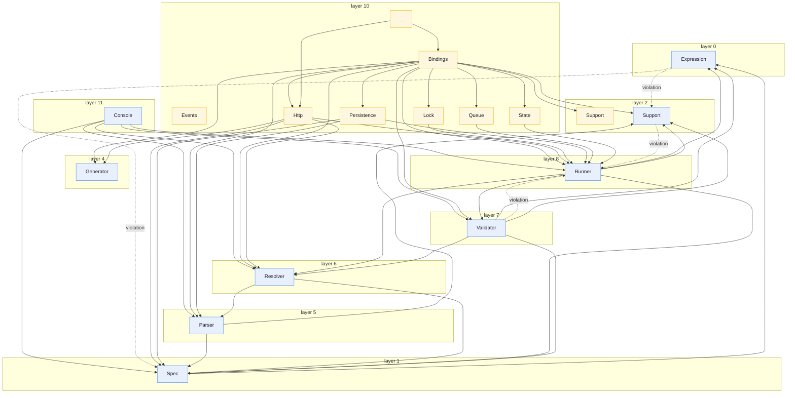

<!-- GENERATED by scripts/generate-docs.php — DO NOT EDIT.
     Refreshed automatically on every commit (see .githooks/pre-commit). -->

# Generated: Layering Map

The intended architecture as a strict layer order (bottom = depended upon,
top = depends). Edges that point **upward** violate the layering and are drawn
red — any red edge in this diagram is a design regression to fix or an order
to consciously revise in `LAYER_ORDER` below.

Edit `scripts/generate-docs/LayeringDoc.php → LAYER_ORDER` when the intended
architecture changes; the map stays honest because edges are always scanned
live.

**4 violation(s) found:**

| From | ↑ depends on | Weight |
|---|---|---:|
| `Support` | `Runner` | 10 |
| `Expression` | `Spec` | 6 |
| `Validator` | `Runner` | 4 |
| `Expression` | `Support` | 1 |
