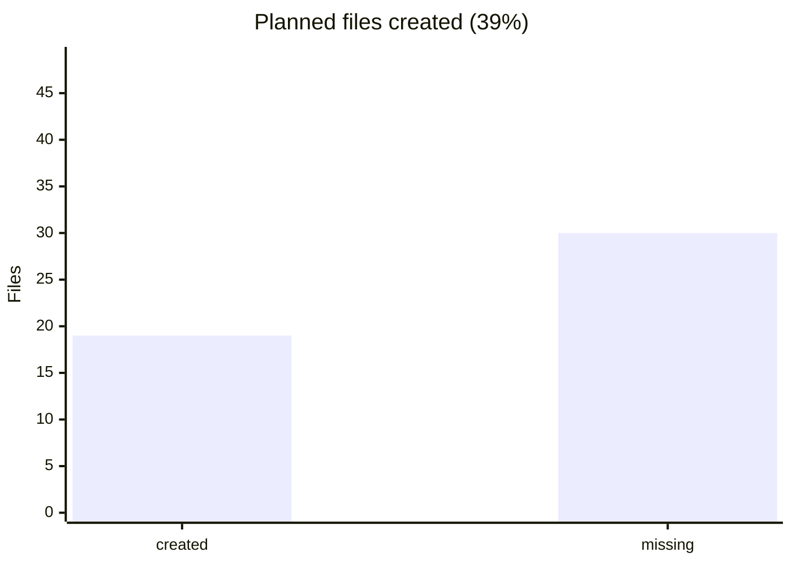

<!-- GENERATED by scripts/generate-docs.php — DO NOT EDIT.
     Refreshed automatically on every commit (see .githooks/pre-commit). -->

# Generated: Modularization Progress

Tracks `docs/superpowers/plans/*-modularization-plan.md` against reality:
every `.php` path the plan promises is checked against the working tree on
each commit. A plan that never meets this doc is a wish, not a roadmap.

Plan: `2026-08-25-runner-modularization-plan.md`

- Files promised: **49** · created: **19** (**39%**)
- Checkboxes ticked: **0 / 90**

## Not yet in the tree

- `packages/core/src/Runner/Policy/BackoffCalculator.php`
- `packages/core/src/Runner/Contract/StateStoreInterface.php`
- `packages/core/src/Runner/State/FileStateStore.php`
- `packages/core/src/Runner/State/InMemoryStateStore.php`
- `packages/core/src/Runner/Async/StateReconciler.php`
- `packages/core/src/Runner/Async/PreflightGuard.php`
- `packages/core/src/Runner/Async/StepExecutor.php`
- `packages/core/src/Runner/Async/CriteriaEvaluator.php`
- `packages/core/src/Runner/Async/TransitionDispatcher.php`
- `packages/core/src/Runner/Async/EventEmitter.php`
- `packages/core/src/Runner/Cli/CliRunner.php`
- `packages/core/src/Runner/Cli/CliStateStore.php`
- `packages/core/src/Runner/Execution/StepProtocolExecutorInterface.php`
- `packages/core/tests/Runner/Policy/RetryPolicyTest.php`
- `packages/core/tests/Runner/Policy/BackoffCalculatorTest.php`
- `packages/core/tests/Runner/Protocol/ProtocolExecutorRegistryTest.php`
- `packages/core/tests/Runner/Protocol/SubWorkflowExecutorTest.php`
- `packages/core/tests/Runner/State/ExecutionContextTest.php`
- `packages/core/tests/Runner/State/FileStateStoreTest.php`
- `packages/core/tests/Runner/Async/StateReconcilerTest.php`
- `packages/core/tests/Runner/Async/PreflightGuardTest.php`
- `packages/core/tests/Runner/Async/StepExecutorTest.php`
- `packages/core/tests/Runner/Async/CriteriaEvaluatorTest.php`
- `packages/core/tests/Runner/Async/TransitionDispatcherTest.php`
- `packages/core/tests/Runner/Async/EventEmitterTest.php`
- `packages/core/tests/Runner/Cli/CliRunnerTest.php`
- `packages/core/tests/Runner/Telemetry/OtelIntegrationTest.php`
- `packages/core/tests/Runner/AdapterParityTest.php`
- `packages/core/tests/Runner/SubWorkflowParityTest.php`
- `packages/laravel/src/ServiceProvider.php`
