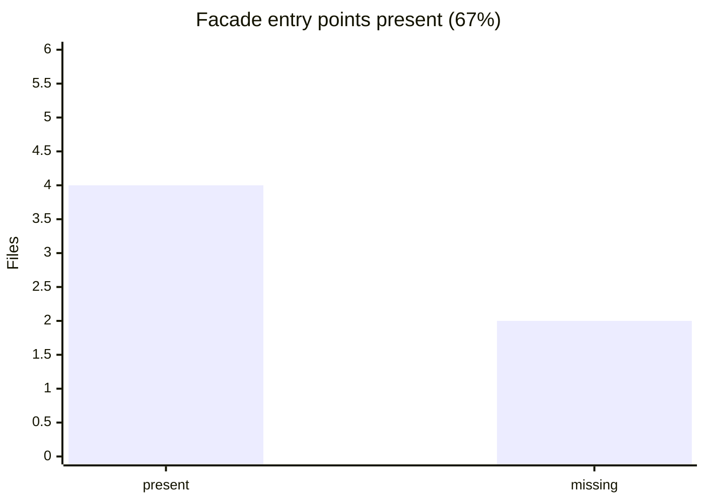

<!-- GENERATED by scripts/generate-docs.php — DO NOT EDIT.
     Refreshed automatically on every commit (see .githooks/pre-commit). -->

# Generated: Modularization Progress

Tracks the completed split of the monolith into six composer packages
(`contracts <- expression <- document <- runner <- cli <- laravel`):
`packages/core/src` must stay empty (aggregator only — `.gitkeep`) and every
package entry point must expose its `*Interface` + facade pair. Any file in
`packages/core/src` or any missing facade below is a modularization
regression to fix, not drift to accept.

- Core aggregator clean: **yes** (0 stray file(s) in `packages/core/src`)
- Facade pairs present: **4 / 6** (**67%**)

## Missing facade files

- `packages/expression/src/ExpressionEngine.php`
- `packages/expression/src/ExpressionEngineInterface.php`
