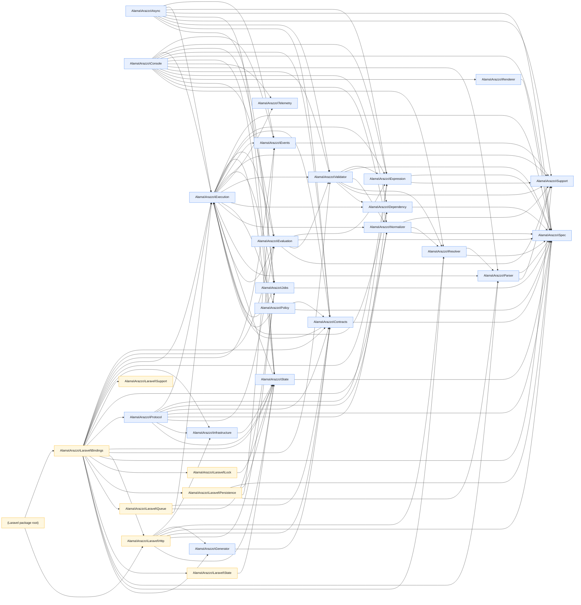

<!-- GENERATED by scripts/generate-docs.php — DO NOT EDIT.
     Refreshed automatically on every commit (see .githooks/pre-commit). -->

# Generated: Namespace Dependency Graph

Cross-module `use` relationships between top-level namespaces, scanned live from
`packages/core/src` and `packages/laravel/src`. Regenerated before every commit.

