<!-- GENERATED by scripts/generate-docs.php — DO NOT EDIT.
     Refreshed automatically on every commit (see .githooks/pre-commit). -->

# Generated: Pipeline Flow

Execution topology of the Runner: every concrete service under `Runner/` (plus
Laravel queue jobs) with the edges introduced by constructor injection or direct
instantiation. Entry points (nothing injects them) are green. Isolated value
objects, enums and exceptions are omitted. Regenerated before every commit.

```mermaid
flowchart TD
    subgraph G_Queue_Jobs["Queue/Jobs"]
        Alama_Arazzo_Laravel_Queue_Jobs_RunExecuteStepJob["RunExecuteStepJob"]:::entry
        Alama_Arazzo_Laravel_Queue_Jobs_RunResumeCorrelationJob["RunResumeCorrelationJob"]:::entry
    end
    subgraph G_Runner_Async["Runner/Async"]
        Alama_Arazzo_Runner_Async_TransitionApplier["TransitionApplier"]:::entry
        Alama_Arazzo_Runner_Async_WorkerEvents["WorkerEvents"]:::service
    end
    subgraph G_Runner_Cli["Runner/Cli"]
        Alama_Arazzo_Runner_Cli_CliRunner["CliRunner"]:::entry
        Alama_Arazzo_Runner_Cli_InProcessExecutionRegistry["InProcessExecutionRegistry"]:::service
        Alama_Arazzo_Runner_Cli_NullEventLedger["NullEventLedger"]:::service
    end
    subgraph G_Runner_Jobs["Runner/Jobs"]
        Alama_Arazzo_Runner_Jobs_ExecuteStepJob["ExecuteStepJob"]:::service
        Alama_Arazzo_Runner_Jobs_ResumeCorrelationJob["ResumeCorrelationJob"]:::service
    end
    subgraph G_Runner_Resolver["Runner/Resolver"]
        Alama_Arazzo_Runner_Resolver_OpenApiOperationResolver["OpenApiOperationResolver"]:::entry
        Alama_Arazzo_Runner_Resolver_ResolvedOperation["ResolvedOperation"]:::service
    end
    Alama_Arazzo_Laravel_Queue_Jobs_RunExecuteStepJob --> Alama_Arazzo_Runner_Jobs_ExecuteStepJob
    Alama_Arazzo_Laravel_Queue_Jobs_RunResumeCorrelationJob --> Alama_Arazzo_Runner_Jobs_ResumeCorrelationJob
    Alama_Arazzo_Runner_Async_TransitionApplier --> Alama_Arazzo_Runner_Async_WorkerEvents
    Alama_Arazzo_Runner_Async_TransitionApplier --> Alama_Arazzo_Runner_Jobs_ExecuteStepJob
    Alama_Arazzo_Runner_Cli_CliRunner --> Alama_Arazzo_Runner_Cli_InProcessExecutionRegistry
    Alama_Arazzo_Runner_Cli_CliRunner --> Alama_Arazzo_Runner_Cli_NullEventLedger
    Alama_Arazzo_Runner_Cli_CliRunner --> Alama_Arazzo_Runner_Jobs_ExecuteStepJob
    Alama_Arazzo_Runner_Resolver_OpenApiOperationResolver --> Alama_Arazzo_Runner_Resolver_ResolvedOperation
    classDef entry fill:#e6f4ea,stroke:#34a853,color:#1a1a1a;
    classDef service fill:#e8f0fe,stroke:#4285f4,color:#1a1a1a;
    classDef laravelNode fill:#fef7e0,stroke:#f9ab00,color:#1a1a1a;
```

| Service | Package | Depends on | Used by | Dispatches |
|---|---|---|---|---|
| **RunExecuteStepJob** | laravel | `ExecuteStepJob` | — | — |
| **RunResumeCorrelationJob** | laravel | `ResumeCorrelationJob` | — | — |
| **TransitionApplier** | core | `WorkerEvents`, `ExecuteStepJob` | — | — |
| **WorkerEvents** | core | — | `TransitionApplier` | `CorrelationPending`, `RunCompleted`, `RunFailed`, `StepExecuted`, `StepFailed`, `StepStarted` |
| **CliRunner** | core | `InProcessExecutionRegistry`, `NullEventLedger`, `ExecuteStepJob` | — | — |
| **InProcessExecutionRegistry** | core | — | `CliRunner` | — |
| **NullEventLedger** | core | — | `CliRunner` | — |
| **ExecuteStepJob** | core | — | `RunExecuteStepJob`, `TransitionApplier`, `CliRunner` | — |
| **ResumeCorrelationJob** | core | — | `RunResumeCorrelationJob` | — |
| **OpenApiOperationResolver** | core | `ResolvedOperation` | — | — |
| **ResolvedOperation** | core | — | `OpenApiOperationResolver` | — |
