<!-- GENERATED by scripts/generate-docs.php — DO NOT EDIT.
     Refreshed automatically on every commit (see .githooks/pre-commit). -->

# Generated: Pipeline Flow

Execution topology of the Runner: every concrete service under `Runner/` (plus
Laravel queue jobs) with the edges introduced by constructor injection or direct
instantiation. Entry points (nothing injects them) are green. Isolated value
objects, enums and exceptions are omitted. Regenerated before every commit.

```mermaid
flowchart TD
    subgraph G_Queue_Jobs["Queue/Jobs"]
        Alama_Arazzo_Laravel_Queue_Jobs_RunExecuteStepJob["RunExecuteStepJob"]:::entry
        Alama_Arazzo_Laravel_Queue_Jobs_RunResumeCorrelationJob["RunResumeCorrelationJob"]:::entry
    end
    subgraph G_Runner_Context["Runner/Context"]
        Alama_Arazzo_Runner_Context_ExecutionState["ExecutionState"]:::service
        Alama_Arazzo_Runner_Context_WorkflowContext["WorkflowContext"]:::service
    end
    subgraph G_Runner_Evaluation["Runner/Evaluation"]
        Alama_Arazzo_Runner_Evaluation_ArazzoCriteriaEvaluator["ArazzoCriteriaEvaluator"]:::entry
        Alama_Arazzo_Runner_Evaluation_ArazzoExpressionResolver["ArazzoExpressionResolver"]:::entry
        Alama_Arazzo_Runner_Evaluation_DependencyAnalyzer["DependencyAnalyzer"]:::service
        Alama_Arazzo_Runner_Evaluation_DependencyGraph["DependencyGraph"]:::service
        Alama_Arazzo_Runner_Evaluation_EvaluationContext["EvaluationContext"]:::service
        Alama_Arazzo_Runner_Evaluation_ExpressionEvaluator["ExpressionEvaluator"]:::service
        Alama_Arazzo_Runner_Evaluation_PayloadReplacer["PayloadReplacer"]:::entry
        Alama_Arazzo_Runner_Evaluation_SelectorEvaluator["SelectorEvaluator"]:::service
        Alama_Arazzo_Runner_Evaluation_StringInterpolator["StringInterpolator"]:::service
    end
    subgraph G_Runner_Evaluation_Condition["Runner/Evaluation/Condition"]
        Alama_Arazzo_Runner_Evaluation_Condition_ConditionEvaluator["ConditionEvaluator"]:::service
        Alama_Arazzo_Runner_Evaluation_Condition_Lexer["Lexer"]:::service
        Alama_Arazzo_Runner_Evaluation_Condition_Parser["Parser"]:::service
        Alama_Arazzo_Runner_Evaluation_Condition_Token["Token"]:::service
    end
    subgraph G_Runner_Evaluation_Condition_Ast["Runner/Evaluation/Condition/Ast"]
        Alama_Arazzo_Runner_Evaluation_Condition_Ast_Comparison["Comparison"]:::service
        Alama_Arazzo_Runner_Evaluation_Condition_Ast_Literal["Literal"]:::service
        Alama_Arazzo_Runner_Evaluation_Condition_Ast_LogicalOp["LogicalOp"]:::service
        Alama_Arazzo_Runner_Evaluation_Condition_Ast_RuntimeExpr["RuntimeExpr"]:::service
        Alama_Arazzo_Runner_Evaluation_Condition_Ast_UnaryNot["UnaryNot"]:::service
    end
    subgraph G_Runner_Evaluation_Xpath["Runner/Evaluation/Xpath"]
        Alama_Arazzo_Runner_Evaluation_Xpath_DomXpathEvaluator["DomXpathEvaluator"]:::service
    end
    subgraph G_Runner_Execution["Runner/Execution"]
        Alama_Arazzo_Runner_Execution_ArazzoOutputExtractor["ArazzoOutputExtractor"]:::entry
        Alama_Arazzo_Runner_Execution_ArazzoSchemaValidator["ArazzoSchemaValidator"]:::entry
        Alama_Arazzo_Runner_Execution_AsyncApiStepExecutor["AsyncApiStepExecutor"]:::entry
        Alama_Arazzo_Runner_Execution_CorrelationResumer["CorrelationResumer"]:::entry
        Alama_Arazzo_Runner_Execution_ExecutionResult["ExecutionResult"]:::service
        Alama_Arazzo_Runner_Execution_ExpressionValueResolver["ExpressionValueResolver"]:::service
        Alama_Arazzo_Runner_Execution_HttpStepExecutor["HttpStepExecutor"]:::entry
        Alama_Arazzo_Runner_Execution_IdempotencyKeyInjector["IdempotencyKeyInjector"]:::service
        Alama_Arazzo_Runner_Execution_InjectionResult["InjectionResult"]:::service
        Alama_Arazzo_Runner_Execution_OpenApiDocumentLoader["OpenApiDocumentLoader"]:::service
        Alama_Arazzo_Runner_Execution_OpenApiPayload["OpenApiPayload"]:::service
        Alama_Arazzo_Runner_Execution_RequestCompiler["RequestCompiler"]:::service
        Alama_Arazzo_Runner_Execution_ReusableParameterResolver["ReusableParameterResolver"]:::service
        Alama_Arazzo_Runner_Execution_RunControlFlow["RunControlFlow"]:::entry
        Alama_Arazzo_Runner_Execution_StepExecutionWorker["StepExecutionWorker"]:::entry
        Alama_Arazzo_Runner_Execution_StepExecutor["StepExecutor"]:::service
        Alama_Arazzo_Runner_Execution_StepOutcomeHandler["StepOutcomeHandler"]:::service
        Alama_Arazzo_Runner_Execution_StepResult["StepResult"]:::service
        Alama_Arazzo_Runner_Execution_SubWorkflowInvoker["SubWorkflowInvoker"]:::service
        Alama_Arazzo_Runner_Execution_SubWorkflowResult["SubWorkflowResult"]:::service
        Alama_Arazzo_Runner_Execution_SubWorkflowStepExecutor["SubWorkflowStepExecutor"]:::entry
        Alama_Arazzo_Runner_Execution_Transition["Transition"]:::entry
        Alama_Arazzo_Runner_Execution_WorkflowEngine["WorkflowEngine"]:::service
        Alama_Arazzo_Runner_Execution_WorkflowExecutor["WorkflowExecutor"]:::service
    end
    subgraph G_Runner_Jobs["Runner/Jobs"]
        Alama_Arazzo_Runner_Jobs_ExecuteStepJob["ExecuteStepJob"]:::service
        Alama_Arazzo_Runner_Jobs_ResumeCorrelationJob["ResumeCorrelationJob"]:::service
    end
    subgraph G_Runner_Normalizer["Runner/Normalizer"]
        Alama_Arazzo_Runner_Normalizer_NormalizedOpenApiOperation["NormalizedOpenApiOperation"]:::service
        Alama_Arazzo_Runner_Normalizer_OpenApi30Normalizer["OpenApi30Normalizer"]:::service
        Alama_Arazzo_Runner_Normalizer_OpenApi31Normalizer["OpenApi31Normalizer"]:::service
        Alama_Arazzo_Runner_Normalizer_OpenApiVersionDetector["OpenApiVersionDetector"]:::service
    end
    subgraph G_Runner_Resolver["Runner/Resolver"]
        Alama_Arazzo_Runner_Resolver_OpenApiOperationResolver["OpenApiOperationResolver"]:::service
        Alama_Arazzo_Runner_Resolver_ResolvedOperation["ResolvedOperation"]:::service
    end
    Alama_Arazzo_Laravel_Queue_Jobs_RunExecuteStepJob --> Alama_Arazzo_Runner_Jobs_ExecuteStepJob
    Alama_Arazzo_Laravel_Queue_Jobs_RunResumeCorrelationJob --> Alama_Arazzo_Runner_Jobs_ResumeCorrelationJob
    Alama_Arazzo_Runner_Context_ExecutionState --> Alama_Arazzo_Runner_Context_WorkflowContext
    Alama_Arazzo_Runner_Evaluation_ArazzoCriteriaEvaluator --> Alama_Arazzo_Runner_Evaluation_Condition_ConditionEvaluator
    Alama_Arazzo_Runner_Evaluation_ArazzoCriteriaEvaluator --> Alama_Arazzo_Runner_Evaluation_EvaluationContext
    Alama_Arazzo_Runner_Evaluation_ArazzoCriteriaEvaluator --> Alama_Arazzo_Runner_Evaluation_Xpath_DomXpathEvaluator
    Alama_Arazzo_Runner_Evaluation_ArazzoExpressionResolver --> Alama_Arazzo_Runner_Evaluation_EvaluationContext
    Alama_Arazzo_Runner_Evaluation_Condition_ConditionEvaluator --> Alama_Arazzo_Runner_Evaluation_Condition_Lexer
    Alama_Arazzo_Runner_Evaluation_Condition_ConditionEvaluator --> Alama_Arazzo_Runner_Evaluation_Condition_Parser
    Alama_Arazzo_Runner_Evaluation_Condition_ConditionEvaluator --> Alama_Arazzo_Runner_Evaluation_EvaluationContext
    Alama_Arazzo_Runner_Evaluation_Condition_Lexer --> Alama_Arazzo_Runner_Evaluation_Condition_Token
    Alama_Arazzo_Runner_Evaluation_Condition_Parser --> Alama_Arazzo_Runner_Evaluation_Condition_Ast_Comparison
    Alama_Arazzo_Runner_Evaluation_Condition_Parser --> Alama_Arazzo_Runner_Evaluation_Condition_Ast_Literal
    Alama_Arazzo_Runner_Evaluation_Condition_Parser --> Alama_Arazzo_Runner_Evaluation_Condition_Ast_LogicalOp
    Alama_Arazzo_Runner_Evaluation_Condition_Parser --> Alama_Arazzo_Runner_Evaluation_Condition_Ast_RuntimeExpr
    Alama_Arazzo_Runner_Evaluation_Condition_Parser --> Alama_Arazzo_Runner_Evaluation_Condition_Ast_UnaryNot
    Alama_Arazzo_Runner_Evaluation_Condition_Parser --> Alama_Arazzo_Runner_Evaluation_Condition_Lexer
    Alama_Arazzo_Runner_Evaluation_DependencyAnalyzer --> Alama_Arazzo_Runner_Evaluation_DependencyGraph
    Alama_Arazzo_Runner_Evaluation_EvaluationContext --> Alama_Arazzo_Runner_Context_WorkflowContext
    Alama_Arazzo_Runner_Evaluation_PayloadReplacer --> Alama_Arazzo_Runner_Evaluation_Xpath_DomXpathEvaluator
    Alama_Arazzo_Runner_Evaluation_SelectorEvaluator --> Alama_Arazzo_Runner_Evaluation_EvaluationContext
    Alama_Arazzo_Runner_Evaluation_SelectorEvaluator --> Alama_Arazzo_Runner_Evaluation_ExpressionEvaluator
    Alama_Arazzo_Runner_Execution_ArazzoOutputExtractor --> Alama_Arazzo_Runner_Evaluation_EvaluationContext
    Alama_Arazzo_Runner_Execution_ArazzoOutputExtractor --> Alama_Arazzo_Runner_Evaluation_ExpressionEvaluator
    Alama_Arazzo_Runner_Execution_ArazzoOutputExtractor --> Alama_Arazzo_Runner_Evaluation_SelectorEvaluator
    Alama_Arazzo_Runner_Execution_ArazzoOutputExtractor --> Alama_Arazzo_Runner_Evaluation_Xpath_DomXpathEvaluator
    Alama_Arazzo_Runner_Execution_ArazzoOutputExtractor --> Alama_Arazzo_Runner_Resolver_OpenApiOperationResolver
    Alama_Arazzo_Runner_Execution_ArazzoSchemaValidator --> Alama_Arazzo_Runner_Resolver_OpenApiOperationResolver
    Alama_Arazzo_Runner_Execution_AsyncApiStepExecutor --> Alama_Arazzo_Runner_Evaluation_EvaluationContext
    Alama_Arazzo_Runner_Execution_AsyncApiStepExecutor --> Alama_Arazzo_Runner_Evaluation_ExpressionEvaluator
    Alama_Arazzo_Runner_Execution_AsyncApiStepExecutor --> Alama_Arazzo_Runner_Execution_ReusableParameterResolver
    Alama_Arazzo_Runner_Execution_CorrelationResumer --> Alama_Arazzo_Runner_Execution_StepOutcomeHandler
    Alama_Arazzo_Runner_Execution_ExpressionValueResolver --> Alama_Arazzo_Runner_Evaluation_ExpressionEvaluator
    Alama_Arazzo_Runner_Execution_ExpressionValueResolver --> Alama_Arazzo_Runner_Evaluation_SelectorEvaluator
    Alama_Arazzo_Runner_Execution_ExpressionValueResolver --> Alama_Arazzo_Runner_Evaluation_StringInterpolator
    Alama_Arazzo_Runner_Execution_ExpressionValueResolver --> Alama_Arazzo_Runner_Evaluation_Xpath_DomXpathEvaluator
    Alama_Arazzo_Runner_Execution_HttpStepExecutor --> Alama_Arazzo_Runner_Execution_ExpressionValueResolver
    Alama_Arazzo_Runner_Execution_HttpStepExecutor --> Alama_Arazzo_Runner_Execution_IdempotencyKeyInjector
    Alama_Arazzo_Runner_Execution_HttpStepExecutor --> Alama_Arazzo_Runner_Execution_RequestCompiler
    Alama_Arazzo_Runner_Execution_HttpStepExecutor --> Alama_Arazzo_Runner_Resolver_OpenApiOperationResolver
    Alama_Arazzo_Runner_Execution_IdempotencyKeyInjector --> Alama_Arazzo_Runner_Execution_InjectionResult
    Alama_Arazzo_Runner_Execution_RequestCompiler --> Alama_Arazzo_Runner_Execution_ExpressionValueResolver
    Alama_Arazzo_Runner_Execution_RequestCompiler --> Alama_Arazzo_Runner_Execution_OpenApiPayload
    Alama_Arazzo_Runner_Execution_RequestCompiler --> Alama_Arazzo_Runner_Execution_ReusableParameterResolver
    Alama_Arazzo_Runner_Execution_RunControlFlow --> Alama_Arazzo_Runner_Execution_WorkflowEngine
    Alama_Arazzo_Runner_Execution_StepExecutionWorker --> Alama_Arazzo_Runner_Execution_WorkflowEngine
    Alama_Arazzo_Runner_Execution_StepExecutionWorker --> Alama_Arazzo_Runner_Jobs_ExecuteStepJob
    Alama_Arazzo_Runner_Execution_StepExecutor --> Alama_Arazzo_Runner_Execution_ExpressionValueResolver
    Alama_Arazzo_Runner_Execution_StepExecutor --> Alama_Arazzo_Runner_Execution_IdempotencyKeyInjector
    Alama_Arazzo_Runner_Execution_StepExecutor --> Alama_Arazzo_Runner_Execution_RequestCompiler
    Alama_Arazzo_Runner_Execution_StepExecutor --> Alama_Arazzo_Runner_Resolver_OpenApiOperationResolver
    Alama_Arazzo_Runner_Execution_StepOutcomeHandler --> Alama_Arazzo_Runner_Evaluation_DependencyAnalyzer
    Alama_Arazzo_Runner_Execution_StepOutcomeHandler --> Alama_Arazzo_Runner_Evaluation_DependencyGraph
    Alama_Arazzo_Runner_Execution_StepOutcomeHandler --> Alama_Arazzo_Runner_Evaluation_EvaluationContext
    Alama_Arazzo_Runner_Execution_StepOutcomeHandler --> Alama_Arazzo_Runner_Evaluation_ExpressionEvaluator
    Alama_Arazzo_Runner_Execution_StepOutcomeHandler --> Alama_Arazzo_Runner_Evaluation_SelectorEvaluator
    Alama_Arazzo_Runner_Execution_StepOutcomeHandler --> Alama_Arazzo_Runner_Execution_SubWorkflowInvoker
    Alama_Arazzo_Runner_Execution_StepOutcomeHandler --> Alama_Arazzo_Runner_Execution_WorkflowEngine
    Alama_Arazzo_Runner_Execution_StepOutcomeHandler --> Alama_Arazzo_Runner_Jobs_ExecuteStepJob
    Alama_Arazzo_Runner_Execution_SubWorkflowInvoker --> Alama_Arazzo_Runner_Evaluation_EvaluationContext
    Alama_Arazzo_Runner_Execution_SubWorkflowInvoker --> Alama_Arazzo_Runner_Evaluation_ExpressionEvaluator
    Alama_Arazzo_Runner_Execution_SubWorkflowInvoker --> Alama_Arazzo_Runner_Evaluation_SelectorEvaluator
    Alama_Arazzo_Runner_Execution_SubWorkflowInvoker --> Alama_Arazzo_Runner_Execution_SubWorkflowResult
    Alama_Arazzo_Runner_Execution_SubWorkflowInvoker --> Alama_Arazzo_Runner_Execution_WorkflowExecutor
    Alama_Arazzo_Runner_Execution_SubWorkflowStepExecutor --> Alama_Arazzo_Runner_Evaluation_EvaluationContext
    Alama_Arazzo_Runner_Execution_SubWorkflowStepExecutor --> Alama_Arazzo_Runner_Evaluation_ExpressionEvaluator
    Alama_Arazzo_Runner_Execution_SubWorkflowStepExecutor --> Alama_Arazzo_Runner_Execution_ReusableParameterResolver
    Alama_Arazzo_Runner_Execution_SubWorkflowStepExecutor --> Alama_Arazzo_Runner_Execution_WorkflowExecutor
    Alama_Arazzo_Runner_Execution_Transition --> Alama_Arazzo_Runner_Context_ExecutionState
    Alama_Arazzo_Runner_Execution_WorkflowEngine --> Alama_Arazzo_Runner_Evaluation_DependencyGraph
    Alama_Arazzo_Runner_Execution_WorkflowExecutor --> Alama_Arazzo_Runner_Context_WorkflowContext
    Alama_Arazzo_Runner_Execution_WorkflowExecutor --> Alama_Arazzo_Runner_Execution_ExecutionResult
    Alama_Arazzo_Runner_Execution_WorkflowExecutor --> Alama_Arazzo_Runner_Execution_StepExecutor
    Alama_Arazzo_Runner_Execution_WorkflowExecutor --> Alama_Arazzo_Runner_Execution_StepResult
    Alama_Arazzo_Runner_Execution_WorkflowExecutor --> Alama_Arazzo_Runner_Execution_WorkflowEngine
    Alama_Arazzo_Runner_Jobs_ExecuteStepJob --> Alama_Arazzo_Runner_Context_WorkflowContext
    Alama_Arazzo_Runner_Normalizer_OpenApi30Normalizer --> Alama_Arazzo_Runner_Normalizer_NormalizedOpenApiOperation
    Alama_Arazzo_Runner_Resolver_OpenApiOperationResolver --> Alama_Arazzo_Runner_Execution_OpenApiDocumentLoader
    Alama_Arazzo_Runner_Resolver_OpenApiOperationResolver --> Alama_Arazzo_Runner_Normalizer_OpenApi30Normalizer
    Alama_Arazzo_Runner_Resolver_OpenApiOperationResolver --> Alama_Arazzo_Runner_Normalizer_OpenApi31Normalizer
    Alama_Arazzo_Runner_Resolver_OpenApiOperationResolver --> Alama_Arazzo_Runner_Normalizer_OpenApiVersionDetector
    Alama_Arazzo_Runner_Resolver_OpenApiOperationResolver --> Alama_Arazzo_Runner_Resolver_ResolvedOperation
    Alama_Arazzo_Runner_Resolver_ResolvedOperation --> Alama_Arazzo_Runner_Normalizer_NormalizedOpenApiOperation
    classDef entry fill:#e6f4ea,stroke:#34a853,color:#1a1a1a;
    classDef service fill:#e8f0fe,stroke:#4285f4,color:#1a1a1a;
    classDef laravelNode fill:#fef7e0,stroke:#f9ab00,color:#1a1a1a;
```

| Service | Package | Depends on | Used by | Dispatches |
|---|---|---|---|---|
| **RunExecuteStepJob** | laravel | `ExecuteStepJob` | — | — |
| **RunResumeCorrelationJob** | laravel | `ResumeCorrelationJob` | — | — |
| **ExecutionState** | core | `WorkflowContext` | `Transition` | — |
| **WorkflowContext** | core | — | `ExecutionState`, `EvaluationContext`, `WorkflowExecutor`, `ExecuteStepJob` | — |
| **ArazzoCriteriaEvaluator** | core | `ConditionEvaluator`, `EvaluationContext`, `DomXpathEvaluator` | — | — |
| **ArazzoExpressionResolver** | core | `EvaluationContext` | — | — |
| **Comparison** | core | — | `Parser` | — |
| **Literal** | core | — | `Parser` | — |
| **LogicalOp** | core | — | `Parser` | — |
| **RuntimeExpr** | core | — | `Parser` | — |
| **UnaryNot** | core | — | `Parser` | — |
| **ConditionEvaluator** | core | `Lexer`, `Parser`, `EvaluationContext` | `ArazzoCriteriaEvaluator` | — |
| **Lexer** | core | `Token` | `ConditionEvaluator`, `Parser` | — |
| **Parser** | core | `Comparison`, `Literal`, `LogicalOp`, `RuntimeExpr`, `UnaryNot`, `Lexer` | `ConditionEvaluator` | — |
| **Token** | core | — | `Lexer` | — |
| **DependencyAnalyzer** | core | `DependencyGraph` | `StepOutcomeHandler` | — |
| **DependencyGraph** | core | — | `DependencyAnalyzer`, `StepOutcomeHandler`, `WorkflowEngine` | — |
| **EvaluationContext** | core | `WorkflowContext` | `ArazzoCriteriaEvaluator`, `ArazzoExpressionResolver`, `ConditionEvaluator`, `SelectorEvaluator`, `ArazzoOutputExtractor`, `AsyncApiStepExecutor`, `StepOutcomeHandler`, `SubWorkflowInvoker`, `SubWorkflowStepExecutor` | — |
| **ExpressionEvaluator** | core | — | `SelectorEvaluator`, `ArazzoOutputExtractor`, `AsyncApiStepExecutor`, `ExpressionValueResolver`, `StepOutcomeHandler`, `SubWorkflowInvoker`, `SubWorkflowStepExecutor` | — |
| **PayloadReplacer** | core | `DomXpathEvaluator` | — | — |
| **SelectorEvaluator** | core | `EvaluationContext`, `ExpressionEvaluator` | `ArazzoOutputExtractor`, `ExpressionValueResolver`, `StepOutcomeHandler`, `SubWorkflowInvoker` | — |
| **StringInterpolator** | core | — | `ExpressionValueResolver` | — |
| **DomXpathEvaluator** | core | — | `ArazzoCriteriaEvaluator`, `PayloadReplacer`, `ArazzoOutputExtractor`, `ExpressionValueResolver` | — |
| **ArazzoOutputExtractor** | core | `EvaluationContext`, `ExpressionEvaluator`, `SelectorEvaluator`, `DomXpathEvaluator`, `OpenApiOperationResolver` | — | — |
| **ArazzoSchemaValidator** | core | `OpenApiOperationResolver` | — | — |
| **AsyncApiStepExecutor** | core | `EvaluationContext`, `ExpressionEvaluator`, `ReusableParameterResolver` | — | — |
| **CorrelationResumer** | core | `StepOutcomeHandler` | — | `CorrelationResumed` |
| **ExecutionResult** | core | — | `WorkflowExecutor` | — |
| **ExpressionValueResolver** | core | `ExpressionEvaluator`, `SelectorEvaluator`, `StringInterpolator`, `DomXpathEvaluator` | `HttpStepExecutor`, `RequestCompiler`, `StepExecutor` | — |
| **HttpStepExecutor** | core | `ExpressionValueResolver`, `IdempotencyKeyInjector`, `RequestCompiler`, `OpenApiOperationResolver` | — | — |
| **IdempotencyKeyInjector** | core | `InjectionResult` | `HttpStepExecutor`, `StepExecutor` | — |
| **InjectionResult** | core | — | `IdempotencyKeyInjector` | — |
| **OpenApiDocumentLoader** | core | — | `OpenApiOperationResolver` | — |
| **OpenApiPayload** | core | — | `RequestCompiler` | — |
| **RequestCompiler** | core | `ExpressionValueResolver`, `OpenApiPayload`, `ReusableParameterResolver` | `HttpStepExecutor`, `StepExecutor` | — |
| **ReusableParameterResolver** | core | — | `AsyncApiStepExecutor`, `RequestCompiler`, `SubWorkflowStepExecutor` | — |
| **RunControlFlow** | core | `WorkflowEngine` | — | — |
| **StepExecutionWorker** | core | `WorkflowEngine`, `ExecuteStepJob` | — | `CorrelationPending`, `RunCompleted`, `RunFailed`, `StepExecuted`, `StepFailed`, `StepStarted` |
| **StepExecutor** | core | `ExpressionValueResolver`, `IdempotencyKeyInjector`, `RequestCompiler`, `OpenApiOperationResolver` | `WorkflowExecutor` | — |
| **StepOutcomeHandler** | core | `DependencyAnalyzer`, `DependencyGraph`, `EvaluationContext`, `ExpressionEvaluator`, `SelectorEvaluator`, `SubWorkflowInvoker`, `WorkflowEngine`, `ExecuteStepJob` | `CorrelationResumer` | `RunCompleted`, `RunFailed`, `StepRetried` |
| **StepResult** | core | — | `WorkflowExecutor` | — |
| **SubWorkflowInvoker** | core | `EvaluationContext`, `ExpressionEvaluator`, `SelectorEvaluator`, `SubWorkflowResult`, `WorkflowExecutor` | `StepOutcomeHandler` | — |
| **SubWorkflowResult** | core | — | `SubWorkflowInvoker` | — |
| **SubWorkflowStepExecutor** | core | `EvaluationContext`, `ExpressionEvaluator`, `ReusableParameterResolver`, `WorkflowExecutor` | — | — |
| **Transition** | core | `ExecutionState` | — | — |
| **WorkflowEngine** | core | `DependencyGraph` | `RunControlFlow`, `StepExecutionWorker`, `StepOutcomeHandler`, `WorkflowExecutor` | — |
| **WorkflowExecutor** | core | `WorkflowContext`, `ExecutionResult`, `StepExecutor`, `StepResult`, `WorkflowEngine` | `SubWorkflowInvoker`, `SubWorkflowStepExecutor` | `RunCompleted`, `RunFailed`, `RunStarted`, `StepExecuted`, `StepFailed`, `StepRetried`, `StepStarted` |
| **ExecuteStepJob** | core | `WorkflowContext` | `RunExecuteStepJob`, `StepExecutionWorker`, `StepOutcomeHandler` | — |
| **ResumeCorrelationJob** | core | — | `RunResumeCorrelationJob` | — |
| **NormalizedOpenApiOperation** | core | — | `OpenApi30Normalizer`, `ResolvedOperation` | — |
| **OpenApi30Normalizer** | core | `NormalizedOpenApiOperation` | `OpenApiOperationResolver` | — |
| **OpenApi31Normalizer** | core | — | `OpenApiOperationResolver` | — |
| **OpenApiVersionDetector** | core | — | `OpenApiOperationResolver` | — |
| **OpenApiOperationResolver** | core | `OpenApiDocumentLoader`, `OpenApi30Normalizer`, `OpenApi31Normalizer`, `OpenApiVersionDetector`, `ResolvedOperation` | `ArazzoOutputExtractor`, `ArazzoSchemaValidator`, `HttpStepExecutor`, `StepExecutor` | — |
| **ResolvedOperation** | core | `NormalizedOpenApiOperation` | `OpenApiOperationResolver` | — |
