<!-- GENERATED by scripts/generate-docs.php — DO NOT EDIT.
     Refreshed automatically on every commit (see .githooks/pre-commit). -->

# Generated: Pipeline Flow

Execution topology of the Runner: every concrete service under `Runner/` (plus
Laravel queue jobs) with the edges introduced by constructor injection or direct
instantiation. Entry points (nothing injects them) are green. Isolated value
objects, enums and exceptions are omitted. Regenerated before every commit.

```mermaid
flowchart TD
    subgraph G_Async["Async"]
        Alama_Arazzo_Runner_Async_SuspensionHandler["SuspensionHandler"]:::entry
        Alama_Arazzo_Runner_Async_TransitionApplier["TransitionApplier"]:::entry
        Alama_Arazzo_Runner_Async_WorkerEvents["WorkerEvents"]:::service
    end
    subgraph G_Events["Events"]
        Alama_Arazzo_Runner_Events_CorrelationPendingEvent["CorrelationPendingEvent"]:::service
        Alama_Arazzo_Runner_Events_CorrelationResumedEvent["CorrelationResumedEvent"]:::service
        Alama_Arazzo_Runner_Events_RunCompletedEvent["RunCompletedEvent"]:::service
        Alama_Arazzo_Runner_Events_RunFailedEvent["RunFailedEvent"]:::service
        Alama_Arazzo_Runner_Events_RunStartedEvent["RunStartedEvent"]:::service
        Alama_Arazzo_Runner_Events_StepExecutedEvent["StepExecutedEvent"]:::service
        Alama_Arazzo_Runner_Events_StepFailedEvent["StepFailedEvent"]:::service
        Alama_Arazzo_Runner_Events_StepRetriedEvent["StepRetriedEvent"]:::service
        Alama_Arazzo_Runner_Events_StepStartedEvent["StepStartedEvent"]:::service
    end
    subgraph G_Execution["Execution"]
        Alama_Arazzo_Runner_Execution_AsyncExecutionGraphAssembler["AsyncExecutionGraphAssembler"]:::entry
        Alama_Arazzo_Runner_Execution_CorrelationResumer["CorrelationResumer"]:::service
        Alama_Arazzo_Runner_Execution_DefaultOpenApiExecutor["DefaultOpenApiExecutor"]:::service
        Alama_Arazzo_Runner_Execution_ExecutionExpressionResolver["ExecutionExpressionResolver"]:::service
        Alama_Arazzo_Runner_Execution_ExecutionGraphFactory["ExecutionGraphFactory"]:::entry
        Alama_Arazzo_Runner_Execution_ExpressionValueResolver["ExpressionValueResolver"]:::service
        Alama_Arazzo_Runner_Execution_IdempotencyKeyInjector["IdempotencyKeyInjector"]:::service
        Alama_Arazzo_Runner_Execution_RequestCompiler["RequestCompiler"]:::service
        Alama_Arazzo_Runner_Execution_ResponseSchemaValidator["ResponseSchemaValidator"]:::service
        Alama_Arazzo_Runner_Execution_ReusableParameterResolver["ReusableParameterResolver"]:::service
        Alama_Arazzo_Runner_Execution_StepExecutionWorker["StepExecutionWorker"]:::service
        Alama_Arazzo_Runner_Execution_StepExecutor["StepExecutor"]:::service
        Alama_Arazzo_Runner_Execution_StepOutcomeHandler["StepOutcomeHandler"]:::service
        Alama_Arazzo_Runner_Execution_StepOutputExtractor["StepOutputExtractor"]:::service
        Alama_Arazzo_Runner_Execution_SubWorkflowInvoker["SubWorkflowInvoker"]:::service
        Alama_Arazzo_Runner_Execution_WorkflowEngine["WorkflowEngine"]:::service
        Alama_Arazzo_Runner_Execution_WorkflowExecutor["WorkflowExecutor"]:::service
    end
    subgraph G_Execution_Data["Execution/Data"]
        Alama_Arazzo_Runner_Execution_Data_ExecutionEvaluationInput["ExecutionEvaluationInput"]:::service
        Alama_Arazzo_Runner_Execution_Data_ExecutionResult["ExecutionResult"]:::service
        Alama_Arazzo_Runner_Execution_Data_InjectionResult["InjectionResult"]:::service
        Alama_Arazzo_Runner_Execution_Data_RunControlFlow["RunControlFlow"]:::service
        Alama_Arazzo_Runner_Execution_Data_RunPersistence["RunPersistence"]:::service
        Alama_Arazzo_Runner_Execution_Data_SubWorkflowResult["SubWorkflowResult"]:::service
        Alama_Arazzo_Runner_Execution_Data_Transition["Transition"]:::entry
    end
    subgraph G_Jobs["Jobs"]
        Alama_Arazzo_Runner_Jobs_ExecuteStepJob["ExecuteStepJob"]:::service
        Alama_Arazzo_Runner_Jobs_ResumeCorrelationJob["ResumeCorrelationJob"]:::service
    end
    subgraph G_Policy["Policy"]
        Alama_Arazzo_Runner_Policy_ExponentialBackoffCalculator["ExponentialBackoffCalculator"]:::service
        Alama_Arazzo_Runner_Policy_RetryPolicy["RetryPolicy"]:::service
    end
    subgraph G_Protocol["Protocol"]
        Alama_Arazzo_Runner_Protocol_AsyncApiStepExecutor["AsyncApiStepExecutor"]:::service
        Alama_Arazzo_Runner_Protocol_HttpStepExecutor["HttpStepExecutor"]:::service
        Alama_Arazzo_Runner_Protocol_SubWorkflowExecutor["SubWorkflowExecutor"]:::entry
        Alama_Arazzo_Runner_Protocol_SubWorkflowStepExecutor["SubWorkflowStepExecutor"]:::service
    end
    subgraph G_Queue_Jobs["Queue/Jobs"]
        Alama_Arazzo_Laravel_Queue_Jobs_RunExecuteStepJob["RunExecuteStepJob"]:::entry
        Alama_Arazzo_Laravel_Queue_Jobs_RunResumeCorrelationJob["RunResumeCorrelationJob"]:::entry
    end
    subgraph G_State_Data["State/Data"]
        Alama_Arazzo_Runner_State_Data_Budget["Budget"]:::service
        Alama_Arazzo_Runner_State_Data_ExecutionContext["ExecutionContext"]:::service
    end
    Alama_Arazzo_Laravel_Queue_Jobs_RunExecuteStepJob --> Alama_Arazzo_Runner_Jobs_ExecuteStepJob
    Alama_Arazzo_Laravel_Queue_Jobs_RunResumeCorrelationJob --> Alama_Arazzo_Runner_Jobs_ResumeCorrelationJob
    Alama_Arazzo_Runner_Async_SuspensionHandler --> Alama_Arazzo_Runner_Events_CorrelationPendingEvent
    Alama_Arazzo_Runner_Async_TransitionApplier --> Alama_Arazzo_Runner_Async_WorkerEvents
    Alama_Arazzo_Runner_Async_TransitionApplier --> Alama_Arazzo_Runner_Execution_WorkflowEngine
    Alama_Arazzo_Runner_Async_TransitionApplier --> Alama_Arazzo_Runner_Jobs_ExecuteStepJob
    Alama_Arazzo_Runner_Async_WorkerEvents --> Alama_Arazzo_Runner_Events_CorrelationPendingEvent
    Alama_Arazzo_Runner_Async_WorkerEvents --> Alama_Arazzo_Runner_Events_RunCompletedEvent
    Alama_Arazzo_Runner_Async_WorkerEvents --> Alama_Arazzo_Runner_Events_RunFailedEvent
    Alama_Arazzo_Runner_Async_WorkerEvents --> Alama_Arazzo_Runner_Events_StepExecutedEvent
    Alama_Arazzo_Runner_Async_WorkerEvents --> Alama_Arazzo_Runner_Events_StepFailedEvent
    Alama_Arazzo_Runner_Async_WorkerEvents --> Alama_Arazzo_Runner_Events_StepStartedEvent
    Alama_Arazzo_Runner_Execution_AsyncExecutionGraphAssembler --> Alama_Arazzo_Runner_Execution_CorrelationResumer
    Alama_Arazzo_Runner_Execution_AsyncExecutionGraphAssembler --> Alama_Arazzo_Runner_Execution_Data_RunControlFlow
    Alama_Arazzo_Runner_Execution_AsyncExecutionGraphAssembler --> Alama_Arazzo_Runner_Execution_Data_RunPersistence
    Alama_Arazzo_Runner_Execution_AsyncExecutionGraphAssembler --> Alama_Arazzo_Runner_Execution_DefaultOpenApiExecutor
    Alama_Arazzo_Runner_Execution_AsyncExecutionGraphAssembler --> Alama_Arazzo_Runner_Execution_ExecutionExpressionResolver
    Alama_Arazzo_Runner_Execution_AsyncExecutionGraphAssembler --> Alama_Arazzo_Runner_Execution_IdempotencyKeyInjector
    Alama_Arazzo_Runner_Execution_AsyncExecutionGraphAssembler --> Alama_Arazzo_Runner_Execution_ResponseSchemaValidator
    Alama_Arazzo_Runner_Execution_AsyncExecutionGraphAssembler --> Alama_Arazzo_Runner_Execution_StepExecutionWorker
    Alama_Arazzo_Runner_Execution_AsyncExecutionGraphAssembler --> Alama_Arazzo_Runner_Execution_StepExecutor
    Alama_Arazzo_Runner_Execution_AsyncExecutionGraphAssembler --> Alama_Arazzo_Runner_Execution_StepOutcomeHandler
    Alama_Arazzo_Runner_Execution_AsyncExecutionGraphAssembler --> Alama_Arazzo_Runner_Execution_StepOutputExtractor
    Alama_Arazzo_Runner_Execution_AsyncExecutionGraphAssembler --> Alama_Arazzo_Runner_Execution_SubWorkflowInvoker
    Alama_Arazzo_Runner_Execution_AsyncExecutionGraphAssembler --> Alama_Arazzo_Runner_Execution_WorkflowEngine
    Alama_Arazzo_Runner_Execution_AsyncExecutionGraphAssembler --> Alama_Arazzo_Runner_Execution_WorkflowExecutor
    Alama_Arazzo_Runner_Execution_AsyncExecutionGraphAssembler --> Alama_Arazzo_Runner_Protocol_AsyncApiStepExecutor
    Alama_Arazzo_Runner_Execution_AsyncExecutionGraphAssembler --> Alama_Arazzo_Runner_Protocol_HttpStepExecutor
    Alama_Arazzo_Runner_Execution_AsyncExecutionGraphAssembler --> Alama_Arazzo_Runner_Protocol_SubWorkflowStepExecutor
    Alama_Arazzo_Runner_Execution_CorrelationResumer --> Alama_Arazzo_Runner_Events_CorrelationResumedEvent
    Alama_Arazzo_Runner_Execution_CorrelationResumer --> Alama_Arazzo_Runner_Execution_StepOutcomeHandler
    Alama_Arazzo_Runner_Execution_Data_RunControlFlow --> Alama_Arazzo_Runner_Execution_WorkflowEngine
    Alama_Arazzo_Runner_Execution_Data_Transition --> Alama_Arazzo_Runner_State_Data_ExecutionContext
    Alama_Arazzo_Runner_Execution_ExecutionExpressionResolver --> Alama_Arazzo_Runner_Execution_Data_ExecutionEvaluationInput
    Alama_Arazzo_Runner_Execution_ExecutionGraphFactory --> Alama_Arazzo_Runner_Execution_DefaultOpenApiExecutor
    Alama_Arazzo_Runner_Execution_ExecutionGraphFactory --> Alama_Arazzo_Runner_Execution_ExecutionExpressionResolver
    Alama_Arazzo_Runner_Execution_ExecutionGraphFactory --> Alama_Arazzo_Runner_Execution_ResponseSchemaValidator
    Alama_Arazzo_Runner_Execution_ExecutionGraphFactory --> Alama_Arazzo_Runner_Execution_StepExecutor
    Alama_Arazzo_Runner_Execution_ExecutionGraphFactory --> Alama_Arazzo_Runner_Execution_StepOutputExtractor
    Alama_Arazzo_Runner_Execution_ExecutionGraphFactory --> Alama_Arazzo_Runner_Execution_WorkflowEngine
    Alama_Arazzo_Runner_Execution_ExecutionGraphFactory --> Alama_Arazzo_Runner_Execution_WorkflowExecutor
    Alama_Arazzo_Runner_Execution_ExpressionValueResolver --> Alama_Arazzo_Runner_Execution_Data_ExecutionEvaluationInput
    Alama_Arazzo_Runner_Execution_IdempotencyKeyInjector --> Alama_Arazzo_Runner_Execution_Data_InjectionResult
    Alama_Arazzo_Runner_Execution_RequestCompiler --> Alama_Arazzo_Runner_Execution_ExpressionValueResolver
    Alama_Arazzo_Runner_Execution_RequestCompiler --> Alama_Arazzo_Runner_Execution_ReusableParameterResolver
    Alama_Arazzo_Runner_Execution_StepExecutionWorker --> Alama_Arazzo_Runner_Events_CorrelationPendingEvent
    Alama_Arazzo_Runner_Execution_StepExecutionWorker --> Alama_Arazzo_Runner_Events_RunCompletedEvent
    Alama_Arazzo_Runner_Execution_StepExecutionWorker --> Alama_Arazzo_Runner_Events_RunFailedEvent
    Alama_Arazzo_Runner_Execution_StepExecutionWorker --> Alama_Arazzo_Runner_Events_StepExecutedEvent
    Alama_Arazzo_Runner_Execution_StepExecutionWorker --> Alama_Arazzo_Runner_Events_StepFailedEvent
    Alama_Arazzo_Runner_Execution_StepExecutionWorker --> Alama_Arazzo_Runner_Events_StepStartedEvent
    Alama_Arazzo_Runner_Execution_StepExecutionWorker --> Alama_Arazzo_Runner_Execution_WorkflowEngine
    Alama_Arazzo_Runner_Execution_StepExecutionWorker --> Alama_Arazzo_Runner_Jobs_ExecuteStepJob
    Alama_Arazzo_Runner_Execution_StepExecutor --> Alama_Arazzo_Runner_Execution_ExpressionValueResolver
    Alama_Arazzo_Runner_Execution_StepExecutor --> Alama_Arazzo_Runner_Execution_IdempotencyKeyInjector
    Alama_Arazzo_Runner_Execution_StepExecutor --> Alama_Arazzo_Runner_Execution_RequestCompiler
    Alama_Arazzo_Runner_Execution_StepOutcomeHandler --> Alama_Arazzo_Runner_Events_RunCompletedEvent
    Alama_Arazzo_Runner_Execution_StepOutcomeHandler --> Alama_Arazzo_Runner_Events_RunFailedEvent
    Alama_Arazzo_Runner_Execution_StepOutcomeHandler --> Alama_Arazzo_Runner_Events_StepRetriedEvent
    Alama_Arazzo_Runner_Execution_StepOutcomeHandler --> Alama_Arazzo_Runner_Execution_Data_ExecutionEvaluationInput
    Alama_Arazzo_Runner_Execution_StepOutcomeHandler --> Alama_Arazzo_Runner_Execution_SubWorkflowInvoker
    Alama_Arazzo_Runner_Execution_StepOutcomeHandler --> Alama_Arazzo_Runner_Execution_WorkflowEngine
    Alama_Arazzo_Runner_Execution_StepOutcomeHandler --> Alama_Arazzo_Runner_Jobs_ExecuteStepJob
    Alama_Arazzo_Runner_Execution_StepOutputExtractor --> Alama_Arazzo_Runner_Execution_Data_ExecutionEvaluationInput
    Alama_Arazzo_Runner_Execution_SubWorkflowInvoker --> Alama_Arazzo_Runner_Execution_Data_ExecutionEvaluationInput
    Alama_Arazzo_Runner_Execution_SubWorkflowInvoker --> Alama_Arazzo_Runner_Execution_Data_SubWorkflowResult
    Alama_Arazzo_Runner_Execution_SubWorkflowInvoker --> Alama_Arazzo_Runner_Execution_WorkflowExecutor
    Alama_Arazzo_Runner_Execution_WorkflowEngine --> Alama_Arazzo_Runner_Policy_RetryPolicy
    Alama_Arazzo_Runner_Execution_WorkflowExecutor --> Alama_Arazzo_Runner_Events_RunCompletedEvent
    Alama_Arazzo_Runner_Execution_WorkflowExecutor --> Alama_Arazzo_Runner_Events_RunFailedEvent
    Alama_Arazzo_Runner_Execution_WorkflowExecutor --> Alama_Arazzo_Runner_Events_RunStartedEvent
    Alama_Arazzo_Runner_Execution_WorkflowExecutor --> Alama_Arazzo_Runner_Events_StepExecutedEvent
    Alama_Arazzo_Runner_Execution_WorkflowExecutor --> Alama_Arazzo_Runner_Events_StepFailedEvent
    Alama_Arazzo_Runner_Execution_WorkflowExecutor --> Alama_Arazzo_Runner_Events_StepRetriedEvent
    Alama_Arazzo_Runner_Execution_WorkflowExecutor --> Alama_Arazzo_Runner_Events_StepStartedEvent
    Alama_Arazzo_Runner_Execution_WorkflowExecutor --> Alama_Arazzo_Runner_Execution_Data_ExecutionResult
    Alama_Arazzo_Runner_Execution_WorkflowExecutor --> Alama_Arazzo_Runner_Execution_StepExecutor
    Alama_Arazzo_Runner_Execution_WorkflowExecutor --> Alama_Arazzo_Runner_Execution_WorkflowEngine
    Alama_Arazzo_Runner_Policy_RetryPolicy --> Alama_Arazzo_Runner_Policy_ExponentialBackoffCalculator
    Alama_Arazzo_Runner_Protocol_AsyncApiStepExecutor --> Alama_Arazzo_Runner_Execution_Data_ExecutionEvaluationInput
    Alama_Arazzo_Runner_Protocol_AsyncApiStepExecutor --> Alama_Arazzo_Runner_Execution_ReusableParameterResolver
    Alama_Arazzo_Runner_Protocol_HttpStepExecutor --> Alama_Arazzo_Runner_Execution_ExpressionValueResolver
    Alama_Arazzo_Runner_Protocol_HttpStepExecutor --> Alama_Arazzo_Runner_Execution_IdempotencyKeyInjector
    Alama_Arazzo_Runner_Protocol_HttpStepExecutor --> Alama_Arazzo_Runner_Execution_RequestCompiler
    Alama_Arazzo_Runner_Protocol_SubWorkflowExecutor --> Alama_Arazzo_Runner_Execution_WorkflowEngine
    Alama_Arazzo_Runner_Protocol_SubWorkflowStepExecutor --> Alama_Arazzo_Runner_Execution_Data_ExecutionEvaluationInput
    Alama_Arazzo_Runner_Protocol_SubWorkflowStepExecutor --> Alama_Arazzo_Runner_Execution_ReusableParameterResolver
    Alama_Arazzo_Runner_Protocol_SubWorkflowStepExecutor --> Alama_Arazzo_Runner_Execution_WorkflowExecutor
    Alama_Arazzo_Runner_State_Data_ExecutionContext --> Alama_Arazzo_Runner_State_Data_Budget
    classDef entry fill:#e6f4ea,stroke:#34a853,color:#1a1a1a;
    classDef service fill:#e8f0fe,stroke:#4285f4,color:#1a1a1a;
    classDef laravelNode fill:#fef7e0,stroke:#f9ab00,color:#1a1a1a;
```

| Service | Package | Depends on | Used by | Dispatches |
|---|---|---|---|---|
| **RunExecuteStepJob** | laravel | `ExecuteStepJob` | — | — |
| **RunResumeCorrelationJob** | laravel | `ResumeCorrelationJob` | — | — |
| **SuspensionHandler** | runner | `CorrelationPendingEvent` | — | `CorrelationPendingEvent` |
| **TransitionApplier** | runner | `WorkerEvents`, `WorkflowEngine`, `ExecuteStepJob` | — | — |
| **WorkerEvents** | runner | `CorrelationPendingEvent`, `RunCompletedEvent`, `RunFailedEvent`, `StepExecutedEvent`, `StepFailedEvent`, `StepStartedEvent` | `TransitionApplier` | `CorrelationPendingEvent`, `RunCompletedEvent`, `RunFailedEvent`, `StepExecutedEvent`, `StepFailedEvent`, `StepStartedEvent` |
| **CorrelationPendingEvent** | runner | — | `SuspensionHandler`, `WorkerEvents`, `StepExecutionWorker` | — |
| **CorrelationResumedEvent** | runner | — | `CorrelationResumer` | — |
| **RunCompletedEvent** | runner | — | `WorkerEvents`, `StepExecutionWorker`, `StepOutcomeHandler`, `WorkflowExecutor` | — |
| **RunFailedEvent** | runner | — | `WorkerEvents`, `StepExecutionWorker`, `StepOutcomeHandler`, `WorkflowExecutor` | — |
| **RunStartedEvent** | runner | — | `WorkflowExecutor` | — |
| **StepExecutedEvent** | runner | — | `WorkerEvents`, `StepExecutionWorker`, `WorkflowExecutor` | — |
| **StepFailedEvent** | runner | — | `WorkerEvents`, `StepExecutionWorker`, `WorkflowExecutor` | — |
| **StepRetriedEvent** | runner | — | `StepOutcomeHandler`, `WorkflowExecutor` | — |
| **StepStartedEvent** | runner | — | `WorkerEvents`, `StepExecutionWorker`, `WorkflowExecutor` | — |
| **AsyncExecutionGraphAssembler** | runner | `CorrelationResumer`, `RunControlFlow`, `RunPersistence`, `DefaultOpenApiExecutor`, `ExecutionExpressionResolver`, `IdempotencyKeyInjector`, `ResponseSchemaValidator`, `StepExecutionWorker`, `StepExecutor`, `StepOutcomeHandler`, `StepOutputExtractor`, `SubWorkflowInvoker`, `WorkflowEngine`, `WorkflowExecutor`, `AsyncApiStepExecutor`, `HttpStepExecutor`, `SubWorkflowStepExecutor` | — | — |
| **CorrelationResumer** | runner | `CorrelationResumedEvent`, `StepOutcomeHandler` | `AsyncExecutionGraphAssembler` | `CorrelationResumedEvent` |
| **ExecutionEvaluationInput** | runner | — | `ExecutionExpressionResolver`, `ExpressionValueResolver`, `StepOutcomeHandler`, `StepOutputExtractor`, `SubWorkflowInvoker`, `AsyncApiStepExecutor`, `SubWorkflowStepExecutor` | — |
| **ExecutionResult** | runner | — | `WorkflowExecutor` | — |
| **InjectionResult** | runner | — | `IdempotencyKeyInjector` | — |
| **RunControlFlow** | runner | `WorkflowEngine` | `AsyncExecutionGraphAssembler` | — |
| **RunPersistence** | runner | — | `AsyncExecutionGraphAssembler` | — |
| **SubWorkflowResult** | runner | — | `SubWorkflowInvoker` | — |
| **Transition** | runner | `ExecutionContext` | — | — |
| **DefaultOpenApiExecutor** | runner | — | `AsyncExecutionGraphAssembler`, `ExecutionGraphFactory` | — |
| **ExecutionExpressionResolver** | runner | `ExecutionEvaluationInput` | `AsyncExecutionGraphAssembler`, `ExecutionGraphFactory` | — |
| **ExecutionGraphFactory** | runner | `DefaultOpenApiExecutor`, `ExecutionExpressionResolver`, `ResponseSchemaValidator`, `StepExecutor`, `StepOutputExtractor`, `WorkflowEngine`, `WorkflowExecutor` | — | — |
| **ExpressionValueResolver** | runner | `ExecutionEvaluationInput` | `RequestCompiler`, `StepExecutor`, `HttpStepExecutor` | — |
| **IdempotencyKeyInjector** | runner | `InjectionResult` | `AsyncExecutionGraphAssembler`, `StepExecutor`, `HttpStepExecutor` | — |
| **RequestCompiler** | runner | `ExpressionValueResolver`, `ReusableParameterResolver` | `StepExecutor`, `HttpStepExecutor` | — |
| **ResponseSchemaValidator** | runner | — | `AsyncExecutionGraphAssembler`, `ExecutionGraphFactory` | — |
| **ReusableParameterResolver** | runner | — | `RequestCompiler`, `AsyncApiStepExecutor`, `SubWorkflowStepExecutor` | — |
| **StepExecutionWorker** | runner | `CorrelationPendingEvent`, `RunCompletedEvent`, `RunFailedEvent`, `StepExecutedEvent`, `StepFailedEvent`, `StepStartedEvent`, `WorkflowEngine`, `ExecuteStepJob` | `AsyncExecutionGraphAssembler` | `CorrelationPendingEvent`, `RunCompletedEvent`, `RunFailedEvent`, `StepExecutedEvent`, `StepFailedEvent`, `StepStartedEvent` |
| **StepExecutor** | runner | `ExpressionValueResolver`, `IdempotencyKeyInjector`, `RequestCompiler` | `AsyncExecutionGraphAssembler`, `ExecutionGraphFactory`, `WorkflowExecutor` | — |
| **StepOutcomeHandler** | runner | `RunCompletedEvent`, `RunFailedEvent`, `StepRetriedEvent`, `ExecutionEvaluationInput`, `SubWorkflowInvoker`, `WorkflowEngine`, `ExecuteStepJob` | `AsyncExecutionGraphAssembler`, `CorrelationResumer` | `RunCompletedEvent`, `RunFailedEvent`, `StepRetriedEvent` |
| **StepOutputExtractor** | runner | `ExecutionEvaluationInput` | `AsyncExecutionGraphAssembler`, `ExecutionGraphFactory` | — |
| **SubWorkflowInvoker** | runner | `ExecutionEvaluationInput`, `SubWorkflowResult`, `WorkflowExecutor` | `AsyncExecutionGraphAssembler`, `StepOutcomeHandler` | — |
| **WorkflowEngine** | runner | `RetryPolicy` | `TransitionApplier`, `AsyncExecutionGraphAssembler`, `RunControlFlow`, `ExecutionGraphFactory`, `StepExecutionWorker`, `StepOutcomeHandler`, `WorkflowExecutor`, `SubWorkflowExecutor` | — |
| **WorkflowExecutor** | runner | `RunCompletedEvent`, `RunFailedEvent`, `RunStartedEvent`, `StepExecutedEvent`, `StepFailedEvent`, `StepRetriedEvent`, `StepStartedEvent`, `ExecutionResult`, `StepExecutor`, `WorkflowEngine` | `AsyncExecutionGraphAssembler`, `ExecutionGraphFactory`, `SubWorkflowInvoker`, `SubWorkflowStepExecutor` | `RunCompletedEvent`, `RunFailedEvent`, `RunStartedEvent`, `StepExecutedEvent`, `StepFailedEvent`, `StepRetriedEvent`, `StepStartedEvent` |
| **ExecuteStepJob** | runner | — | `RunExecuteStepJob`, `TransitionApplier`, `StepExecutionWorker`, `StepOutcomeHandler` | — |
| **ResumeCorrelationJob** | runner | — | `RunResumeCorrelationJob` | — |
| **ExponentialBackoffCalculator** | runner | — | `RetryPolicy` | — |
| **RetryPolicy** | runner | `ExponentialBackoffCalculator` | `WorkflowEngine` | — |
| **AsyncApiStepExecutor** | runner | `ExecutionEvaluationInput`, `ReusableParameterResolver` | `AsyncExecutionGraphAssembler` | — |
| **HttpStepExecutor** | runner | `ExpressionValueResolver`, `IdempotencyKeyInjector`, `RequestCompiler` | `AsyncExecutionGraphAssembler` | — |
| **SubWorkflowExecutor** | runner | `WorkflowEngine` | — | — |
| **SubWorkflowStepExecutor** | runner | `ExecutionEvaluationInput`, `ReusableParameterResolver`, `WorkflowExecutor` | `AsyncExecutionGraphAssembler` | — |
| **Budget** | runner | — | `ExecutionContext` | — |
| **ExecutionContext** | runner | `Budget` | `Transition` | — |
