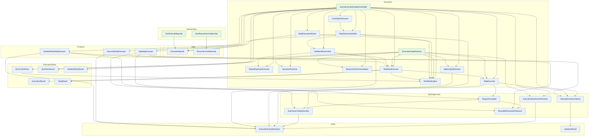

<!-- GENERATED by scripts/generate-docs.php — DO NOT EDIT.
     Refreshed automatically on every commit (see .githooks/pre-commit). -->

# Generated: Pipeline Flow

Execution topology of the execution path: every concrete service under
`RequestPipeline/` and `Runner/` (plus Laravel queue jobs) with the edges
introduced by constructor injection or direct instantiation. Entry points
(nothing injects them) are green. Isolated value objects, enums and
exceptions are omitted. Regenerated before every commit.

```mermaid
flowchart TD
    subgraph G__root["(package root)"]
        Alama_Arazzo_RequestPipeline_ExecutionExpressionResolver["ExecutionExpressionResolver"]:::service
        Alama_Arazzo_RequestPipeline_ExpressionValueResolver["ExpressionValueResolver"]:::service
        Alama_Arazzo_RequestPipeline_IdempotencyKeyInjector["IdempotencyKeyInjector"]:::service
        Alama_Arazzo_RequestPipeline_RequestCompiler["RequestCompiler"]:::service
        Alama_Arazzo_RequestPipeline_ReusableParameterResolver["ReusableParameterResolver"]:::service
    end
    subgraph G_Data["Data"]
        Alama_Arazzo_RequestPipeline_Data_ExecutionEvaluationInput["ExecutionEvaluationInput"]:::service
        Alama_Arazzo_RequestPipeline_Data_InjectionResult["InjectionResult"]:::service
    end
    subgraph G_Execution["Execution"]
        Alama_Arazzo_Runner_Execution_AsyncExecutionGraphAssembler["AsyncExecutionGraphAssembler"]:::entry
        Alama_Arazzo_Runner_Execution_CorrelationResumer["CorrelationResumer"]:::service
        Alama_Arazzo_Runner_Execution_DefaultOpenApiExecutor["DefaultOpenApiExecutor"]:::service
        Alama_Arazzo_Runner_Execution_ExecutionGraphFactory["ExecutionGraphFactory"]:::entry
        Alama_Arazzo_Runner_Execution_OperationRuntime["OperationRuntime"]:::service
        Alama_Arazzo_Runner_Execution_ResponseSchemaValidator["ResponseSchemaValidator"]:::service
        Alama_Arazzo_Runner_Execution_StepExecutionWorker["StepExecutionWorker"]:::service
        Alama_Arazzo_Runner_Execution_StepExecutor["StepExecutor"]:::service
        Alama_Arazzo_Runner_Execution_StepOutcomeHandler["StepOutcomeHandler"]:::service
        Alama_Arazzo_Runner_Execution_StepOutputExtractor["StepOutputExtractor"]:::service
        Alama_Arazzo_Runner_Execution_SubWorkflowInvoker["SubWorkflowInvoker"]:::service
        Alama_Arazzo_Runner_Execution_WorkflowEngine["WorkflowEngine"]:::service
        Alama_Arazzo_Runner_Execution_WorkflowExecutor["WorkflowExecutor"]:::service
    end
    subgraph G_Execution_Data["Execution/Data"]
        Alama_Arazzo_Runner_Execution_Data_ExecutionResult["ExecutionResult"]:::service
        Alama_Arazzo_Runner_Execution_Data_RunControlFlow["RunControlFlow"]:::service
        Alama_Arazzo_Runner_Execution_Data_RunPersistence["RunPersistence"]:::service
        Alama_Arazzo_Runner_Execution_Data_StepResult["StepResult"]:::service
        Alama_Arazzo_Runner_Execution_Data_SubWorkflowResult["SubWorkflowResult"]:::service
    end
    subgraph G_Jobs["Jobs"]
        Alama_Arazzo_Runner_Jobs_ExecuteStepJob["ExecuteStepJob"]:::service
        Alama_Arazzo_Runner_Jobs_ResumeCorrelationJob["ResumeCorrelationJob"]:::service
    end
    subgraph G_Protocol["Protocol"]
        Alama_Arazzo_Runner_Protocol_AsyncApiStepExecutor["AsyncApiStepExecutor"]:::service
        Alama_Arazzo_Runner_Protocol_HttpStepExecutor["HttpStepExecutor"]:::service
        Alama_Arazzo_Runner_Protocol_SubWorkflowStepExecutor["SubWorkflowStepExecutor"]:::service
    end
    subgraph G_Queue_Jobs["Queue/Jobs"]
        Alama_Arazzo_Laravel_Queue_Jobs_RunExecuteStepJob["RunExecuteStepJob"]:::entry
        Alama_Arazzo_Laravel_Queue_Jobs_RunResumeCorrelationJob["RunResumeCorrelationJob"]:::entry
    end
    Alama_Arazzo_Laravel_Queue_Jobs_RunExecuteStepJob --> Alama_Arazzo_Runner_Jobs_ExecuteStepJob
    Alama_Arazzo_Laravel_Queue_Jobs_RunResumeCorrelationJob --> Alama_Arazzo_Runner_Jobs_ResumeCorrelationJob
    Alama_Arazzo_RequestPipeline_ExecutionExpressionResolver --> Alama_Arazzo_RequestPipeline_Data_ExecutionEvaluationInput
    Alama_Arazzo_RequestPipeline_ExpressionValueResolver --> Alama_Arazzo_RequestPipeline_Data_ExecutionEvaluationInput
    Alama_Arazzo_RequestPipeline_IdempotencyKeyInjector --> Alama_Arazzo_RequestPipeline_Data_InjectionResult
    Alama_Arazzo_RequestPipeline_RequestCompiler --> Alama_Arazzo_RequestPipeline_ExpressionValueResolver
    Alama_Arazzo_RequestPipeline_RequestCompiler --> Alama_Arazzo_RequestPipeline_ReusableParameterResolver
    Alama_Arazzo_Runner_Execution_AsyncExecutionGraphAssembler --> Alama_Arazzo_RequestPipeline_ExecutionExpressionResolver
    Alama_Arazzo_Runner_Execution_AsyncExecutionGraphAssembler --> Alama_Arazzo_RequestPipeline_IdempotencyKeyInjector
    Alama_Arazzo_Runner_Execution_AsyncExecutionGraphAssembler --> Alama_Arazzo_Runner_Execution_CorrelationResumer
    Alama_Arazzo_Runner_Execution_AsyncExecutionGraphAssembler --> Alama_Arazzo_Runner_Execution_Data_RunControlFlow
    Alama_Arazzo_Runner_Execution_AsyncExecutionGraphAssembler --> Alama_Arazzo_Runner_Execution_Data_RunPersistence
    Alama_Arazzo_Runner_Execution_AsyncExecutionGraphAssembler --> Alama_Arazzo_Runner_Execution_DefaultOpenApiExecutor
    Alama_Arazzo_Runner_Execution_AsyncExecutionGraphAssembler --> Alama_Arazzo_Runner_Execution_OperationRuntime
    Alama_Arazzo_Runner_Execution_AsyncExecutionGraphAssembler --> Alama_Arazzo_Runner_Execution_ResponseSchemaValidator
    Alama_Arazzo_Runner_Execution_AsyncExecutionGraphAssembler --> Alama_Arazzo_Runner_Execution_StepExecutionWorker
    Alama_Arazzo_Runner_Execution_AsyncExecutionGraphAssembler --> Alama_Arazzo_Runner_Execution_StepExecutor
    Alama_Arazzo_Runner_Execution_AsyncExecutionGraphAssembler --> Alama_Arazzo_Runner_Execution_StepOutcomeHandler
    Alama_Arazzo_Runner_Execution_AsyncExecutionGraphAssembler --> Alama_Arazzo_Runner_Execution_StepOutputExtractor
    Alama_Arazzo_Runner_Execution_AsyncExecutionGraphAssembler --> Alama_Arazzo_Runner_Execution_SubWorkflowInvoker
    Alama_Arazzo_Runner_Execution_AsyncExecutionGraphAssembler --> Alama_Arazzo_Runner_Execution_WorkflowEngine
    Alama_Arazzo_Runner_Execution_AsyncExecutionGraphAssembler --> Alama_Arazzo_Runner_Execution_WorkflowExecutor
    Alama_Arazzo_Runner_Execution_AsyncExecutionGraphAssembler --> Alama_Arazzo_Runner_Protocol_AsyncApiStepExecutor
    Alama_Arazzo_Runner_Execution_AsyncExecutionGraphAssembler --> Alama_Arazzo_Runner_Protocol_HttpStepExecutor
    Alama_Arazzo_Runner_Execution_AsyncExecutionGraphAssembler --> Alama_Arazzo_Runner_Protocol_SubWorkflowStepExecutor
    Alama_Arazzo_Runner_Execution_CorrelationResumer --> Alama_Arazzo_Runner_Execution_StepOutcomeHandler
    Alama_Arazzo_Runner_Execution_Data_RunControlFlow --> Alama_Arazzo_Runner_Execution_WorkflowEngine
    Alama_Arazzo_Runner_Execution_ExecutionGraphFactory --> Alama_Arazzo_RequestPipeline_ExecutionExpressionResolver
    Alama_Arazzo_Runner_Execution_ExecutionGraphFactory --> Alama_Arazzo_Runner_Execution_DefaultOpenApiExecutor
    Alama_Arazzo_Runner_Execution_ExecutionGraphFactory --> Alama_Arazzo_Runner_Execution_OperationRuntime
    Alama_Arazzo_Runner_Execution_ExecutionGraphFactory --> Alama_Arazzo_Runner_Execution_ResponseSchemaValidator
    Alama_Arazzo_Runner_Execution_ExecutionGraphFactory --> Alama_Arazzo_Runner_Execution_StepExecutor
    Alama_Arazzo_Runner_Execution_ExecutionGraphFactory --> Alama_Arazzo_Runner_Execution_StepOutputExtractor
    Alama_Arazzo_Runner_Execution_ExecutionGraphFactory --> Alama_Arazzo_Runner_Execution_WorkflowEngine
    Alama_Arazzo_Runner_Execution_ExecutionGraphFactory --> Alama_Arazzo_Runner_Execution_WorkflowExecutor
    Alama_Arazzo_Runner_Execution_StepExecutionWorker --> Alama_Arazzo_Runner_Execution_WorkflowEngine
    Alama_Arazzo_Runner_Execution_StepExecutionWorker --> Alama_Arazzo_Runner_Jobs_ExecuteStepJob
    Alama_Arazzo_Runner_Execution_StepExecutor --> Alama_Arazzo_RequestPipeline_ExpressionValueResolver
    Alama_Arazzo_Runner_Execution_StepExecutor --> Alama_Arazzo_RequestPipeline_IdempotencyKeyInjector
    Alama_Arazzo_Runner_Execution_StepExecutor --> Alama_Arazzo_RequestPipeline_RequestCompiler
    Alama_Arazzo_Runner_Execution_StepOutcomeHandler --> Alama_Arazzo_RequestPipeline_Data_ExecutionEvaluationInput
    Alama_Arazzo_Runner_Execution_StepOutcomeHandler --> Alama_Arazzo_Runner_Execution_SubWorkflowInvoker
    Alama_Arazzo_Runner_Execution_StepOutcomeHandler --> Alama_Arazzo_Runner_Execution_WorkflowEngine
    Alama_Arazzo_Runner_Execution_StepOutcomeHandler --> Alama_Arazzo_Runner_Jobs_ExecuteStepJob
    Alama_Arazzo_Runner_Execution_StepOutputExtractor --> Alama_Arazzo_RequestPipeline_Data_ExecutionEvaluationInput
    Alama_Arazzo_Runner_Execution_SubWorkflowInvoker --> Alama_Arazzo_RequestPipeline_Data_ExecutionEvaluationInput
    Alama_Arazzo_Runner_Execution_SubWorkflowInvoker --> Alama_Arazzo_Runner_Execution_Data_SubWorkflowResult
    Alama_Arazzo_Runner_Execution_SubWorkflowInvoker --> Alama_Arazzo_Runner_Execution_WorkflowExecutor
    Alama_Arazzo_Runner_Execution_WorkflowExecutor --> Alama_Arazzo_Runner_Execution_Data_ExecutionResult
    Alama_Arazzo_Runner_Execution_WorkflowExecutor --> Alama_Arazzo_Runner_Execution_Data_StepResult
    Alama_Arazzo_Runner_Execution_WorkflowExecutor --> Alama_Arazzo_Runner_Execution_StepExecutor
    Alama_Arazzo_Runner_Execution_WorkflowExecutor --> Alama_Arazzo_Runner_Execution_WorkflowEngine
    Alama_Arazzo_Runner_Protocol_AsyncApiStepExecutor --> Alama_Arazzo_RequestPipeline_Data_ExecutionEvaluationInput
    Alama_Arazzo_Runner_Protocol_AsyncApiStepExecutor --> Alama_Arazzo_RequestPipeline_ReusableParameterResolver
    Alama_Arazzo_Runner_Protocol_HttpStepExecutor --> Alama_Arazzo_RequestPipeline_ExpressionValueResolver
    Alama_Arazzo_Runner_Protocol_HttpStepExecutor --> Alama_Arazzo_RequestPipeline_IdempotencyKeyInjector
    Alama_Arazzo_Runner_Protocol_HttpStepExecutor --> Alama_Arazzo_RequestPipeline_RequestCompiler
    Alama_Arazzo_Runner_Protocol_SubWorkflowStepExecutor --> Alama_Arazzo_RequestPipeline_Data_ExecutionEvaluationInput
    Alama_Arazzo_Runner_Protocol_SubWorkflowStepExecutor --> Alama_Arazzo_RequestPipeline_ReusableParameterResolver
    Alama_Arazzo_Runner_Protocol_SubWorkflowStepExecutor --> Alama_Arazzo_Runner_Execution_WorkflowExecutor
    classDef entry fill:#e6f4ea,stroke:#34a853,color:#1a1a1a;
    classDef service fill:#e8f0fe,stroke:#4285f4,color:#1a1a1a;
    classDef laravelNode fill:#fef7e0,stroke:#f9ab00,color:#1a1a1a;
```

| Service | Package | Depends on | Used by | Dispatches |
|---|---|---|---|---|
| **RunExecuteStepJob** | laravel | `ExecuteStepJob` | — | — |
| **RunResumeCorrelationJob** | laravel | `ResumeCorrelationJob` | — | — |
| **ExecutionEvaluationInput** | request-pipeline | — | `ExecutionExpressionResolver`, `ExpressionValueResolver`, `StepOutcomeHandler`, `StepOutputExtractor`, `SubWorkflowInvoker`, `AsyncApiStepExecutor`, `SubWorkflowStepExecutor` | — |
| **InjectionResult** | request-pipeline | — | `IdempotencyKeyInjector` | — |
| **ExecutionExpressionResolver** | request-pipeline | `ExecutionEvaluationInput` | `AsyncExecutionGraphAssembler`, `ExecutionGraphFactory` | — |
| **ExpressionValueResolver** | request-pipeline | `ExecutionEvaluationInput` | `RequestCompiler`, `StepExecutor`, `HttpStepExecutor` | — |
| **IdempotencyKeyInjector** | request-pipeline | `InjectionResult` | `AsyncExecutionGraphAssembler`, `StepExecutor`, `HttpStepExecutor` | — |
| **RequestCompiler** | request-pipeline | `ExpressionValueResolver`, `ReusableParameterResolver` | `StepExecutor`, `HttpStepExecutor` | — |
| **ReusableParameterResolver** | request-pipeline | — | `RequestCompiler`, `AsyncApiStepExecutor`, `SubWorkflowStepExecutor` | — |
| **AsyncExecutionGraphAssembler** | runner | `ExecutionExpressionResolver`, `IdempotencyKeyInjector`, `CorrelationResumer`, `RunControlFlow`, `RunPersistence`, `DefaultOpenApiExecutor`, `OperationRuntime`, `ResponseSchemaValidator`, `StepExecutionWorker`, `StepExecutor`, `StepOutcomeHandler`, `StepOutputExtractor`, `SubWorkflowInvoker`, `WorkflowEngine`, `WorkflowExecutor`, `AsyncApiStepExecutor`, `HttpStepExecutor`, `SubWorkflowStepExecutor` | — | — |
| **CorrelationResumer** | runner | `StepOutcomeHandler` | `AsyncExecutionGraphAssembler` | — |
| **ExecutionResult** | runner | — | `WorkflowExecutor` | — |
| **RunControlFlow** | runner | `WorkflowEngine` | `AsyncExecutionGraphAssembler` | — |
| **RunPersistence** | runner | — | `AsyncExecutionGraphAssembler` | — |
| **StepResult** | runner | — | `WorkflowExecutor` | — |
| **SubWorkflowResult** | runner | — | `SubWorkflowInvoker` | — |
| **DefaultOpenApiExecutor** | runner | — | `AsyncExecutionGraphAssembler`, `ExecutionGraphFactory` | — |
| **ExecutionGraphFactory** | runner | `ExecutionExpressionResolver`, `DefaultOpenApiExecutor`, `OperationRuntime`, `ResponseSchemaValidator`, `StepExecutor`, `StepOutputExtractor`, `WorkflowEngine`, `WorkflowExecutor` | — | — |
| **OperationRuntime** | runner | — | `AsyncExecutionGraphAssembler`, `ExecutionGraphFactory` | — |
| **ResponseSchemaValidator** | runner | — | `AsyncExecutionGraphAssembler`, `ExecutionGraphFactory` | — |
| **StepExecutionWorker** | runner | `WorkflowEngine`, `ExecuteStepJob` | `AsyncExecutionGraphAssembler` | — |
| **StepExecutor** | runner | `ExpressionValueResolver`, `IdempotencyKeyInjector`, `RequestCompiler` | `AsyncExecutionGraphAssembler`, `ExecutionGraphFactory`, `WorkflowExecutor` | — |
| **StepOutcomeHandler** | runner | `ExecutionEvaluationInput`, `SubWorkflowInvoker`, `WorkflowEngine`, `ExecuteStepJob` | `AsyncExecutionGraphAssembler`, `CorrelationResumer` | — |
| **StepOutputExtractor** | runner | `ExecutionEvaluationInput` | `AsyncExecutionGraphAssembler`, `ExecutionGraphFactory` | — |
| **SubWorkflowInvoker** | runner | `ExecutionEvaluationInput`, `SubWorkflowResult`, `WorkflowExecutor` | `AsyncExecutionGraphAssembler`, `StepOutcomeHandler` | — |
| **WorkflowEngine** | runner | — | `AsyncExecutionGraphAssembler`, `RunControlFlow`, `ExecutionGraphFactory`, `StepExecutionWorker`, `StepOutcomeHandler`, `WorkflowExecutor` | — |
| **WorkflowExecutor** | runner | `ExecutionResult`, `StepResult`, `StepExecutor`, `WorkflowEngine` | `AsyncExecutionGraphAssembler`, `ExecutionGraphFactory`, `SubWorkflowInvoker`, `SubWorkflowStepExecutor` | — |
| **ExecuteStepJob** | runner | — | `RunExecuteStepJob`, `StepExecutionWorker`, `StepOutcomeHandler` | — |
| **ResumeCorrelationJob** | runner | — | `RunResumeCorrelationJob` | — |
| **AsyncApiStepExecutor** | runner | `ExecutionEvaluationInput`, `ReusableParameterResolver` | `AsyncExecutionGraphAssembler` | — |
| **HttpStepExecutor** | runner | `ExpressionValueResolver`, `IdempotencyKeyInjector`, `RequestCompiler` | `AsyncExecutionGraphAssembler` | — |
| **SubWorkflowStepExecutor** | runner | `ExecutionEvaluationInput`, `ReusableParameterResolver`, `WorkflowExecutor` | `AsyncExecutionGraphAssembler` | — |
