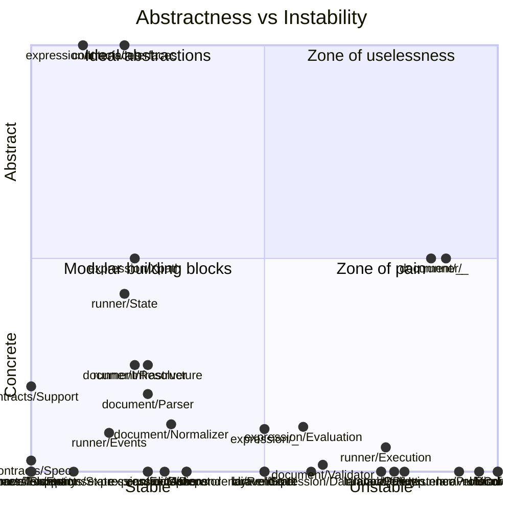

<!-- GENERATED by scripts/generate-docs.php — DO NOT EDIT.
     Refreshed automatically on every commit (see .githooks/pre-commit). -->

# Generated: SOLID Metrics

Uncle Bob's structural health check, computed live:

1. **Abstractness × Instability** — the classic design balance chart. Bottom-right
   ("zone of pain"): concrete modules everything depends on. Top-left
   ("zone of uselessness"): abstractions nobody uses.
2. **God classes** — single types absorbing too much responsibility (SRP).
3. **Fat interfaces** — contracts demanding more than clients need (ISP).
4. **Concrete hubs** — heavily depended-upon modules offering no abstraction (DIP).

## Design balance

## God classes (SRP)

Concrete types over 300 LOC:

| Class | Module | LOC |
|---|---|---:|
| `Parser` | `document:Parser` | 820 |
| `ExecutionContext` | `runner:State` | 493 |
| `StepExecutionWorker` | `runner:Execution` | 376 |
| `StepOutcomeHandler` | `runner:Execution` | 376 |
| `WorkflowContext` | `contracts:State` | 359 |
| `Parser` | `expression:_` | 348 |
| `ExecutionState` | `contracts:State` | 308 |
| `PreflightValidator` | `document:Validator` | 300 |

## Fat interfaces (ISP)

Contracts declaring more than 7 methods:

| Interface | Methods |
|---|---:|
| — | — |

## Concrete hubs (DIP)

Modules depended upon by ≥4 others while offering no interface:

| Module | Fan-in | Classes | Interfaces |
|---|---:|---:|---:|
| — | — | — | 0 |
