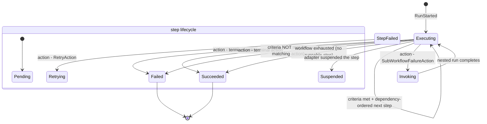

<!-- GENERATED by scripts/generate-docs.php — DO NOT EDIT.
     Refreshed automatically on every commit (see .githooks/pre-commit). -->

# Generated: Run Lifecycle State Machine

The reliability contract of the runner, in one picture. States come live from
the `*Status` / `TransitionType` enums; edges are derived from the
`Transition::*()` factories inside the engine's `transition()` method, labelled
with the trigger found immediately before each call site. Guards are the
exceptions that method raises. Any diff here is a behavioural contract change.

## Enumerated states (live)

| Enum | Cases |
|---|---|
| `ExecutionStatus` | Running · Succeeded · Failed |
| `StepStatus` | Pending · Succeeded · Failed · Retrying · Suspended |
| `TransitionType` | Next · Retry · Goto · End · Suspend · Invoke |

## Transition verbs (live call sites in engine)

| Trigger (nearest condition above call) | Verb | Argument |
|---|---|---|
| action: terminal action | `end` | `failed` |
| action: terminal action | `end` | `succeeded` |
| criteria NOT met (no matching action) | `end` | `failed` |
| workflow exhausted (no runnable step) | `end` | `succeeded` |
| action: FailureGotoAction | `goto` | — |
| action: SubWorkflowFailureAction | `invoke` | — |
| criteria met + dependency-ordered next step | `next` | — |
| action: RetryAction | `retry` | — |
| adapter suspended the step | `suspend` | — |

## Guards raised by transition()

| Exception | Meaning |
|---|---|
| `GotoTargetNotFoundException` | goto/reusable target missing |
| `StepBudgetExceededException` | step budget exhausted |
| `WorkflowCycleException` | re-entry into running workflow blocked |
| `WorkflowDepthExceededException` | workflow nesting depth exceeded |
