<!-- GENERATED by scripts/generate-docs.php — DO NOT EDIT.
     Refreshed automatically on every commit (see .githooks/pre-commit). -->

# Generated: Subdomain Map

Strategic classification: where does this codebase invest, and should it?
Classification is a **declared seed** (edit `SUBDOMAINS` when strategy
changes); LOC and module membership are always scanned live — the numbers keep
the declaration honest.

- **Core domain** — the reason this package exists; hand-written, heavily tested.
- **Supporting** — necessary domain work, less differentiation.
- **Generic** — solved problems; adapters over frameworks. Buy, don't build.

```mermaid
flowchart LR
    subgraph S_core["Core domain"]
        S_contracts_Spec["contracts:Spec<br/><small>1202 LOC</small>"]:::coreDomain
    end
    subgraph S_supporting["Supporting"]
        S_cli_Console["cli:Console<br/><small>793 LOC</small>"]:::supportingDomain
        S_cli_Generator["cli:Generator<br/><small>111 LOC</small>"]:::supportingDomain
        S_cli_Renderer["cli:Renderer<br/><small>255 LOC</small>"]:::supportingDomain
        S_document_Parser["document:Parser<br/><small>1316 LOC</small>"]:::supportingDomain
        S_document_Validator["document:Validator<br/><small>3470 LOC</small>"]:::supportingDomain
        S_sources_Resolver["sources:Resolver<br/><small>488 LOC</small>"]:::supportingDomain
        S_sources_Validator["sources:Validator<br/><small>303 LOC</small>"]:::supportingDomain
    end
    subgraph S_generic["Generic subdomain"]
        S_contracts_State["contracts:State<br/><small>667 LOC</small>"]:::genericDomain
        S_contracts_Support["contracts:Support<br/><small>185 LOC</small>"]:::genericDomain
        S_laravel_Bindings["laravel:Bindings<br/><small>364 LOC</small>"]:::genericDomain
        S_laravel_Events["laravel:Events<br/><small>24 LOC</small>"]:::genericDomain
        S_laravel_Http["laravel:Http<br/><small>170 LOC</small>"]:::genericDomain
        S_laravel_Lock["laravel:Lock<br/><small>52 LOC</small>"]:::genericDomain
        S_laravel_Persistence["laravel:Persistence<br/><small>264 LOC</small>"]:::genericDomain
        S_laravel_Queue["laravel:Queue<br/><small>109 LOC</small>"]:::genericDomain
        S_laravel_State["laravel:State<br/><small>46 LOC</small>"]:::genericDomain
        S_laravel_Support["laravel:Support<br/><small>126 LOC</small>"]:::genericDomain
        S_runtime_State["runtime:State<br/><small>1063 LOC</small>"]:::genericDomain
    end
    subgraph S_unclassified["Unclassified"]
        S_contracts_Dependency["contracts:Dependency<br/><small>336 LOC</small>"]:::unknownDomain
        S_contracts_Exceptions["contracts:Exceptions<br/><small>31 LOC</small>"]:::unknownDomain
        S_contracts_Interfaces["contracts:Interfaces<br/><small>322 LOC</small>"]:::unknownDomain
        S_engine_Data["engine:Data<br/><small>52 LOC</small>"]:::unknownDomain
        S_engine_Enum["engine:Enum<br/><small>15 LOC</small>"]:::unknownDomain
        S_evaluation_Condition["evaluation:Condition<br/><small>654 LOC</small>"]:::unknownDomain
        S_evaluation_Data["evaluation:Data<br/><small>34 LOC</small>"]:::unknownDomain
        S_evaluation_Enum["evaluation:Enum<br/><small>82 LOC</small>"]:::unknownDomain
        S_evaluation_Exceptions["evaluation:Exceptions<br/><small>32 LOC</small>"]:::unknownDomain
        S_evaluation_Interfaces["evaluation:Interfaces<br/><small>108 LOC</small>"]:::unknownDomain
        S_evaluation_Plugins["evaluation:Plugins<br/><small>95 LOC</small>"]:::unknownDomain
        S_evaluation_Registries["evaluation:Registries<br/><small>121 LOC</small>"]:::unknownDomain
        S_evaluation_Xpath["evaluation:Xpath<br/><small>109 LOC</small>"]:::unknownDomain
        S_events_Interfaces["events:Interfaces<br/><small>19 LOC</small>"]:::unknownDomain
        S_events_Listener["events:Listener<br/><small>95 LOC</small>"]:::unknownDomain
        S_expression_Ast["expression:Ast<br/><small>350 LOC</small>"]:::unknownDomain
        S_expression_Data["expression:Data<br/><small>66 LOC</small>"]:::unknownDomain
        S_expression_Enum["expression:Enum<br/><small>45 LOC</small>"]:::unknownDomain
        S_expression_Exceptions["expression:Exceptions<br/><small>23 LOC</small>"]:::unknownDomain
        S_expression_Interfaces["expression:Interfaces<br/><small>25 LOC</small>"]:::unknownDomain
        S_runner_Execution["runner:Execution<br/><small>3902 LOC</small>"]:::unknownDomain
        S_runner_Jobs["runner:Jobs<br/><small>40 LOC</small>"]:::unknownDomain
        S_runner_Protocol["runner:Protocol<br/><small>366 LOC</small>"]:::unknownDomain
        S_runtime_Infrastructure["runtime:Infrastructure<br/><small>155 LOC</small>"]:::unknownDomain
        S_runtime_Policy["runtime:Policy<br/><small>102 LOC</small>"]:::unknownDomain
        S_runtime_Telemetry["runtime:Telemetry<br/><small>282 LOC</small>"]:::unknownDomain
        S_sources_Normalizer["sources:Normalizer<br/><small>782 LOC</small>"]:::unknownDomain
    end
    classDef coreDomain fill:#e6f4ea,stroke:#34a853,color:#1a1a1a;
    classDef supportingDomain fill:#e8f0fe,stroke:#4285f4,color:#1a1a1a;
    classDef genericDomain fill:#f1f3f4,stroke:#9aa0a6,color:#1a1a1a;
    classDef unknownDomain fill:#fce8e6,stroke:#ea4335,color:#1a1a1a;
```

| Subdomain | Modules | Core pkg LOC | Laravel pkg LOC | Share |
|---|---:|---:|---:|---:|
| Core domain | 1 | 1,202 | 0 | 6% |
| Supporting | 7 | 6,736 | 0 | 35% |
| Generic subdomain | 11 | 1,915 | 1,155 | 16% |
| Unclassified | 27 | 8,243 | 0 | 43% |

**Unclassified modules** — classify them in `SUBDOMAINS` or delete them:
- `contracts:Dependency`
- `contracts:Exceptions`
- `contracts:Interfaces`
- `engine:Data`
- `engine:Enum`
- `evaluation:Condition`
- `evaluation:Data`
- `evaluation:Enum`
- `evaluation:Exceptions`
- `evaluation:Interfaces`
- `evaluation:Plugins`
- `evaluation:Registries`
- `evaluation:Xpath`
- `events:Interfaces`
- `events:Listener`
- `expression:Ast`
- `expression:Data`
- `expression:Enum`
- `expression:Exceptions`
- `expression:Interfaces`
- `runner:Execution`
- `runner:Jobs`
- `runner:Protocol`
- `runtime:Infrastructure`
- `runtime:Policy`
- `runtime:Telemetry`
- `sources:Normalizer`
