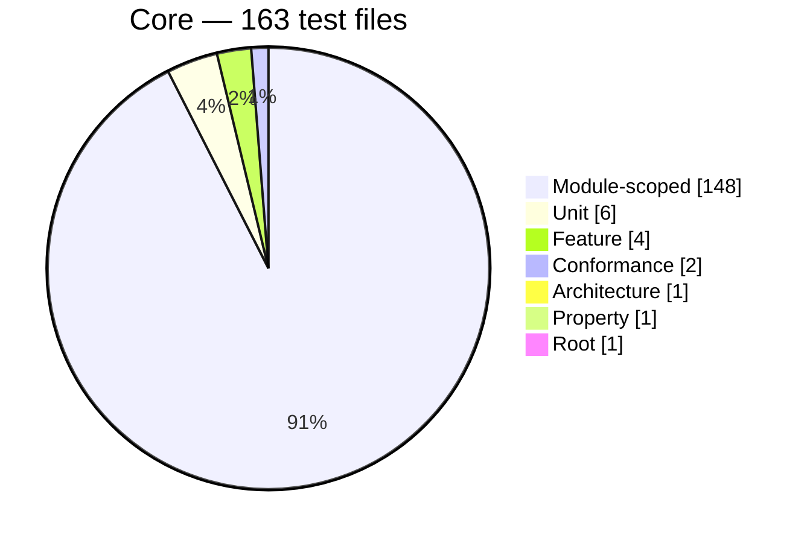
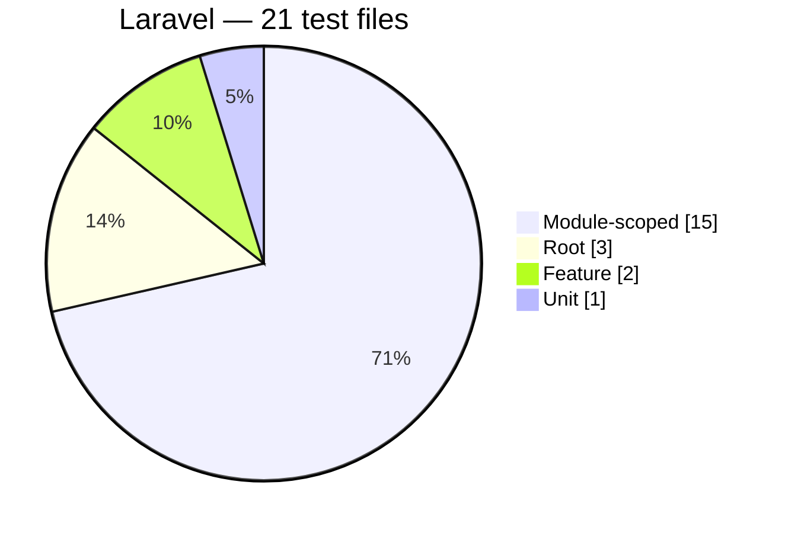

<!-- GENERATED by scripts/generate-docs.php — DO NOT EDIT.
     Refreshed automatically on every commit (see .githooks/pre-commit). -->

# Generated: Test Suite Composition

Shape of the reliability evidence, counted by test file (`*Test.php`) per
suite directory in `packages/*/tests`. A healthy package usually shows a wide
unit base, a deliberate feature layer, and a conformance slice proving spec
compliance — not an inverted pyramid of end-to-end tests.

## Core package

| Suite | Files | Share |
|---|---:|---:|
| Module-scoped | 148 | 91% |
| Unit | 6 | 4% |
| Feature | 4 | 2% |
| Conformance | 2 | 1% |
| Architecture | 1 | 1% |
| Property | 1 | 1% |
| Root | 1 | 1% |

## Laravel package

| Suite | Files | Share |
|---|---:|---:|
| Module-scoped | 15 | 71% |
| Root | 3 | 14% |
| Feature | 2 | 10% |
| Unit | 1 | 5% |
