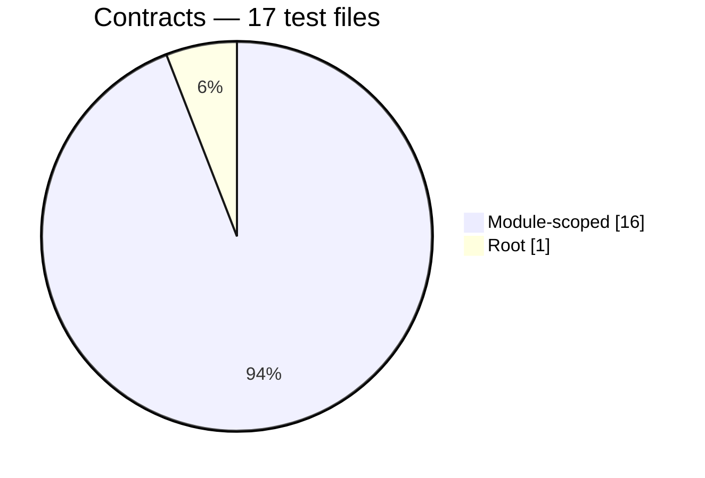
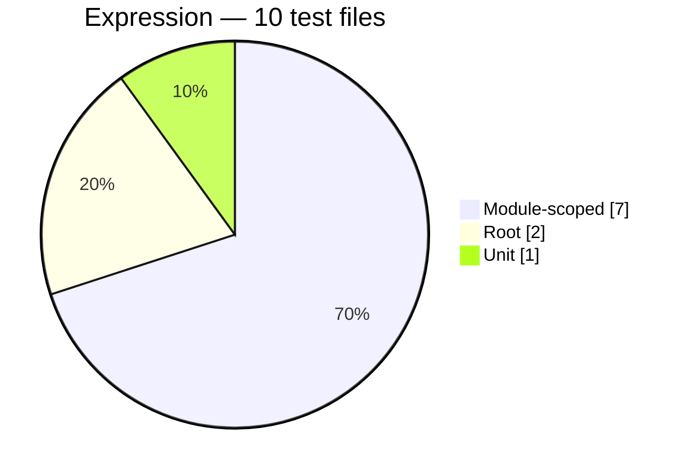
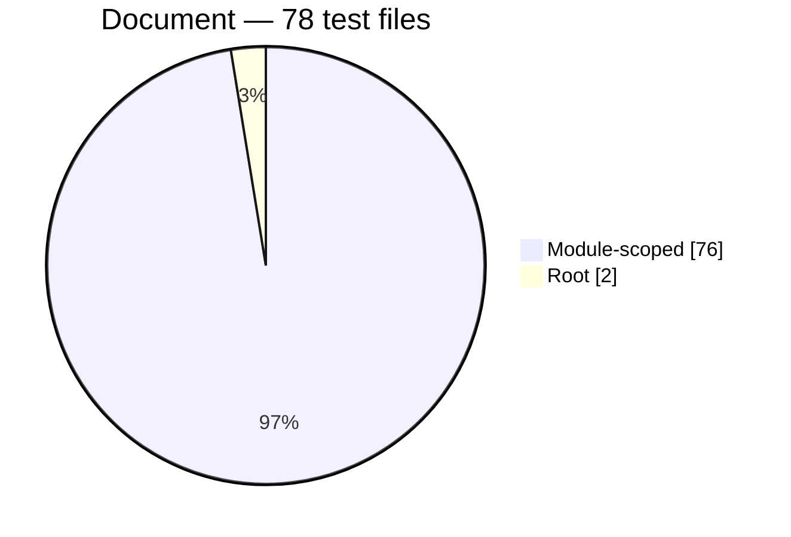
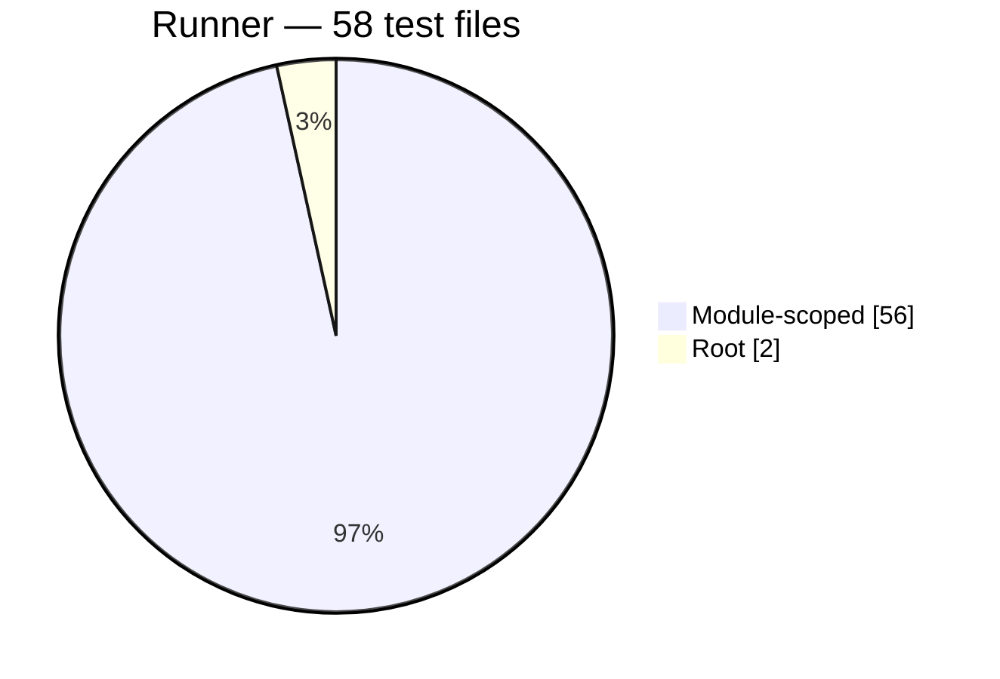
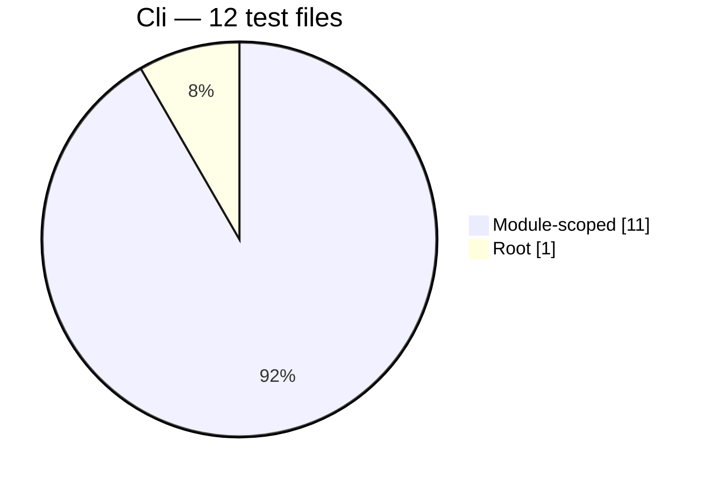
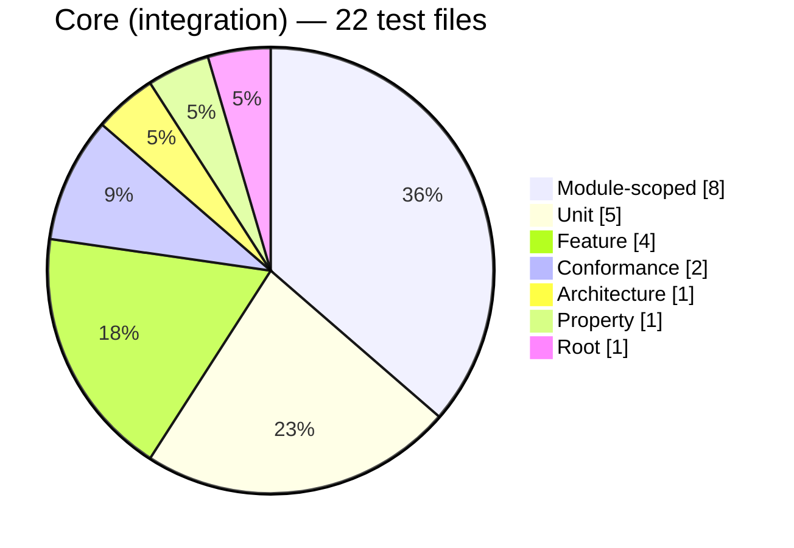
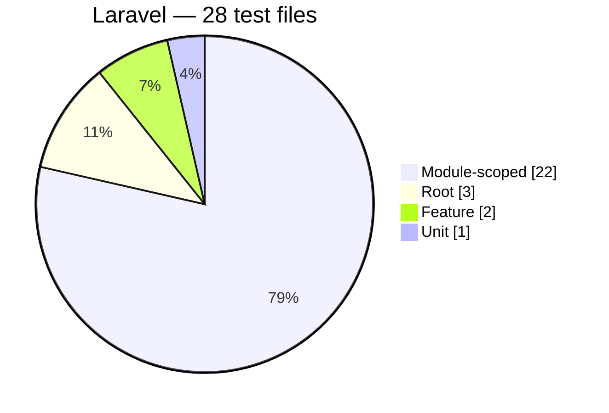

<!-- GENERATED by scripts/generate-docs.php — DO NOT EDIT.
     Refreshed automatically on every commit (see .githooks/pre-commit). -->

# Generated: Test Suite Composition

Shape of the reliability evidence, counted by test file (`*Test.php`) per
suite directory in `packages/*/tests`. A healthy package usually shows a wide
unit base, a deliberate feature layer, and a conformance slice proving spec
compliance — not an inverted pyramid of end-to-end tests.

## Contracts package

| Suite | Files | Share |
|---|---:|---:|
| Module-scoped | 16 | 94% |
| Root | 1 | 6% |

## Expression package

| Suite | Files | Share |
|---|---:|---:|
| Module-scoped | 7 | 70% |
| Root | 2 | 20% |
| Unit | 1 | 10% |

## Document package

| Suite | Files | Share |
|---|---:|---:|
| Module-scoped | 76 | 97% |
| Root | 2 | 3% |

## Runner package

| Suite | Files | Share |
|---|---:|---:|
| Module-scoped | 56 | 97% |
| Root | 2 | 3% |

## Cli package

| Suite | Files | Share |
|---|---:|---:|
| Module-scoped | 11 | 92% |
| Root | 1 | 8% |

## Core (integration) package

| Suite | Files | Share |
|---|---:|---:|
| Module-scoped | 8 | 36% |
| Unit | 5 | 23% |
| Feature | 4 | 18% |
| Conformance | 2 | 9% |
| Architecture | 1 | 5% |
| Property | 1 | 5% |
| Root | 1 | 5% |

## Laravel package

| Suite | Files | Share |
|---|---:|---:|
| Module-scoped | 22 | 79% |
| Root | 3 | 11% |
| Feature | 2 | 7% |
| Unit | 1 | 4% |
