<!-- GENERATED by scripts/generate-docs.php — DO NOT EDIT.
     Refreshed automatically on every commit (see .githooks/pre-commit). -->

# Generated: Test Suite Composition

Shape of the reliability evidence, counted by test file (`*Test.php`) per
suite directory in `packages/*/tests`. A healthy package usually shows a wide
unit base, a deliberate feature layer, and a conformance slice proving spec
compliance — not an inverted pyramid of end-to-end tests.

## Contracts package

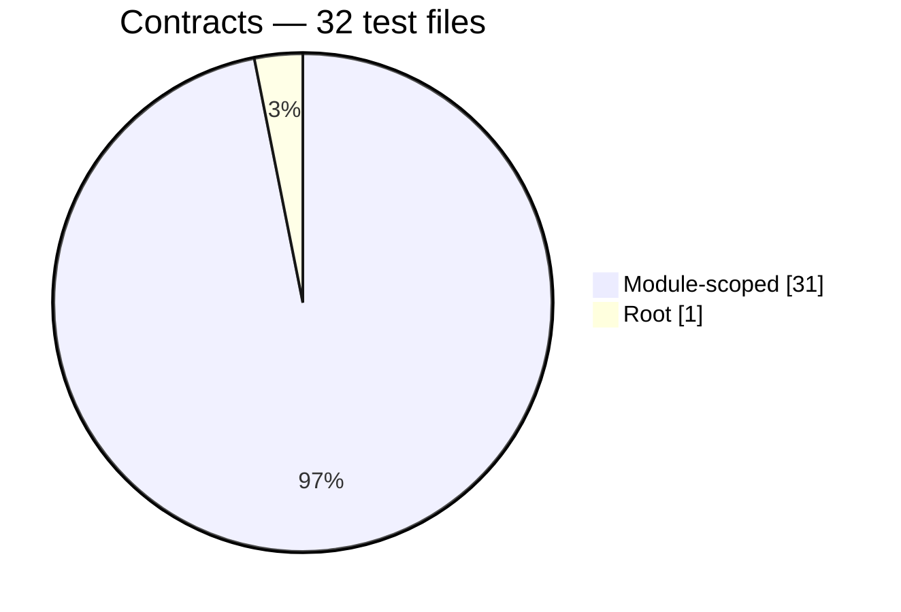
```mermaid
pie showData
    title Contracts — 32 test files
    "Module-scoped": 31
    "Root": 1
```

| Suite | Files | Share |
|---|---:|---:|
| Module-scoped | 31 | 97% |
| Root | 1 | 3% |

## Expression package

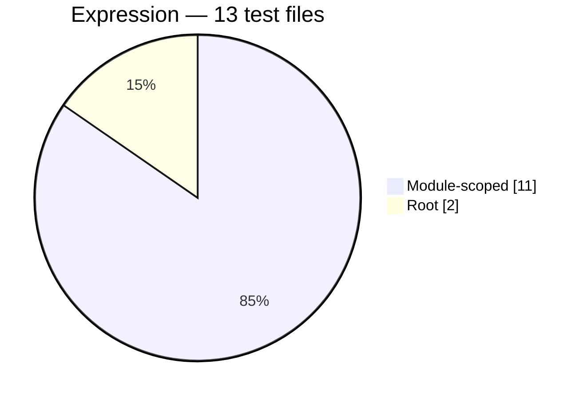
```mermaid
pie showData
    title Expression — 13 test files
    "Module-scoped": 11
    "Root": 2
```

| Suite | Files | Share |
|---|---:|---:|
| Module-scoped | 11 | 85% |
| Root | 2 | 15% |

## Evaluation package

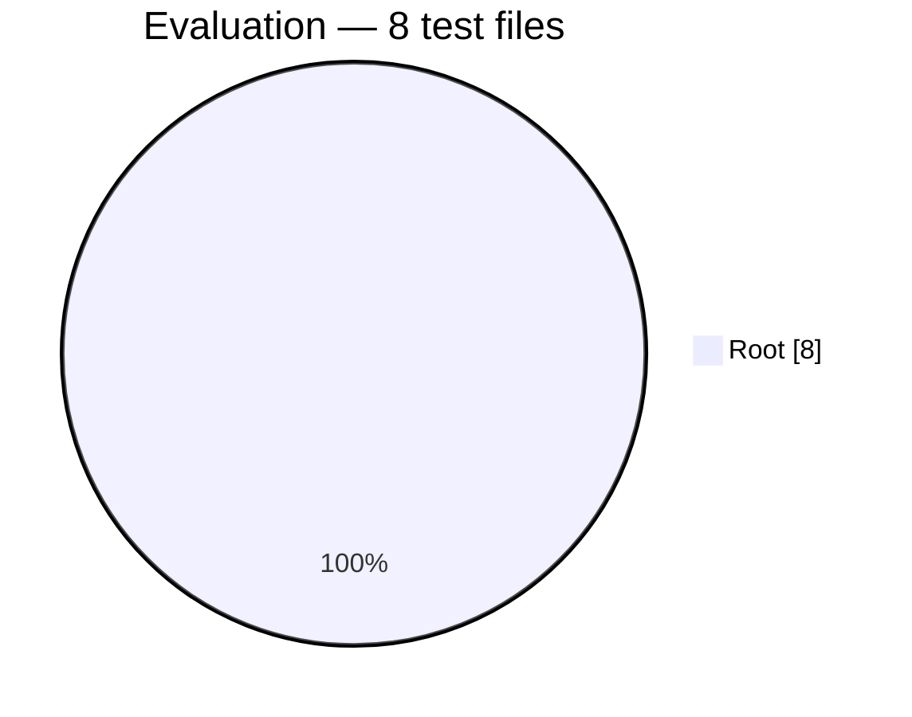
```mermaid
pie showData
    title Evaluation — 8 test files
    "Root": 8
```

| Suite | Files | Share |
|---|---:|---:|
| Root | 8 | 100% |

## Document package

```mermaid
pie showData
    title Document — 76 test files
    "Module-scoped": 73
    "Root": 3
```

| Suite | Files | Share |
|---|---:|---:|
| Module-scoped | 73 | 96% |
| Root | 3 | 4% |

## Sources package

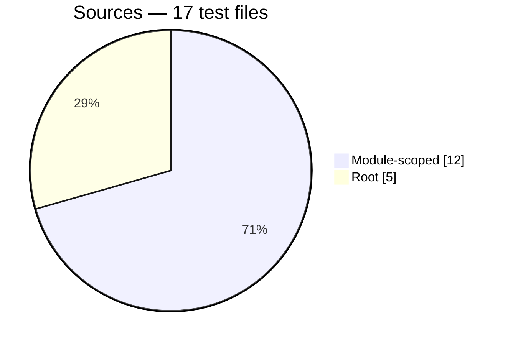
```mermaid
pie showData
    title Sources — 17 test files
    "Module-scoped": 12
    "Root": 5
```

| Suite | Files | Share |
|---|---:|---:|
| Module-scoped | 12 | 71% |
| Root | 5 | 29% |

## Runtime package

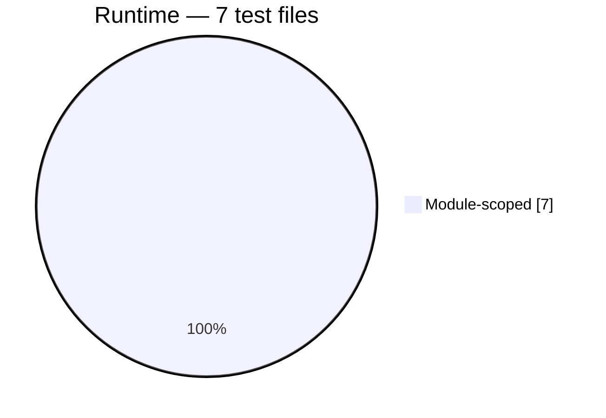
```mermaid
pie showData
    title Runtime — 7 test files
    "Module-scoped": 7
```

| Suite | Files | Share |
|---|---:|---:|
| Module-scoped | 7 | 100% |

## Engine package

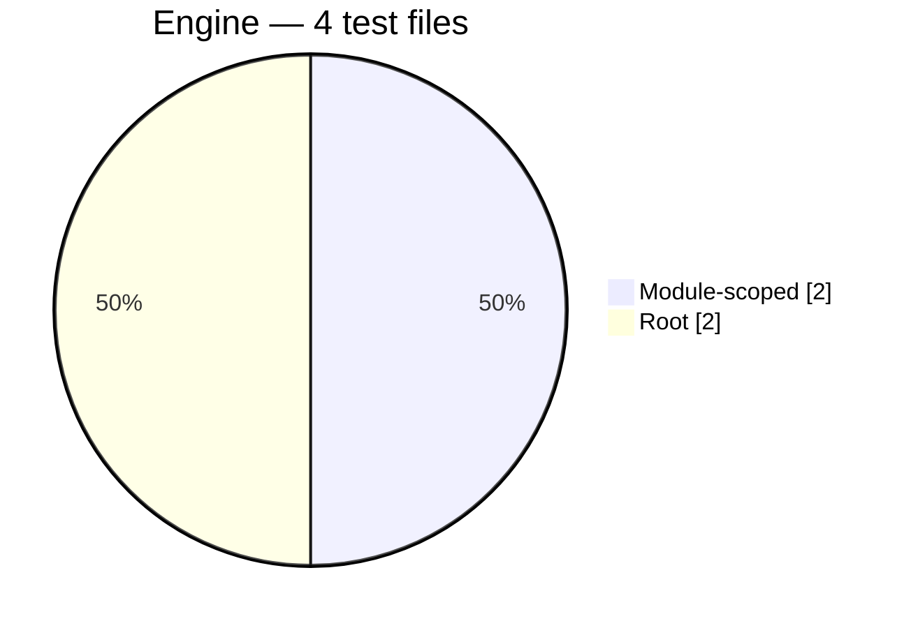
```mermaid
pie showData
    title Engine — 4 test files
    "Module-scoped": 2
    "Root": 2
```

| Suite | Files | Share |
|---|---:|---:|
| Module-scoped | 2 | 50% |
| Root | 2 | 50% |

## Events package

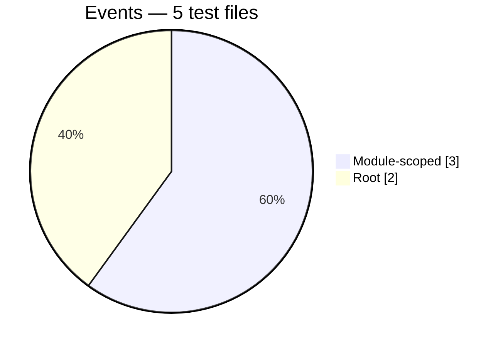
```mermaid
pie showData
    title Events — 5 test files
    "Module-scoped": 3
    "Root": 2
```

| Suite | Files | Share |
|---|---:|---:|
| Module-scoped | 3 | 60% |
| Root | 2 | 40% |

## Runner package

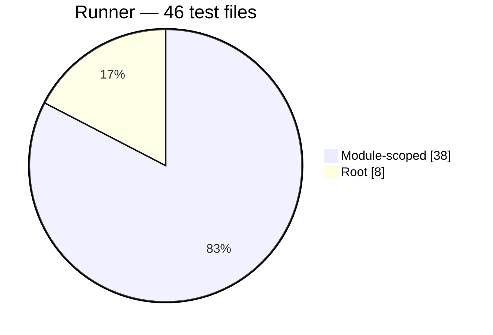
```mermaid
pie showData
    title Runner — 46 test files
    "Module-scoped": 38
    "Root": 8
```

| Suite | Files | Share |
|---|---:|---:|
| Module-scoped | 38 | 83% |
| Root | 8 | 17% |

## Cli package

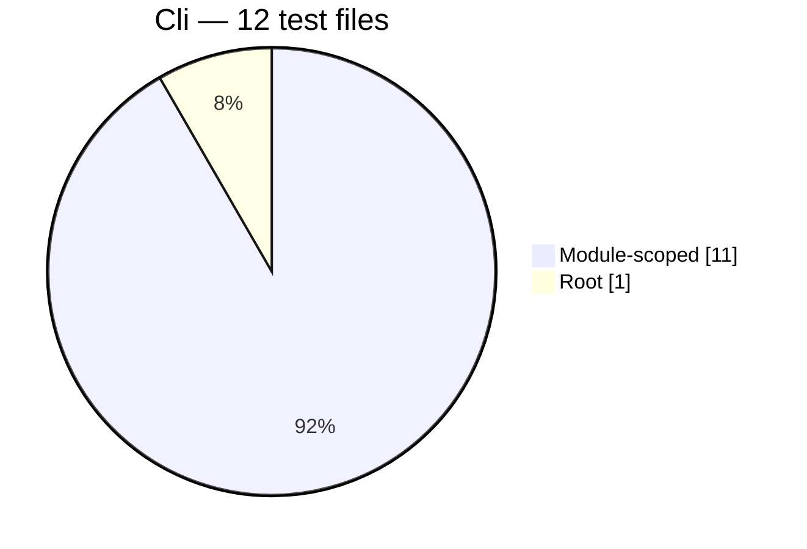
```mermaid
pie showData
    title Cli — 12 test files
    "Module-scoped": 11
    "Root": 1
```

| Suite | Files | Share |
|---|---:|---:|
| Module-scoped | 11 | 92% |
| Root | 1 | 8% |

## Core (integration) package

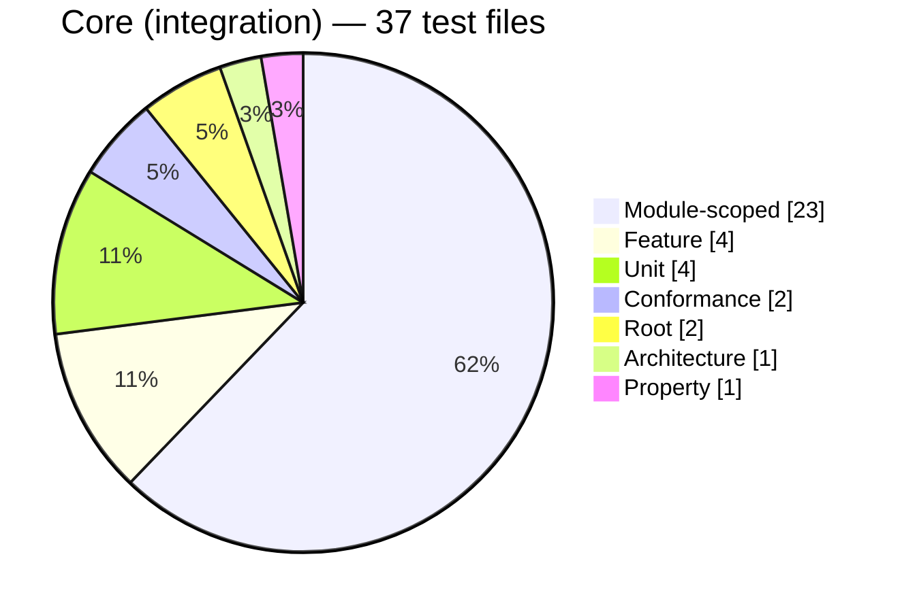
```mermaid
pie showData
    title Core (integration) — 37 test files
    "Module-scoped": 23
    "Feature": 4
    "Unit": 4
    "Conformance": 2
    "Root": 2
    "Architecture": 1
    "Property": 1
```

| Suite | Files | Share |
|---|---:|---:|
| Module-scoped | 23 | 62% |
| Feature | 4 | 11% |
| Unit | 4 | 11% |
| Conformance | 2 | 5% |
| Root | 2 | 5% |
| Architecture | 1 | 3% |
| Property | 1 | 3% |

## Laravel package

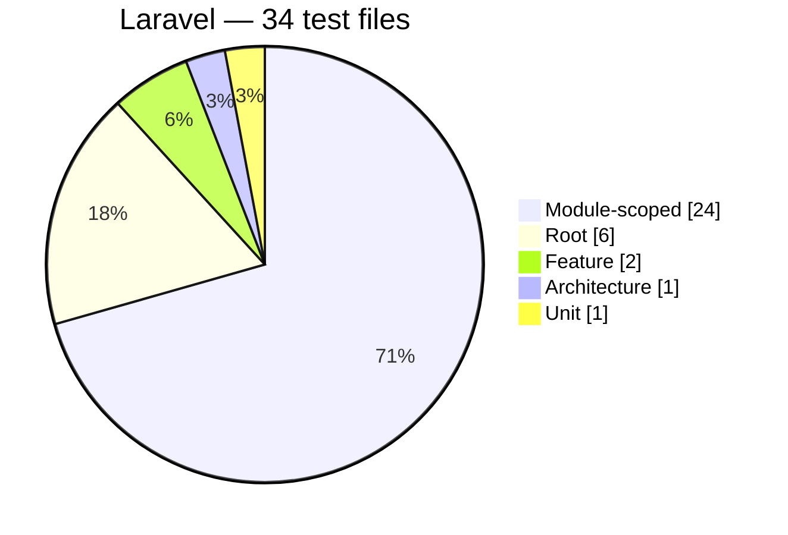
```mermaid
pie showData
    title Laravel — 34 test files
    "Module-scoped": 24
    "Root": 6
    "Feature": 2
    "Architecture": 1
    "Unit": 1
```

| Suite | Files | Share |
|---|---:|---:|
| Module-scoped | 24 | 71% |
| Root | 6 | 18% |
| Feature | 2 | 6% |
| Architecture | 1 | 3% |
| Unit | 1 | 3% |
