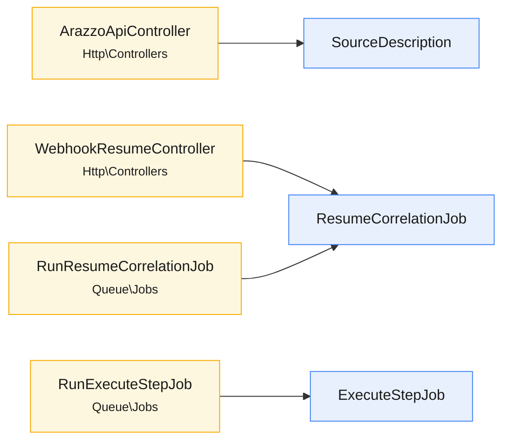

<!-- GENERATED by scripts/generate-docs.php — DO NOT EDIT.
     Refreshed automatically on every commit (see .githooks/pre-commit). -->

# Generated: Trust Boundary Flow

How untrusted input travels from each entry point into the core. Edges are the
entry point's constructor-injected and instantiated dependencies (same
extraction as the pipeline doc). **Validation** nodes mark dependencies whose
name signals request validation; a boundary reaching a sink-named dependency
directly is drawn red — review that path before trusting it.

## Path audit

| Boundary | Validation on path? | Direct sink access |
|---|---|---|
| `ArazzoApiController` | _none found in ctor deps_ | no |
| `WebhookResumeController` | _none found in ctor deps_ | no |
| `RunExecuteStepJob` | _none found in ctor deps_ | no |
| `RunResumeCorrelationJob` | _none found in ctor deps_ | no |
